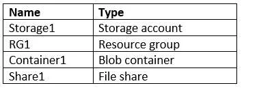
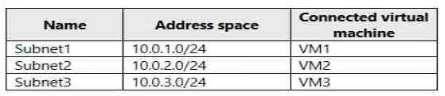

### Question 1

You have an Azure subscription named Subscription1. Subscription1 contains the resources in the following table: 

VNet1 is in RG1. VNet2 is in RG2. There is no connectivity between VNet1 and VNet2. An administrator
named Admin1 creates an Azure virtual machine VM1 in RG1. VM1 uses a disk named Disk1 and connects
to VNet1. Admin1 then installs a custom application in VM1.

You need to move the custom application to VNet2. The solution must minimize administrative effort.

Which two actions should you perform? To answer, select the appropriate options in the answer area.

[See the answer](#answer-1)

### Question 2

You have an Azure subscription named Subscription1 that is used by several departments at your
company. Subscription1 contains the resources in the following table.

Another administrator deploys a virtual machine named VM1 and an Azure Storage account named
Storage2 by using a single Azure Resource Manager template.

You need to view the template used for the deployment.
From the Azure Portal, for which blade can you view the template that was used for the deployment?

* A: Container1
* B: VM1
* C: Storage2
* D: RG1

[See the answer](#answer-2)

### Question 3

You have two subscriptions named Subscription1 and Subscription2. Each subscription is associated to a
different Azure AD tenant.

Subscription1 contains a virtual network named VNet1. VNet1 contains an Azure virtual machine named
VM1 and has an IP address space of 10.0.0.0/16.

Subscription2 contains a virtual network named VNet2. Vnet2 contains an Azure virtual machine named
VM2 and has an IP address space of 10.10.0.0/24.

You need to connect VNet1 to VNet2. What should you do first?
* A: Modify the IP address space of VNet2.
* B: Move VM1 to Subscription2.
* C: Provision virtual network gateways.
* D: Move VNet1 to Subscription2.

[See the answer](#answer-3)

### Question 4

You have an Azure Active Directory (Azure AD) tenant.

You have an existing Azure AD conditional access policy named Policy1. Policy1 enforces the use of Azure
AD-joined devices when members of the Global Administrators group authenticate to Azure AD from
untrusted locations.

You need to ensure that members of the Global Administrators group will also be forced to use multi-factor
authentication when authenticating from untrusted locations.

What should you do?

* A: From the Azure portal, modify session control of Policy1.
* B: From multi-factor authentication page, modify the user settings.
* C: From multi-factor authentication page, modify the service settings.
* D: From the Azure portal, modify grant control of Policy1.

[See the answer](#answer-4)

### Question 5

You plan to deploy five virtual machines to a virtual network subnet.

Each virtual machine will have a public IP address and a private IP address.

Each virtual machine requires the same inbound and outbound security rules.

What is the minimum number of network interfaces and network security groups that you require? To
answer, select the appropriate options in the answer area.

[See the answer](#answer-5)

### Question 6

You have an Azure subscription named Subscription1 that contains an Azure virtual machine named VM1.

VM1 is in a resource group named RG1.

VM1 runs services that will be used to deploy resources to RG1.

You need to ensure that a service running on VM1 can manage the resources in RG1 by using the identity
of VM1.

What should you do first?

* A: From the Azure portal, modify the Access control (IAM) settings of RG1.
* B: From the Azure portal, modify the Policies settings of RG1.
* C: From the Azure portal, modify the Access control (IAM) settings of VM1.
* D: From the Azure portal, modify the value of the Managed Service Identity option for VM1.

[See the answer](#answer-6)

### Question 7
You have an Azure subscription named Subscription1. 

Subscription1 contains the virtual networks in the following table:

Subscription1 contains the virtual machines in the following table:

The firewalls on all the virtual machines are configured to allow all ICMP traffic.

You add the peerings in the following table:

For each of the following statements, select Yes if the statement is true. Otherwise, select No.

[See the answer](#answer-7)

### Question 8
You have an Azure Active Directory (Azure AD) tenant.

You need to create a conditional access policy that requires all users to use multi-factor authentication
when they access the Azure portal.

Which three settings should you configure? To answer, select the appropriate settings in the answer area.

[See the answer](#answer-8)

### Question 9
You configure Azure AD Connect for Azure Active Directory Seamless Single Sign-On (Azure AD Seamless
SSO) for an on-premises network.

Users report that when they attempt to access myapps.microsoft.com, they are prompted multiple times to
sign in and are forced to use an account name that ends with onmicrosoft.com.

You discover that there is a UPN mismatch between Azure AD and the on-premises Active Directory.

You need to ensure that the users can use single-sign on (SSO) to access Azure resources.

What should you do first?

* A: From on-premises network, deploy Active Directory Federation Services (AD FS).
* B: From Azure AD, add and verify a custom domain name.
* C: From on-premises network, request a new certificate that contains the Active Directory domain name.
* D: From the server that runs Azure AD Connect, modify the filtering options.

[See the answer](#answer-9)

### Question 10
You have an Active Directory forest named contoso.com.

You install and configure Azure AD Connect to use password hash synchronization as the single sign-on
(SSO) method. Staging mode is enabled.

You review the synchronization results and discover that the Synchronization Service Manager does not
display any sync jobs.

You need to ensure that the synchronization completes successfully.

What should you do?

* A: From Azure PowerShell, run Start-AdSyncSyncCycle –PolicyType Initial.
* B: Run Azure AD Connect and set the SSO method to Pass-through Authentication.
* C: From Synchronization Service Manager, run a full import.
* D: Run Azure AD Connect and disable staging mode.

[See the answer](#answer-10)

### Question 11
You have an Azure Active Directory (Azure AD) tenant that has the initial domain name.

You have a domain name of contoso.com registered at a third-party registrar.

You need to ensure that you can create Azure AD users that have names containing a suffix of
@contoso.com.

Which three actions should you perform in sequence? To answer, move the appropriate cmdlets from the
list of cmdlets to the answer area and arrange them in the correct order.

Select and Place:

[See the answer](#answer-11)

### Question 12
You have an Azure subscription that contains 100 virtual machines.

You regularly create and delete virtual machines.

You need to identify unattached disks that can be deleted.

What should you do?

* A: From Microsoft Azure Storage Explorer, view the Account Management properties.
* B: From Azure Cost Management, create a Cost Management report.
* C: From the Azure portal, configure the Advisor recommendations.
* D: From Azure Cost Management, open the Optimizer tab and create a report.

[See the answer](#answer-12)

### Question 13
You have an Azure subscription that contains 10 virtual machines.

You need to ensure that you receive an email message when any virtual machines are powered off,
restarted, or deallocated.

What is the minimum number of rules and action groups that you require?

* A: three rules and three action groups
* B: one rule and one action group
* C: three rules and one action group
* D: one rule and three action groups

[See the answer](#answer-13)

### Question 14
You plan to automate the deployment of a virtual machine scale set that uses the Windows Server 2016
Datacenter image.

You need to ensure that when the scale set virtual machines are provisioned, they have web server
components installed.

Which two actions should you perform? Each correct answer presents part of the solution.

* A: Upload a configuration script.
* B: Create an automation account.
* C: Create a new virtual machine scale set in the Azure portal.
* D: Create an Azure policy.
* E: Modify the extensionProfile section of the Azure Resource Manager template.

[See the answer](#answer-14)

### Question 15
You have an Azure subscription.

You have 100 Azure virtual machines.

You need to quickly identify underutilized virtual machines that can have their service tier changed to a less expensive offering.

Which blade should you use?

* A: Customer insights
* B: Monitor
* C: Advisor
* D: Metrics

[See the answer](#answer-15)

### Question 16

An app uses a virtual network with two subnets. One subnet is used for the application server. The other
subnet is used for a database server. A network virtual appliance (NVA) is used as a firewall.

Traffic destined for one specific address prefix is routed to the NVA and then to an on-premises database
server that stores sensitive data. A Border Gateway Protocol (BGP) route is used for the traffic to the on-
premises database server.

You need to recommend a method for creating the user-defined route.

Which two options should you recommend? Each correct answer presents a complete solution.

* A: For the virtual network configuration, use a VPN.
* B: For the next hop type, use a virtual network peering.
* C: For the virtual network configuration, use Azure ExpressRoute.
* D: For the next hop type, use a virtual network gateway.

[See the answer](#answer-16)

### Question 17
You manage a solution in Azure that consists of a single application which runs on a virtual machine (VM).

Traffic to the application has increased dramatically.
The application must not experience any downtime and scaling must be dynamically defined.

You need to define an auto-scale strategy to ensure that the VM can handle the workload.

Which three options should you recommend? Each correct answer presents a complete solution.

* A: Deploy application automatic vertical scaling.
* B: Create a VM availability set.
* C: Create a VM scale set.
* D: Deploy application automatic horizontal scaling.
* E: Deploy a custom auto-scale implementation.

[See the answer](#answer-17)

### Question 18
You develop a web app that uses the tier D1 app service plan by using the Web Apps feature of Microsoft
Azure App Service.

Spikes in traffic have caused increases in page load times.

You need to ensure that the web app automatically scales when CPU load is about 85 percent and minimize costs.

Which four actions should you perform in sequence? To answer, move the appropriate actions from the list
of actions to the answer area and arrange them in the correct order.

>**NOTE:** More than one order of answer choices is correct. You will receive credit for any of the correct
orders you select.

Select and Place:

[See the answer](#answer-18)

### Question 19
You have Azure subscription that contains a virtual network named VNet1. VNet1 uses an IP address
space of 10.0.0.0/16 and contains the subnets in the following table.

Subnet1 contains a virtual appliance named VM1 that operates as a router.

You create a routing table named RT1.

You need to route all inbound traffic to VNet1 through VM1.

How should you configure RT1? To answer, select the appropriate options in the answer area.

[See the answer](#answer-19)

### Question 20

You are implementing authentication for applications in your company. You plan to implement self-service
password reset (SSPR) and multifactor authentication (MFA) in Azure Active Directory (Azure AD).

You need to select authentication mechanisms that can be used for both MFA and SSPR.

Which two authentication methods should you use? Each correct answer presents a complete solution.

* A: Short Message Service (SMS) messages
* B: Authentication app
* C: Email addresses
* D: Security questions
* E: App passwords

[See the answer](#answer-20)

### Question 21
You have an Azure subscription that contains 10 virtual networks. The virtual networks are hosted in
separate resource groups.

Another administrator plans to create several network security groups (NSGs) in the subscription.

You need to ensure that when an NSG is created, it automatically blocks TCP port 8080 between the virtual
networks.

Solution: You create a resource lock, and then you assign the lock to the subscription.

Does this meet the goal?

* A: Yes
* B: No

[See the answer](#answer-21)

### Question 22
You have an Azure subscription named Subscription1. Subscription1 contains a resource group named RG1. RG1 contains resources that were deployed by using templates.

You need to view the date and time when the resources were created in RG1.

Solution: From the RG1 blade, you click Automation script.

Does this meet the goal?

* A: Yes
* B: No

[See the answer](#answer-22)

### Question 23
You have an Azure subscription named Subscription1. Subscription1 contains a resource group named RG1. RG1 contains resources that were deployed by using templates.

You need to view the date and time when the resources were created in RG1.

Solution: From the Subscription blade, you select the subscription, and then click Resource providers.

Does this meet the goal?

* A: Yes
* B: No

[See the answer](#answer-23)

### Question 24
You have an Azure subscription named Subscription1. Subscription1 contains a resource group named RG1. RG1 contains resources that were deployed by using templates.

You need to view the date and time when the resources were created in RG1.

Solution: From the RG1 blade, you click Deployments.
Does this meet the goal?

* A: Yes
* B: No

[See the answer](#answer-24)

### Question 25

You have several Azure virtual machines on a virtual network named VNet1.

You configure an Azure Storage account as shown in the following exhibit.

Use the drop-down menus to select the answer choice that completes each statement based on the information presented in the graphic.

[See the answer](#answer-25)

### Question 26
You plan to create an Azure Storage account in the Azure region of East US 2.

You need to create a storage account that meets the following requirements:
- Replicates synchronously
- Remains available if a single data center in the region fails

How should you configure the storage account? To answer, select the appropriate options in the answer area.

[See the answer](#answer-26)

### Question 27
You have an on-premises file server named Server1 that runs Windows Server 2016.

You have an Azure subscription that contains an Azure file share.

You deploy an Azure File Sync Storage Sync Service, and you create a sync group.

You need to synchronize files from Server1 to Azure.

Which three actions should you perform in sequence? To answer, move the appropriate actions from the list of actions to the answer area and arrange them in the correct order.

Select and Place:

[See the answer](#answer-27)

### Question 28
You plan to use the Azure Import/Export service to copy files to a storage account.

Which two files should you create before you prepare the drives for the import job? Each correct answer
presents part of the solution.

* A: a dataset CSV file
* B: an XML manifest file
* C: a driveset CSV file
* D: a PowerShell PS1 file
* E: a JSON configuration file

[See the answer](#answer-28)

### Question 29
You create an Azure Storage account named contosostorage.

You plan to create a file share named data. 

Users need to map a drive to the data file share from home computers that run Windows 10.

Which outbound port should you open between the home computers and the data file share?

* A: 80
* B: 443
* C: 445
* D: 3389

[See the answer](#answer-29)

### Question 30
You have an Azure subscription named Subscription1.
Subscription1 contains the virtual machines in the following table:

Subscription1 contains a virtual network named VNet1 that has the subnets in the following table.

VM3 has multiple network adapters, including a network adapter named NIC3. IP forwarding is enabled on
NIC3. Routing is enabled on VM3.

You create a route table named RT1 that contains the routers in the following table.

You apply RT1 to Subnet1 and Subnet2.

For each of the following statements, select Yes if the statement is true. Otherwise, select No.

[See the answer](#answer-30)

### Question 31
You have a virtual network named VNet1 that has the configuration shown in the following exhibit.

### Answer 1
**CORRECT ANSWERT:**

**Explanation:** 

We cannot just move a virtual machine between networks.  What we need to do is identify the disk used by
the VM, delete the VM itself while retaining the disk, and recreate the VM in the target virtual network and
then attach the original disk to it.

**Reference:**
* https://blogs.technet.microsoft.com/canitpro/2014/06/16/step-by-step-move-a-vm-to-a-different-vnet-on-azure
* https://4sysops.com/archives/move-an-azure-vm-to-another-virtual-network-vnet/#migrate-an-azure-vm-between-vnets

[Back to questions](#question-1)

### Answer 2

**CORRECT ANSWERT:** D

**Explanation:** 

You can verify the deployment by exploring the resource group from the Azure portal

**Reference:**
* https://docs.microsoft.com/en-us/azure/azure-resource-manager/templates/deployment-manager-tutorial
* https://docs.microsoft.com/en-us/azure/azure-resource-manager/templates/template-tutorial-create-first-template?tabs=azure-powershell

[Back to questions](#question-2)

### Answer 3
**CORRECT ANSWERT:** C

**Explanation:**

We require a virtual network gateway for VNet-to-VNet connectivity.

Incorrect Answers:

A: There is no need to modify the address space. If you update the address space for one VNet, the other
VNet automatically knows to route to the updated address space.

**Reference:**

* https://docs.microsoft.com/en-us/azure/vpn-gateway/vpn-gateway-howto-vnet-vnet-cli

[Back to questions](#question-3)

### Answer 4
**CORRECT ANSWERT:** D

**Explanation:**

We need to modify the grant control of Policy1.
The grant control can trigger enforcement of one or more controls.
- Require multi-factor authentication (Azure Multi-Factor Authentication)
- Require device to be marked as compliant (Intune)
- Require Hybrid Azure AD joined device
- Require approved client app
- Require app protection policy

**Note:** It is now possible to explicitly apply the Require MFA for admins rule.

**Reference:**
* https://docs.microsoft.com/en-us/azure/active-directory/conditional-access/untrusted-networks
* https://docs.microsoft.com/en-us/azure/active-directory/conditional-access/concept-baseline-protection

[Back to questions](#question-4)

### Answer 5
**CORRECT ANSWERT:** 

**Explanation:**

Box 1: 5

We have five virtual machines. Each virtual machine will have a public IP address and a private IP address. Each will require a network interface.

Box 2: 1

Each virtual machine requires the same inbound and outbound security rules. We can add tem to one group.

**Reference:**
* https://blogs.msdn.microsoft.com/igorpag/2016/05/14/azure-network-security-groups-nsg-best-practices-and-lessons-learned/
* https://docs.microsoft.com/en-us/azure/virtual-network/security-overview

[Back to questions](#question-5)

### Answer 6
**CORRECT ANSWERT:** D

**Explanation:**

Through a create process, Azure creates an identity in the Azure AD tenant that's trusted by the
subscription in use. After the identity is created, the identity can be assigned to one or more Azure service
instances.

**Reference:**
* https://docs.microsoft.com/en-us/azure/app-service/overview-managed-identity
* https://docs.microsoft.com/en-us/azure/active-directory/managed-identities-azure-resources/overview

[Back to questions](#question-6)

### Answer 7
**CORRECT ANSWERT:**

**Explanation:**
* VM1 on VNet1 can ping VM3 on VNet3 as VNet1 and VNet3 are peered.
* VM2 onVNet2 can ping VM3 on VNet3 as VNet2 and VNet3 are peered.
* VM2 cannot ping VM1 as there is not peering between VNet2 and VNet1.

**Reference:**
* https://docs.microsoft.com/en-us/azure/virtual-network/tutorial-connect-virtual-networks-portal

[Back to questions](#question-7)

### Answer 8
**CORRECT ANSWERT:**

**Reference:**
* https://docs.microsoft.com/en-us/azure/active-directory/conditional-access/app-based-mfa

[Back to questions](#question-8)

### Answer 9
**CORRECT ANSWERT:** B

**Explanation:**

The UPN is used by Azure AD to allow users to sign-in. The UPN that a user can use, depends on whether
or not the domain has been verified. If the domain has been verified, then a user with that suffix will be
allowed to sign-in to Azure AD.
To do so, you need to add and verify a custom domain in Azure AD before you can start syncing the users.

**Reference:**
* https://docs.microsoft.com/en-us/azure/active-directory/hybrid/plan-connect-design-concepts#azure-ad-sign-in
* https://docs.microsoft.com/en-us/azure/active-directory/hybrid/tshoot-connect-objectsync#detect-upn-mismatch-if-object-is-synced-to-azure-active-directory

[Back to questions](#question-9)

### Answer 10
**CORRECT ANSWERT:** D

**Explanation:**

In staging mode, the server is active for import and synchronization, but it does not run any exports. A
server in staging mode is not running password sync or password writeback, even if you selected these
features during installation. When you disable staging mode, the server starts exporting, enables password
sync, and enables password writeback.

**Reference:**
* https://docs.microsoft.com/en-us/azure/active-directory/hybrid/how-to-connect-sync-staging-server
* https://docs.microsoft.com/en-us/azure/active-directory/hybrid/how-to-connect-sync-operations

[Back to questions](#question-10)

### Answer 11
**CORRECT ANSWERT:**

**Explanation:**

1. Add your custom domain name to Azure AD.
2. Add your DNS information to the domain registrar.
3. Verify your custom domain name.

**Reference:**
* https://docs.microsoft.com/en-us/azure/active-directory/fundamentals/add-custom-domain

[Back to questions](#question-11)

### Answer 12
**CORRECT ANSWERT:** D

**Explanation:**

You can find unused disks in the Azure Storage Explorer console. Once you drill down to the Blob
containers under a storage account, you can see the lease state of the residing VHD (the lease state
determines if the VHD is being used by any resource) and the VM to which it is leased out. If you find that
the lease state and the VM fields are blank, it means that the VHD in question is unused.

**Note:** The ManagedBy property stores the Id of the VM to which Managed Disk is attached to. If the
ManagedBy property is $null then it means that the Managed Disk is not attached to a VM

**Reference:**
* https://cloud.netapp.com/blog/reduce-azure-storage-costs

[Back to questions](#question-12)

### Answer 13
**CORRECT ANSWERT:** C

**Explanation:**

We need a separate rule for each condition. We also need a separate action group for each action type that
we want to fire when the rule is met.

In this scenario we have three conditions (when any virtual machines are powered off, restarted, or
deallocated) and one action type (you are sent an email message).

**Reference:**
* https://docs.microsoft.com/en-us/azure/azure-monitor/platform/alerts-action-rules
* https://docs.microsoft.com/en-us/azure/azure-monitor/platform/alerts-metric-overview
* https://docs.microsoft.com/en-us/azure/azure-monitor/platform/action-groups

[Back to questions](#question-13)

### Answer 14
**CORRECT ANSWERT:** C, E

**Reference:**
* https://docs.microsoft.com/en-us/azure/virtual-machine-scale-sets/tutorial-install-apps-template

[Back to questions](#question-14)

### Answer 15
**CORRECT ANSWERT:** C

**Explanation:**

Advisor helps you optimize and reduce your overall Azure spend by identifying idle and underutilized
resources. You can get cost recommendations from the Cost tab on the Advisor dashboard.

**Reference:**
* https://docs.microsoft.com/en-us/azure/advisor/advisor-cost-recommendations

[Back to questions](#question-15)

### Answer 16
**CORRECT ANSWERT:** A, D

**Explanation:**

You can create custom, or user-defined, routes in Azure to override Azure's default system routes, or to add
additional routes to a subnet's route table. You can specify the following next hop types when creating a
user-defined route:
* Virtual appliance: A virtual appliance is a virtual machine that typically runs a network application, such
as a firewall. 
* Virtual network gateway: Specify when you want traffic destined for specific address prefixes routed to a
virtual network gateway. The virtual network gateway must be created with type VPN. You cannot
specify a virtual network gateway created as type ExpressRoute in a user-defined route because with
ExpressRoute, you must use BGP for custom routes.
* None: Specify when you want to drop traffic to an address prefix, rather than forwarding the traffic to a
destination.
* Virtual network: Specify when you want to override the default routing within a virtual network.
* Internet: Specify when you want to explicitly route traffic destined to an address prefix to the Internet, or
if you want traffic destined for Azure services with public IP addresses kept within the Azure backbone
network.

Incorrect Answers:

B: You cannot specify VNet peering or VirtualNetworkServiceEndpoint as the next hop type in user-defined routes. Routes with the VNet peering or VirtualNetworkServiceEndpoint next hop types are only created by Azure, when you configure a virtual network peering, or a service endpoint.

C: You cannot specify a virtual network gateway created as type ExpressRoute in a user-defined route because with ExpressRoute, you must use BGP for custom routes.

**Reference:**
* https://docs.microsoft.com/en-us/azure/virtual-network/virtual-networks-udr-overview

[Back to questions](#question-16)

### Answer 17
**CORRECT ANSWERT:** C, D, E

[Back to questions](#question-17)

### Answer 18
**CORRECT ANSWERT:**

**Reference:**
* https://docs.microsoft.com/en-us/azure/azure-monitor/platform/autoscale-get-started

[Back to questions](#question-18)

### Answer 19
**CORRECT ANSWERT:**

[Back to questions](#question-19)

### Answer 20
**CORRECT ANSWERT:** A, B

**Explanation:**

The following authentication mechanisms can be used for both MFA and SSPR:
- Short Message Service (SMS) messages
- Azure AD passwords
- Microsoft Authenticator app
- Voice call

Incorrect Answers:

C, D: The following authentication mechanisms are used for SSPR only:
- Email addresses
- Security questions

E: App passwords authentication mechanisms can be used for MFA only, but only in certain cases.

**Reference:**
* https://docs.microsoft.com/en-us/azure/active-directory/authentication/concept-authentication-methods

[Back to questions](#question-20)

### Answer 21
**CORRECT ANSWERT:** B

**Explanation:**

How can I freeze or lock my production/critical Azure resources from accidental deletion? There is way to
do this with both ASM and ARM resources using Azure resource lock.

**References:**
* https://blogs.msdn.microsoft.com/azureedu/2016/04/27/using-azure-resource-manager-policy-and-azure-lock-to-control-your-azure-resources/

[Back to questions](#question-21)

### Answer 22
**CORRECT ANSWERT:** B

**Explanation:**

From the RG1 blade, click Deployments

**References:**
* https://docs.microsoft.com/en-us/azure/azure-resource-manager/templates/template-tutorial-create-first-template?tabs=azure-powershell

[Back to questions](#question-22)

### Answer 23
**CORRECT ANSWERT:** B

**Explanation:**

From the RG1 blade, click Deployments

**References:**
* https://docs.microsoft.com/en-us/azure/azure-resource-manager/templates/template-tutorial-create-first-template?tabs=azure-powershell

[Back to questions](#question-23)

### Answer 24
**CORRECT ANSWERT:** A

**Explanation:**

From the RG1 blade, click Deployments. You see a history of deployment for the resource group.

**References:**
* https://docs.microsoft.com/en-us/azure/azure-resource-manager/templates/template-tutorial-create-first-template?tabs=azure-powershell

[Back to questions](#question-24)

### Answer 25
**CORRECT ANSWERT:**

**Explanation:**

Box 1: always

Endpoint status is enabled.

Box 2: Never

After you configure firewall and virtual network settings for your storage account, select Allow trusted
Microsoft services to access this storage account as an exception to enable Azure Backup service to
access the network restricted storage account.

**References:**
* https://docs.microsoft.com/en-us/azure/storage/files/storage-how-to-use-files-windows
* https://azure.microsoft.com/en-us/blog/azure-backup-now-supports-storage-accounts-secured-with-azure-storage-firewalls-and-virtual-networks/

[Back to questions](#question-25)

### Answer 26
**CORRECT ANSWERT:**

**Explanation:**

Box 1: Zone-redundant storage (ZRS)
* Zone-redundant storage (ZRS) replicates your data synchronously across three storage clusters in a single
region.
* LRS would not remain available if a data center in the region fails
* GRS and RA GRS use asynchronous replication.

Box 2: StorageV2 (general purpose V2)
* ZRS only support GPv2.

**References:**
* https://docs.microsoft.com/en-us/azure/storage/common/storage-redundancy
* https://docs.microsoft.com/en-us/azure/storage/common/storage-redundancy-zrs

[Back to questions](#question-26)

### Answer 27
**CORRECT ANSWERT:**

**Explanation:**

1. Install the Azure File Sync agent on Server1.

    The Azure File Sync agent is a downloadable package that enables Windows Server to be synced with an Azure file share
2. Register Server1.

    Register Windows Server with Storage Sync Service Registering your Windows Server with a Storage Sync Service establishes a trust relationship between your server (or cluster) and the Storage Sync Service.
3. Add a server endpoint

    Create a sync group and a cloud endpoint. A sync group defines the sync topology for a set of files. Endpoints within a sync group are kept in sync with each other. A sync group must contain one cloud endpoint, which represents an Azure file share and one or more server endpoints. A server endpoint represents a path on registered server.

**References:**
* https://docs.microsoft.com/en-us/azure/storage/files/storage-sync-files-deployment-guide

[Back to questions](#question-27)

### Answer 28
**CORRECT ANSWERT:** A, C

**Explanation:**

A: Modify the dataset.csv file in the root folder where the tool resides. Depending on whether you want to
import a file or folder or both, add entries in the dataset.csv file

C: Modify the driveset.csv file in the root folder where the tool resides.

**References:**
* https://docs.microsoft.com/en-us/azure/storage/common/storage-import-export-data-to-files

[Back to questions](#question-28)

### Answer 29
**CORRECT ANSWERT:** C

**Explanation:**

Ensure port 445 is open: The SMB protocol requires TCP port 445 to be open; connections will fail if port
445 is blocked.

**References:**
* https://docs.microsoft.com/en-us/azure/storage/files/storage-how-to-use-files-windows

[Back to questions](#question-29)

### Answer 30
**CORRECT ANSWERT:**

**Explanation:**

IP forwarding enables the virtual machine a network interface is attached to:
- Receive network traffic not destined for one of the IP addresses assigned to any of the IP configurations
assigned to the network interface.
- Send network traffic with a different source IP address than the one assigned to one of a network
interface's IP configurations.

The setting must be enabled for every network interface that is attached to the virtual machine that receives
traffic that the virtual machine needs to forward. A virtual machine can forward traffic whether it has multiple network interfaces or a single network interface attached to it.

Box 1: Yes

The routing table allows connections from VM3 to VM1 and VM2. And as IP forwarding is enabled on VM3, VM3 can connect to VM1.

Box 2: No

VM3, which has IP forwarding, must be turned on, in order for VM2 to connect to VM1.

Box 3: Yes

The routing table allows connections from VM1 and VM2 to VM3. IP forwarding on VM3 allows VM1 to connect to VM2 via VM3.

**References:**
* https://docs.microsoft.com/en-us/azure/virtual-network/virtual-networks-udr-overview
* https://www.quora.com/What-is-IP-forwarding

[Back to questions](#question-30)