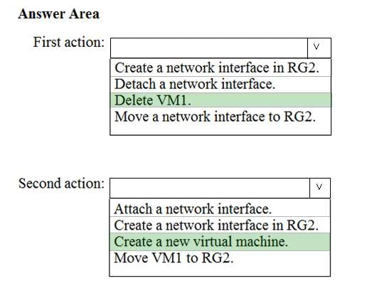

### Question 1

You have an Azure subscription named Subscription1. Subscription1 contains the resources in the following table: 

VNet1 is in RG1. VNet2 is in RG2. There is no connectivity between VNet1 and VNet2. An administrator
named Admin1 creates an Azure virtual machine VM1 in RG1. VM1 uses a disk named Disk1 and connects
to VNet1. Admin1 then installs a custom application in VM1.

You need to move the custom application to VNet2. The solution must minimize administrative effort.

Which two actions should you perform? To answer, select the appropriate options in the answer area.

[See the answer](#answer-1)

### Question 2

You have an Azure subscription named Subscription1 that is used by several departments at your
company. Subscription1 contains the resources in the following table.

Another administrator deploys a virtual machine named VM1 and an Azure Storage account named
Storage2 by using a single Azure Resource Manager template.

You need to view the template used for the deployment.
From the Azure Portal, for which blade can you view the template that was used for the deployment?

* A: Container1
* B: VM1
* C: Storage2
* D: RG1

[See the answer](#answer-2)

### Question 3

You have two subscriptions named Subscription1 and Subscription2. Each subscription is associated to a
different Azure AD tenant.

Subscription1 contains a virtual network named VNet1. VNet1 contains an Azure virtual machine named
VM1 and has an IP address space of 10.0.0.0/16.

Subscription2 contains a virtual network named VNet2. Vnet2 contains an Azure virtual machine named
VM2 and has an IP address space of 10.10.0.0/24.

You need to connect VNet1 to VNet2. What should you do first?
* A: Modify the IP address space of VNet2.
* B: Move VM1 to Subscription2.
* C: Provision virtual network gateways.
* D: Move VNet1 to Subscription2.

[See the answer](#answer-3)

### Question 4

You have an Azure Active Directory (Azure AD) tenant.

You have an existing Azure AD conditional access policy named Policy1. Policy1 enforces the use of Azure
AD-joined devices when members of the Global Administrators group authenticate to Azure AD from
untrusted locations.

You need to ensure that members of the Global Administrators group will also be forced to use multi-factor
authentication when authenticating from untrusted locations.

What should you do?

* A: From the Azure portal, modify session control of Policy1.
* B: From multi-factor authentication page, modify the user settings.
* C: From multi-factor authentication page, modify the service settings.
* D: From the Azure portal, modify grant control of Policy1.

[See the answer](#answer-4)

### Question 5

You plan to deploy five virtual machines to a virtual network subnet.

Each virtual machine will have a public IP address and a private IP address.

Each virtual machine requires the same inbound and outbound security rules.

What is the minimum number of network interfaces and network security groups that you require? To
answer, select the appropriate options in the answer area.

[See the answer](#answer-5)

### Question 6

You have an Azure subscription named Subscription1 that contains an Azure virtual machine named VM1.

VM1 is in a resource group named RG1.

VM1 runs services that will be used to deploy resources to RG1.

You need to ensure that a service running on VM1 can manage the resources in RG1 by using the identity
of VM1.

What should you do first?

* A: From the Azure portal, modify the Access control (IAM) settings of RG1.
* B: From the Azure portal, modify the Policies settings of RG1.
* C: From the Azure portal, modify the Access control (IAM) settings of VM1.
* D: From the Azure portal, modify the value of the Managed Service Identity option for VM1.

[See the answer](#answer-6)

### Question 7
You have an Azure subscription named Subscription1. 

Subscription1 contains the virtual networks in the following table:

Subscription1 contains the virtual machines in the following table:

The firewalls on all the virtual machines are configured to allow all ICMP traffic.

You add the peerings in the following table:

For each of the following statements, select Yes if the statement is true. Otherwise, select No.

[See the answer](#answer-7)

### Answer 1
**CORRECT ANSWERT:**

**Explanation:** 

We cannot just move a virtual machine between networks.  What we need to do is identify the disk used by
the VM, delete the VM itself while retaining the disk, and recreate the VM in the target virtual network and
then attach the original disk to it.

**Reference:**
* https://blogs.technet.microsoft.com/canitpro/2014/06/16/step-by-step-move-a-vm-to-a-different-vnet-on-azure
* https://4sysops.com/archives/move-an-azure-vm-to-another-virtual-network-vnet/#migrate-an-azure-vm-between-vnets

[Back to questions](#question-1)

### Answer 2

**CORRECT ANSWERT:** D

**Explanation:** 

You can verify the deployment by exploring the resource group from the Azure portal

**Reference:**
* https://docs.microsoft.com/en-us/azure/azure-resource-manager/templates/deployment-manager-tutorial
* https://docs.microsoft.com/en-us/azure/azure-resource-manager/templates/template-tutorial-create-first-template?tabs=azure-powershell

[Back to questions](#question-2)

### Answer 3
**CORRECT ANSWERT:** C

**Explanation:**

We require a virtual network gateway for VNet-to-VNet connectivity.

Incorrect Answers:

A: There is no need to modify the address space. If you update the address space for one VNet, the other
VNet automatically knows to route to the updated address space.

**Reference:**

* https://docs.microsoft.com/en-us/azure/vpn-gateway/vpn-gateway-howto-vnet-vnet-cli

[Back to questions](#question-3)

### Answer 4
**CORRECT ANSWERT:** D

**Explanation:**

We need to modify the grant control of Policy1.
The grant control can trigger enforcement of one or more controls.
- Require multi-factor authentication (Azure Multi-Factor Authentication)
- Require device to be marked as compliant (Intune)
- Require Hybrid Azure AD joined device
- Require approved client app
- Require app protection policy

**Note:** It is now possible to explicitly apply the Require MFA for admins rule.

**Reference:**
* https://docs.microsoft.com/en-us/azure/active-directory/conditional-access/untrusted-networks
* https://docs.microsoft.com/en-us/azure/active-directory/conditional-access/concept-baseline-protection

[Back to questions](#question-4)

### Answer 5
**CORRECT ANSWERT:** 

**Explanation:**

Box 1: 5

We have five virtual machines. Each virtual machine will have a public IP address and a private IP address. Each will require a network interface.

Box 2: 1

Each virtual machine requires the same inbound and outbound security rules. We can add tem to one group.

**Reference:**
* https://blogs.msdn.microsoft.com/igorpag/2016/05/14/azure-network-security-groups-nsg-best-practices-and-lessons-learned/
* https://docs.microsoft.com/en-us/azure/virtual-network/security-overview

[Back to questions](#question-5)

### Answer 6
**CORRECT ANSWERT:** D

**Explanation:**

Through a create process, Azure creates an identity in the Azure AD tenant that's trusted by the
subscription in use. After the identity is created, the identity can be assigned to one or more Azure service
instances.

**Reference:**
* https://docs.microsoft.com/en-us/azure/app-service/overview-managed-identity
* https://docs.microsoft.com/en-us/azure/active-directory/managed-identities-azure-resources/overview

[Back to questions](#question-6)

### Answer 7
**CORRECT ANSWERT:**

**Explanation:**
* VM1 on VNet1 can ping VM3 on VNet3 as VNet1 and VNet3 are peered.
* VM2 onVNet2 can ping VM3 on VNet3 as VNet2 and VNet3 are peered.
* VM2 cannot ping VM1 as there is not peering between VNet2 and VNet1.

**Reference:**
* https://docs.microsoft.com/en-us/azure/virtual-network/tutorial-connect-virtual-networks-portal

[Back to questions](#question-7)