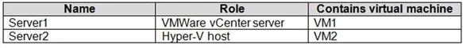
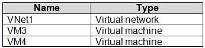
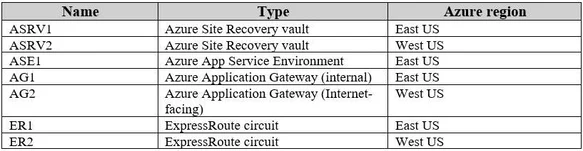
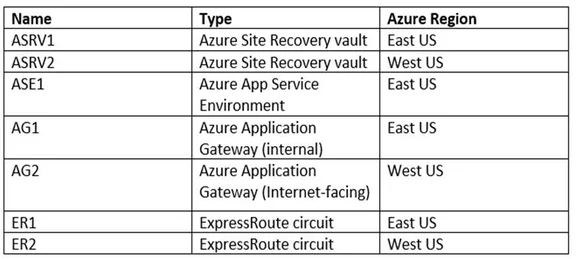
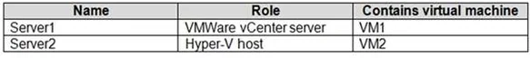
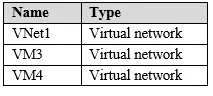
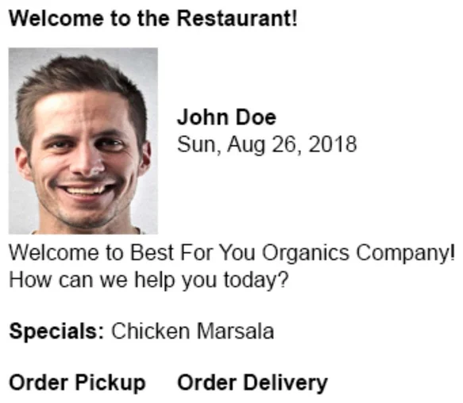
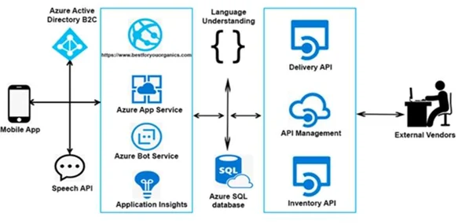
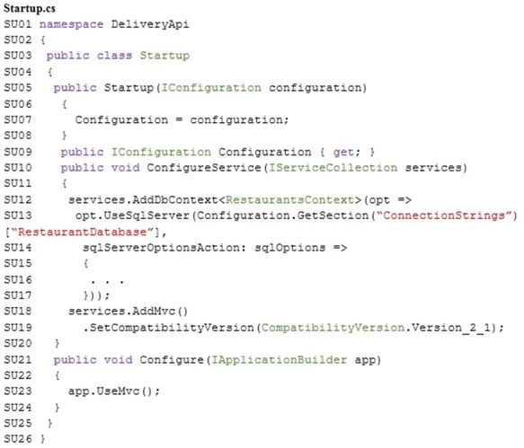

### Case-1

Humongous Insurance is an insurance company that has three offices in Miami, Tokyo and Bangkok. Each office has 5.000 users.

Existing Environment

Active Directory Environment

Humongous Insurance has a single-domain Active Directory forest named humongousinsurance.com. The functional level of the forest is Windows Server 2012.

You recently provisioned an Azure Active Directory (Azure AD) tenant.

Network Infrastructure

Each office has a local data center that contains all the servers for that office. Each office has a dedicated connection to the Internet.

Each office has several link load balancers that provide access to the servers.

Active Directory Issue

Several users in humongousinsurance.com have UPNs that contain special characters.

You suspect that some of the characters are unsupported in Azure AD.

Licensing Issue

You attempt to assign a license in Azure to several users and receive the following error message: "Licenses not assigned. License agreement failed for one user."

You verify that the Azure subscription has the available licenses.

Requirements

Planned Changes

Humongous Insurance plans to open a new office in Paris. The Paris office will contain 1,000 users who will be hired during the next 12 months. All the resources used by the Paris office users will be hosted in Azure.

Planned Azure AD Infrastructure

The on-premises Active Directory domain will be synchronized to Azure AD.

All client computers in the Paris office will be joined to an Azure AD domain.

Planned Azure Networking Infrastructure

You plan to create the following networking resources in a resource group named All_Resources:

- Default Azure system routes that will be the only routes used to route traffic

- A virtual network named Paris-VNet that will contain two subnets named Subnet1 and Subnet2

- A virtual network named ClientResources-VNet that will contain one subnet named ClientSubnet

- A virtual network named AllOffices-VNet that will contain two subnets named Subnet3 and Subnet4

You plan to enable peering between Paris-VNet and AllOffices-VNet. You will enable the Use remote gateways setting for the Paris-VNet peerings.

You plan to create a private DNS zone named humongousinsurance.local and set the registration network to the ClientResources-VNet virtual network.

Planned Azure Computer Infrastructure

Each subnet will contain several virtual machines that will run either Windows Server 2012 R2, Windows Server 2016, or Red Hat Linux.

Department Requirements

Humongous Insurance identifies the following requirements for the company's departments:

- Web administrators will deploy Azure web apps for the marketing department. Each web app will be added to a separate resource group. The initial configuration of the web apps will be identical. The web administrators have permission to deploy web apps to resource groups.

- During the testing phase, auditors in the finance department must be able to review all Azure costs from the past week.

Authentication Requirements

Users in the Miami office must use Azure Active Directory Seamless Single Sign-on (Azure AD Seamless SSO) when accessing resources in Azure.

### Case-2

Contoso, Ltd. is a consulting company that has a main office in Montreal and two branch offices in Seattle and New York.

The Montreal office has 2,000 employees. The Seattle office has 1,000 employees. The New York office has 200 employees.

All the resources used by Contoso are hosted on-premises.

Contoso creates a new Azure subscription. The Azure Active Directory (Azure AD) tenant uses a domain named contoso.onmicrosoft.com. The tenant uses the P1 pricing tier.

Existing Environment

The network contains an Active Directory forest named contoso.com. All domain controllers are configured as DNS servers and host the contoso.com DNS zone.

Contoso has finance, human resources, sales, research, and information technology departments. Each department has an organizational unit (OU) that contains all the accounts of that respective department. All the user accounts have the department attribute set to their respective department. New users are added frequently.

Contoso.com contains a user named User1.

All the offices connect by using private links.

Contoso has data centers in the Montreal and Seattle offices. Each data center has a firewall that can be configured as a VPN device.

All infrastructure servers are virtualized. The virtualization environment contains the servers in the following table.

Contoso uses two web applications named App1 and App2. Each instance on each web application requires 1GB of memory.

The Azure subscription contains the resources in the following table.

The network security team implements several network security groups (NSGs).

Planned Changes

Contoso plans to implement the following changes:

- Deploy Azure ExpressRoute to the Montreal office.

- Migrate the virtual machines hosted on Server1 and Server2 to Azure.

- Synchronize on-premises Active Directory to Azure Active Directory (Azure AD).

- Migrate App1 and App2 to two Azure web apps named WebApp1 and WebApp2.

Technical Requirements

Contoso must meet the following technical requirements:

- Ensure that WebApp1 can adjust the number of instances automatically based on the load and can scale up to five instances.

- Ensure that VM3 can establish outbound connections over TCP port 8080 to the applications servers in the Montreal office.

- Ensure that routing information is exchanged automatically between Azure and the routers in the Montreal office.

- Enable Azure Multi-Factor Authentication (MFA) for the users in the finance department only.

- Ensure that webapp2.azurewebsites.net can be accessed by using the name app2.contoso.com

- Connect the New York office to VNet1 over the Internet by using an encrypted connection.

- Create a workflow to send an email message when the settings of VM4 are modified.

- Create a custom Azure role named Role1 that is based on the Reader role.

- Minimize costs whenever possible.

### Case-3

ADatum Corporation is a financial company that has two main offices in New York and Los Angeles.

ADatum has a subsidiary named Fabrikam, Inc. that shares the Los Angeles office.

ADatum is conducting an initial deployment of Azure services to host new line-of-business applications and is preparing to migrate its existing on-premises workloads to Azure.

ADatum uses Microsoft Exchange Online for email.

Existing Environment

On-Premises Environment

The on-premises workloads run on virtual machines hosted in a VMware vSphere 6 infrastructure. All the virtual machines are members of an Active Directory forest named adatum.com and run Windows Server 2016.

The New York office uses an IP address space of 10.0.0.0/16. The Los Angeles office uses an IP address space of 10.10.0.0/16.

The offices connect by using a VPN provided by an ISP. Each office has one Azure ExpressRoute circuit that provides access to Azure services and Microsoft Online Services. Routing is implemented by using Microsoft peering.

The New York office has a virtual machine named VM1 that has the vSphere console installed.

Azure Environment

You provision the Azure infrastructure by using the Azure portal. The infrastructure contains the resources shown in the following table.

AG1 has two backend pools named Pool11 and Pool12. AG2 has two backend pools named Pool21 and Pool22.

Requirements

Planned Changes

ADatum plans to migrate the virtual machines from the New York office to the East US Azure region by using Azure Site Recovery.

Infrastructure Requirements

ADatum identifies the following infrastructure requirements:

- A new web app named App1 that will access third-parties for credit card processing must be deployed.

- A newly developed API must be implemented as an Azure function named App2. App2 will use a blob storage trigger. App2 must process new blobs immediately.

- The Azure infrastructure and the on-premises infrastructure must be prepared for the migration of the VMware virtual machines to Azure.

- The sizes of the Azure virtual machines that will be used to migrate the on-premises workloads must be identified.

- All migrated and newly deployed Azure virtual machines must be joined to the adatum.com domain.

- AG1 must load balance incoming traffic in the following manner:

    - http://corporate.adatum.com/video/* will be load balanced across Pool11.

    - http://corporate.adatum.com/images/* will be load balanced across Pool12.

- AG2 must load balance incoming traffic in the following manner:

    - http://www.adatum.com will be load balanced across Pool21.

    - http://fabrikam.com will be load balanced across Pool22.

- ER1 must route traffic between the New York office and platform as a service (PaaS) services in the East US Azure region, as long as ER1 is available.

- ER2 must route traffic between the Los Angeles office and the PaaS services in the West US region, as long as ER2 is available.

- ER1 and ER2 must be configured to fail over automatically.

Application Requirements

App2 must be available to connect directly to the private IP addresses of the Azure virtual machines. App2 will be deployed directly to an Azure virtual network.

Inbound and outbound communications to App1 must be controlled by using NSGs.

Pricing Requirements

ADatum identifies the following pricing requirements:

- The cost of App1 and App2 must be minimized

- The transactional charges of Azure Storage accounts must be minimized

### Case-4

ADatum Corporation is a financial company that has two main offices in New York and Los Angeles.

ADatum has a subsidiary named Fabrikam, Inc. that shares the Los Angeles office. 

ADatum is conducting an initial deployment of Azure services to host new line-of-business applications and is preparing to migrate its existing on-premises workloads to Azure. 

ADatum uses Microsoft Exchange Online for email.

Existing Environment

On-Premises Environment

The on-premises workloads run on virtual machines hosted in a VMware vSphere 6 infrastructure. All the virtual machines are members of an Active Directory forest named adatum.com and run Windows Server 2016.

The New York office uses an IP address space of 10.0.0.0/16. The Los Angeles office uses an IP address space of 10.10.0.0/16.

The offices connect by using a VPN provided by an ISP. Each office has one Azure ExpressRoute circuit that provides access to Azure services and Microsoft Online Services. Routing is implemented by using Microsoft peering.

The New York office has a virtual machine named VM1 that has the vSphere console installed.

Azure Environment

You provision the Azure infrastructure by using the Azure portal. The infrastructure contains the resources shown in the following table.

AG1 has two backend pools named Pool11 and Pool12. AG2 has two backend pools named Pool21 and Pool22.

Requirements

Planned Changes

ADatum plans to migrate the virtual machines from the New York office to the East US Azure region by using Azure Site Recovery.

Infrastructure Requirements

ADatum identifies the following infrastructure requirements:

- A new web app named App1 that will access third-parties for credit card processing must be deployed

- A newly developed API must be implemented as an Azure function named App2. App2 will use a blob storage trigger. App2 must process new blobs immediately.

- The Azure infrastructure and the on-premises infrastructure must be prepared for the migration of the VMware virtual machines to Azure.

- The sizes of the Azure virtual machines that will be used to migrate the on-premises workloads must be identified.

- All migrated and newly deployed Azure virtual machines must be joined to the adatum.com domain.

- AG1 must load balance incoming traffic in the following manner:

    1. http://corporate.adatum.com/video/* will be load balanced across Pool11

    2. http://corporate.adatum.com/images/* will be load balanced across Pool12

- AG2 must load balance incoming traffic in the following manner:

    1. http://www.adatum.com will be load balanced across Pool21

    2. http://www.fabrikam.com will be load balanced across Pool22

- ER1 must route traffic between the New York office and the platform as a service (PaaS) services in the East US Azure region, as long as ER1 is available.

- ER2 must route traffic between the Los Angeles office and the PaaS services in the West US region, as long as ER2 is available.

- ER1 and ER2 must be configured to fail over automatically.

Application Requirements

App2 must be able to connect directly to the private IP addresses of the Azure virtual machines. App2 will be deployed directly to an Azure virtual network.

Inbound and outbound communications to App1 must be controlled by using NSGs.

Pricing Requirements

ADatum identifies the following pricing requirements:

- The cost of App1 and App2 must be minimized.

- The transactional charges of Azure Storage accounts must be minimized.

### Case-5

Contoso, Ltd. is a consulting company that has a main office in Montreal and two branch offices in Seattle and New York.

The Montreal office has 2,000 employees. The Seattle office has 1,000 employees. The New York office has 200 employees.

All the resources used by Contoso are hosted on-premises.

Contoso creates a new Azure subscription. The Azure Active Directory (Azure AD) tenant uses a domain named contoso.onmicrosoft.com. The tenant uses the P1 pricing tier.

Existing Environment

The network contains an Active Directory forest named contoso.com. All domain controllers are configured as DNS servers and host the contoso.com DNS zone.

Contoso has finance, human resources, sales, research, and information technology departments. Each department has an organizational unit (OU) that contains all the accounts of that respective department. All the user accounts have the department attribute set to their respective department. New users are added frequently.

Contoso.com contains a user named User1.

All the offices connect by using private links.

Contoso has data centers in the Montreal and Seattle offices. Each data center has a firewall that can be configured as a VPN device.

All infrastructure servers are virtualized. The virtualization environment contains the servers in the following table.

Contoso uses two web applications named App1 and App2. Each instance on each web application requires 1GB of memory.

The Azure subscription contains the resources in the following table.

The network security team implements several network security groups (NSGs).

Planned Changes

Contoso plans to implement the following changes:

- Deploy Azure ExpressRoute to the Montreal office.

- Migrate the virtual machines hosted on Server1 and Server2 to Azure.

- Synchronize on-premises Active Directory to Azure Active Directory (Azure AD).

- Migrate App1 and App2 to two Azure web apps named WebApp1 and WebApp2.

Technical Requirements

Contoso must meet the following technical requirements:

- Ensure that WebApp1 can adjust the number of instances automatically based on the load and can scale up to five instances.

- Ensure that VM3 can establish outbound connections over TCP port 8080 to the applications servers in the Montreal office.

- Ensure that routing information is exchanged automatically between Azure and the routers in the Montreal office.

- Enable Azure Multi-Factor Authentication (MFA) for the users in the finance department only.

- Ensure that webapp2.azurewebsites.net can be accessed by using the name app2.contoso.com

- Connect the New York office to VNet1 over the Internet by using an encrypted connection.

- Create a workflow to send an email message when the settings of VM4 are modified.

- Create a custom Azure role named Role1 that is based on the Reader role.

- Minimize costs whenever possible.

### Case-6

ADatum Corporation is a financial company that has two main offices in New York and Los Angeles.

ADatum has a subsidiary named Fabrikam, Inc. that shares the Los Angeles office. 

ADatum is conducting an initial deployment of Azure services to host new line-of-business applications and is preparing to migrate its existing on-premises workloads to Azure. 

ADatum uses Microsoft Exchange Online for email.

Existing Environment

On-Premises Environment

The on-premises workloads run on virtual machines hosted in a VMware vSphere 6 infrastructure. All the virtual machines are members of an Active Directory forest named adatum.com and run Windows Server 2016.

The New York office uses an IP address space of 10.0.0.0/16. The Los Angeles office uses an IP address space of 10.10.0.0/16.

The offices connect by using a VPN provided by an ISP. Each office has one Azure ExpressRoute circuit that provides access to Azure services and Microsoft Online Services. Routing is implemented by using Microsoft peering.

The New York office has a virtual machine named VM1 that has the vSphere console installed.

Azure Environment

You provision the Azure infrastructure by using the Azure portal. The infrastructure contains the resources shown in the following table.

AG1 has two backend pools named Pool11 and Pool12. AG2 has two backend pools named Pool21 and Pool22.

Requirements

Planned Changes

ADatum plans to migrate the virtual machines from the New York office to the East US Azure region by using Azure Site Recovery.

Infrastructure Requirements

ADatum identifies the following infrastructure requirements:

- A new web app named App1 that will access third-parties for credit card processing must be deployed

- A newly developed API must be implemented as an Azure function named App2. App2 will use a blob storage trigger. App2 must process new blobs immediately.

- The Azure infrastructure and the on-premises infrastructure must be prepared for the migration of the VMware virtual machines to Azure.

- The sizes of the Azure virtual machines that will be used to migrate the on-premises workloads must be identified.

- All migrated and newly deployed Azure virtual machines must be joined to the adatum.com domain.

- AG1 must load balance incoming traffic in the following manner:

    1. http://corporate.adatum.com/video/* will be load balanced across Pool11

    2. http://corporate.adatum.com/images/* will be load balanced across Pool12

- AG2 must load balance incoming traffic in the following manner:

    1. http://www.adatum.com will be load balanced across Pool21

    2. http://www.fabrikam.com will be load balanced across Pool22

- ER1 must route traffic between the New York office and the platform as a service (PaaS) services in the East US Azure region, as long as ER1 is available.

- ER2 must route traffic between the Los Angeles office and the PaaS services in the West US region, as long as ER2 is available.

- ER1 and ER2 must be configured to fail over automatically.

Application Requirements

App2 must be able to connect directly to the private IP addresses of the Azure virtual machines. App2 will be deployed directly to an Azure virtual network.

Inbound and outbound communications to App1 must be controlled by using NSGs.

Pricing Requirements

ADatum identifies the following pricing requirements:

- The cost of App1 and App2 must be minimized.

- The transactional charges of Azure Storage accounts must be minimized.

### Case-7

Contoso, Ltd. is a consulting company that has a main office in Montreal and two branch offices in Seattle and New York.

The Montreal office has 2,000 employees. The Seattle office has 1,000 employees. The New York office has 200 employees.

All the resources used by Contoso are hosted on-premises.

Contoso created a new Azure subscription. The Azure Active Directory (Azure AD) tenant uses a domain named contoso.onmicrosoft.com. The tenant uses the P1 pricing tier.

Existing Environment

The network contains an Active Directory forest named contoso.com. All domain controllers are configured as DNS servers and host the contoso.com DNS zone.

Contoso has finance, human resources, sales, research, and information technology departments. Each department has an organizational unit (OU) that contains all the accounts of that respective department. All the user accounts have the department attribute set to their respective department. New users are added frequently.

Contoso.com contains a user named User1.

All the offices connect by using private links.

Contoso has data centers in the Montreal and Seattle offices. Each data center has a firewall that can be configured as a VPN device.

All infrastructure servers are virtualized. The virtualization environment contains the servers in the following table.

Contoso uses two web applications named App1 and App2. Each instance on each web application requires 1 GB of memory.

The Azure subscription contains the resources in the following table.

The network security team implements several network security groups (NSGs).

Requirements

Planned Changes

Contoso plans to implement the following changes:

- Deploy Azure ExpressRoute to the Montreal office

- Migrate the virtual machine hosted on Server1 and Server2 to Azure

- Synchronize on-premises Active Directory to Azure Active Directory (Azure AD)

- Migrate App1 and App2 to two Azure web apps named WebApp1 and WebApp2.

Technical Requirements

Contoso must meet the following technical requirements:

- Ensure that WebApp1 can adjust the number of instances automatically based on the load and can scale up to five instances

- Ensure that VM3 can establish outbound connections over TCP port 8080 to the applications servers in the Montreal office

- Ensure that routing information is exchanged automatically between Azure and the routers in the Montreal office

- Enable Azure Multi-Factor Authentication (MFA) for the users in the finance department only

- Ensure that webapp2.azurewebsites.net can be accessed by using the name app2.contoso.com

- Connect the New York office to VNet1 over the Internet by using an encrypted connection

- Create a workflow to send an email message when the settings of VM4 are modified

- Create a custom Azure role named Role1 that is based on the Reader role

- Minimize costs whenever possible

### Case-8

Humongous Insurance is an insurance company that has three offices in Miami, Tokyo and Bangkok. Each office has 5.000 users.

Existing Environment

Active Directory Environment

Humongous Insurance has a single-domain Active Directory forest named humongousinsurance.com. The functional level of the forest is Windows Server 2012.

You recently provisioned an Azure Active Directory (Azure AD) tenant.

Network Infrastructure

Each office has a local data center that contains all the servers for that office. Each office has a dedicated connection to the Internet.

Each office has several link load balancers that provide access to the servers.

Active Directory Issue

Several users in humongousinsurance.com have UPNs that contain special characters.

You suspect that some of the characters are unsupported in Azure AD.

Licensing Issue

You attempt to assign a license in Azure to several users and receive the following error message: "Licenses not assigned. License agreement failed for one user."

You verify that the Azure subscription has the available licenses.

Requirements

Planned Changes

Humongous Insurance plans to open a new office in Paris. The Paris office will contain 1,000 users who will be hired during the next 12 months. All the resources used by the Paris office users will be hosted in Azure.

Planned Azure AD Infrastructure

The on-premises Active Directory domain will be synchronized to Azure AD.

All client computers in the Paris office will be joined to an Azure AD domain.

Planned Azure Networking Infrastructure

You plan to create the following networking resources in a resource group named All_Resources:

- Default Azure system routes that will be the only routes used to route traffic

- A virtual network named Paris-VNet that will contain two subnets named Subnet1 and Subnet2

- A virtual network named ClientResources-VNet that will contain one subnet named ClientSubnet

- A virtual network named AllOffices-VNet that will contain two subnets named Subnet3 and Subnet4

You plan to enable peering between Paris-VNet and AllOffices-VNet. You will enable the Use remote gateways setting for the Paris-VNet peerings.

You plan to create a private DNS zone named humongousinsurance.local and set the registration network to the ClientResources-VNet virtual network.

Planned Azure Computer Infrastructure

Each subnet will contain several virtual machines that will run either Windows Server 2012 R2, Windows Server 2016, or Red Hat Linux.

Department Requirements

Humongous Insurance identifies the following requirements for the company's departments:

- Web administrators will deploy Azure web apps for the marketing department. Each web app will be added to a separate resource group. The initial configuration of the web apps will be identical. The web administrators have permission to deploy web apps to resource groups.

- During the testing phase, auditors in the finance department must be able to review all Azure costs from the past week.

Authentication Requirements

Users in the Miami office must use Azure Active Directory Seamless Single Sign-on (Azure AD Seamless SSO) when accessing resources in Azure.

### Case-9

Contoso, Ltd. is a consulting company that has a main office in Montreal and two branch offices in Seattle and New York.

The Montreal office has 2,000 employees. The Seattle office has 1,000 employees. The New York office has 200 employees.

All the resources used by Contoso are hosted on-premises.

Contoso creates a new Azure subscription. The Azure Active Directory (Azure AD) tenant uses a domain named contoso.onmicrosoft.com. The tenant uses the P1 pricing tier.

Existing Environment

The network contains an Active Directory forest named contoso.com. All domain controllers are configured as DNS servers and host the contoso.com DNS zone.

Contoso has finance, human resources, sales, research, and information technology departments. Each department has an organizational unit (OU) that contains all the accounts of that respective department. All the user accounts have the department attribute set to their respective department. New users are added frequently.

Contoso.com contains a user named User1.

All the offices connect by using private links.

Contoso has data centers in the Montreal and Seattle offices. Each data center has a firewall that can be configured as a VPN device.

All infrastructure servers are virtualized. The virtualization environment contains the servers in the following table.

Contoso uses two web applications named App1 and App2. Each instance on each web application requires 1GB of memory.

The Azure subscription contains the resources in the following table.

The network security team implements several network security groups (NSGs).

Planned Changes

Contoso plans to implement the following changes:

- Deploy Azure ExpressRoute to the Montreal office.

- Migrate the virtual machines hosted on Server1 and Server2 to Azure.

- Synchronize on-premises Active Directory to Azure Active Directory (Azure AD).

- Migrate App1 and App2 to two Azure web apps named WebApp1 and WebApp2.

Technical Requirements

Contoso must meet the following technical requirements:

- Ensure that WebApp1 can adjust the number of instances automatically based on the load and can scale up to five instances.

- Ensure that VM3 can establish outbound connections over TCP port 8080 to the applications servers in the Montreal office.

- Ensure that routing information is exchanged automatically between Azure and the routers in the Montreal office.

- Enable Azure Multi-Factor Authentication (MFA) for the users in the finance department only.

- Ensure that webapp2.azurewebsites.net can be accessed by using the name app2.contoso.com

- Connect the New York office to VNet1 over the Internet by using an encrypted connection.

- Create a workflow to send an email message when the settings of VM4 are modified.

- Create a custom Azure role named Role1 that is based on the Reader role.

- Minimize costs whenever possible.

### Case-10

Background

Best For You Organics Company is a global restaurant franchise that has multiple locations. The company wants to enhance user experiences and vendor integrations. The company plans to implement automated mobile ordering and delivery services.

Best For You Organics hosts an Azure web app at the URL https://www.bestforyouorganics.com. Users can use the web app to browse restaurant location, menu items, nutritional information, and company information. The company developed and deployed a cross-platform mobile app.

Requirements

Chatbot

You must develop a chatbot by using the Bot Builder SDK and Language Understanding Intelligence Service (LUIS). The chatbot must allow users to order food for pickup or delivery.

The chatbot must meet the following requirements:

- Ensure that chatbot is secure by using the Bot Framework connector.

- Use natural language processing and speech recognition so that users can interact with the chatbot by using text and voice. Processing must be server-based.

- Alert users about promotions at local restaurants.

- Enable users to place an order for delivery or pickup by using their voice.

- Greet the user upon sign-in by displaying a graphical interface that contains action buttons.

- The chatbot greeting interface must match the formatting of the following example:

Vendor API

Vendors receive and provide updates for the restaurant inventory and delivery services by using Azure API Management hosted APIs. Each vendor uses their own subscription to access each of the APIs.

APIs must meet the following conditions:

- API usage must not exceed 5,000 calls and 50,000 kilobytes of bandwidth per hour per vendor.

- If a vendor is nearing the number of calls or bandwidth limit, the API must trigger email notifications to the vendor.

- API must prevent API usage spikes on a per-subscription basis by limiting the call rate to 100 calls per minute.

- The Inventory API must be written by using ASP.NET Core and Node.js.

- The API must be updated to provide an interface to Azure SQL Database objects must be managed by using code.

- The Delivery API must be protected by using the OAuth 2.0 protocol with Azure Active Directory (Azure AD) when called from the Azure web app. You register the Delivery API and web app in Azure AD. You enable OAuth 2.0 in the web app.

- The delivery API must update the Products table, the Vendor transactions table, and the Billing table in a single transaction.

The Best For You Organics Company architecture team has created the following diagram depicting the expected deployments into Azure:

Architecture

Issues

Delivery API

The Delivery API intermittently throws the following exception: "System.Data.Entity.Core.EntityCommandExecutionException: An error occurred while executing the command definition. See the inner exception for details. --> System.Data.SqlClient.SqlException: A transport-level error has occurred when receiving results from the server. (provider: Session Provider, error: 19 – Physical connection is not usable)"

Chatbot greeting

The chatbot’s greeting does not show the user’s name. You need to debug the chatbot locally.

Language processing

Users report that the bot fails to understand when a customer attempts to order dishes that use Italian names.

App code

Relevant portions of the app files are shown below. Line numbers are included for reference only and include a two-character prefix that denotes the specific file to which they belong.

