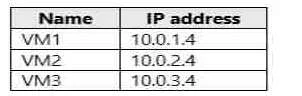
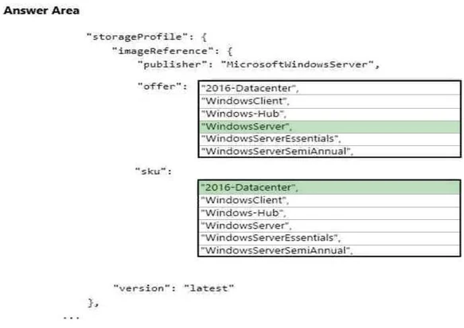

### Question 1

You have an Azure subscription named Subscription1. Subscription1 contains the resources in the following table:


VNet1 is in RG1. VNet2 is in RG2. There is no connectivity between VNet1 and VNet2.

An administrator named Admin1 creates an Azure virtual machine VM1 in RG1. VM1 uses a disk named Disk1 and connects to VNet1. Admin1 then installs a custom application in VM1.

You need to move the custom application to VNet2. The solution must minimize administrative effort.

Which two actions should you perform? To answer, select the appropriate options in the answer area.


[See the answer](#answer-1)

### Question 2

You have an Azure subscription named Subscription1 that is used by several departments at your company. Subscription1 contains the resources in the following table.


Another administrator deploys a virtual machine named VM1 and an Azure Storage account named Storage2 by using a single Azure Resource Manager template.

You need to view the template used for the deployment.

From the Azure Portal, for which blade can you view the template that was used for the deployment?

* A: Container1

* B: VM1

* C: Storage2

* D: RG1

[See the answer](#answer-2)

### Question 3

You have two subscriptions named Subscription1 and Subscription2. Each subscription is associated to a different Azure AD tenant.

Subscription1 contains a virtual network named VNet1. VNet1 contains an Azure virtual machine named VM1 and has an IP address space of 10.0.0.0/16.

Subscription2 contains a virtual network named VNet2. Vnet2 contains an Azure virtual machine named VM2 and has an IP address space of 10.10.0.0/24.

You need to connect VNet1 to VNet2.

What should you do first?

* A: Modify the IP address space of VNet2.

* B: Move VM1 to Subscription2.

* C: Provision virtual network gateways.

* D: Move VNet1 to Subscription2.

[See the answer](#answer-3)

### Question 4

You have an Azure Active Directory (Azure AD) tenant.

You have an existing Azure AD conditional access policy named Policy1. Policy1 enforces the use of Azure AD-joined devices when members of the Global Administrators group authenticate to Azure AD from untrusted locations.

You need to ensure that members of the Global Administrators group will also be forced to use multi-factor authentication when authenticating from untrusted locations.

What should you do?

* A: From the Azure portal, modify session control of Policy1.

* B: From multi-factor authentication page, modify the user settings.

* C: From multi-factor authentication page, modify the service settings.

* D: From the Azure portal, modify grant control of Policy1.

[See the answer](#answer-4)

### Question 5

You plan to deploy five virtual machines to a virtual network subnet.

Each virtual machine will have a public IP address and a private IP address.

Each virtual machine requires the same inbound and outbound security rules.

What is the minimum number of network interfaces and network security groups that you require? To answer, select the appropriate options in the answer area.


[See the answer](#answer-5)

### Question 6

You have an Azure subscription named Subscription1 that contains an Azure virtual machine named VM1.

VM1 is in a resource group named RG1.

VM1 runs services that will be used to deploy resources to RG1.

You need to ensure that a service running on VM1 can manage the resources in RG1 by using the identity of VM1.

What should you do first?

* A: From the Azure portal, modify the Access control (IAM) settings of RG1.

* B: From the Azure portal, modify the Policies settings of RG1.

* C: From the Azure portal, modify the Access control (IAM) settings of VM1.

* D: From the Azure portal, modify the value of the Managed Service Identity option for VM1.

[See the answer](#answer-6)

### Question 7

You have an Azure subscription named Subscription1. Subscription1 contains the virtual networks in the following table:


Subscription1 contains the virtual machines in the following table:


The firewalls on all the virtual machines are configured to allow all ICMP traffic.

You add the peerings in the following table:


For each of the following statements, select Yes if the statement is true. Otherwise, select No.


[See the answer](#answer-7)

### Question 8

You have an Azure Active Directory (Azure AD) tenant.

You need to create a conditional access policy that requires all users to use multi-factor authentication when they access the Azure portal.

Which three settings should you configure? To answer, select the appropriate settings in the answer area.


[See the answer](#answer-8)

### Question 9

You configure Azure AD Connect for Azure Active Directory Seamless Single Sign-On (Azure AD Seamless SSO) for an on-premises network.

Users report that when they attempt to access myapps.microsoft.com, they are prompted multiple times to sign in and are forced to use an account name that ends with onmicrosoft.com.

You discover that there is a UPN mismatch between Azure AD and the on-premises Active Directory.

You need to ensure that the users can use single-sign on (SSO) to access Azure resources.

What should you do first?

* A: From on-premises network, deploy Active Directory Federation Services (AD FS).

* B: From Azure AD, add and verify a custom domain name.

* C: From on-premises network, request a new certificate that contains the Active Directory domain name.

* D: From the server that runs Azure AD Connect, modify the filtering options.

[See the answer](#answer-9)

### Question 10

You have an Active Directory forest named contoso.com.

You install and configure Azure AD Connect to use password hash synchronization as the single sign-on (SSO) method. Staging mode is enabled.

You review the synchronization results and discover that the Synchronization Service Manager does not display any sync jobs.

You need to ensure that the synchronization completes successfully.

What should you do?

* A: From Azure PowerShell, run Start-AdSyncSyncCycle –PolicyType Initial.

* B: Run Azure AD Connect and set the SSO method to Pass-through Authentication.

* C: From Synchronization Service Manager, run a full import.

* D: Run Azure AD Connect and disable staging mode.

[See the answer](#answer-10)

### Question 11

You have an Azure Active Directory (Azure AD) tenant that has the initial domain name.

You have a domain name of contoso.com registered at a third-party registrar.

You need to ensure that you can create Azure AD users that have names containing a suffix of @contoso.com.

Which three actions should you perform in sequence? To answer, move the appropriate cmdlets from the list of cmdlets to the answer area and arrange them in the correct order.


[See the answer](#answer-11)

### Question 12

You have an Azure subscription that contains 100 virtual machines.

You regularly create and delete virtual machines.

You need to identify unattached disks that can be deleted.

What should you do?

* A: From Microsoft Azure Storage Explorer, view the Account Management properties.

* B: From Azure Cost Management, create a Cost Management report.

* C: From the Azure portal, configure the Advisor recommendations.

* D: From Azure Cost Management, open the Optimizer tab and create a report.

[See the answer](#answer-12)

### Question 13

You have an Azure subscription that contains 10 virtual machines.

You need to ensure that you receive an email message when any virtual machines are powered off, restarted, or deallocated.

What is the minimum number of rules and action groups that you require?

* A: three rules and three action groups

* B: one rule and one action group

* C: three rules and one action group

* D: one rule and three action groups

[See the answer](#answer-13)

### Question 14

You plan to automate the deployment of a virtual machine scale set that uses the Windows Server 2016 Datacenter image.

You need to ensure that when the scale set virtual machines are provisioned, they have web server components installed.

Which two actions should you perform? Each correct answer presents part of the solution.

* A: Upload a configuration script.

* B: Create an automation account.

* C: Create a new virtual machine scale set in the Azure portal.

* D: Create an Azure policy.

* E: Modify the extensionProfile section of the Azure Resource Manager template.

[See the answer](#answer-14)

### Question 15

You have an Azure subscription.

You have 100 Azure virtual machines.

You need to quickly identify underutilized virtual machines that can have their service tier changed to a less expensive offering.

Which blade should you use?

* A: Customer insights

* B: Monitor

* C: Advisor

* D: Metrics

[See the answer](#answer-15)

### Question 16

An app uses a virtual network with two subnets. One subnet is used for the application server. The other subnet is used for a database server. A network virtual appliance (NVA) is used as a firewall.

Traffic destined for one specific address prefix is routed to the NVA and then to an on-premises database server that stores sensitive data. A Border Gateway Protocol (BGP) route is used for the traffic to the on-premises database server.

You need to recommend a method for creating the user-defined route.

Which two options should you recommend? Each correct answer presents a complete solution.

* A: For the virtual network configuration, use a VPN.

* B: For the next hop type, use a virtual network peering.

* C: For the virtual network configuration, use Azure ExpressRoute.

* D: For the next hop type, use a virtual network gateway.

[See the answer](#answer-16)

### Question 17

You manage a solution in Azure that consists of a single application which runs on a virtual machine (VM).

Traffic to the application has increased dramatically.

The application must not experience any downtime and scaling must be dynamically defined.

You need to define an auto-scale strategy to ensure that the VM can handle the workload.

Which three options should you recommend? Each correct answer presents a complete solution.

* A: Deploy application automatic vertical scaling.

* B: Create a VM availability set.

* C: Create a VM scale set.

* D: Deploy application automatic horizontal scaling.

* E: Deploy a custom auto-scale implementation.

[See the answer](#answer-17)

### Question 18

You develop a web app that uses the tier D1 app service plan by using the Web Apps feature of Microsoft Azure App Service.

Spikes in traffic have caused increases in page load times.

You need to ensure that the web app automatically scales when CPU load is about 85 percent and minimize costs.

Which four actions should you perform in sequence? To answer, move the appropriate actions from the list of actions to the answer area and arrange them in the correct order.


[See the answer](#answer-18)

### Question 19

You have Azure subscription that contains a virtual network named VNet1. VNet1 uses an IP address space of 10.0.0.0/16 and contains the subnets in the following table.


Subnet1 contains a virtual appliance named VM1 that operates as a router.

You create a routing table named RT1.

You need to route all inbound traffic to VNet1 through VM1.

How should you configure RT1? To answer, select the appropriate options in the answer area.


[See the answer](#answer-19)

### Question 20

You are implementing authentication for applications in your company. You plan to implement self-service password reset (SSPR) and multifactor authentication (MFA) in Azure Active Directory (Azure AD).

You need to select authentication mechanisms that can be used for both MFA and SSPR.

Which two authentication methods should you use? Each correct answer presents a complete solution.

* A: Short Message Service (SMS) messages

* B: Authentication app

* C: Email addresses

* D: Security questions

* E: App passwords

[See the answer](#answer-20)

### Question 21

You have an Azure subscription that contains 10 virtual networks. The virtual networks are hosted in separate resource groups.

Another administrator plans to create several network security groups (NSGs) in the subscription.

You need to ensure that when an NSG is created, it automatically blocks TCP port 8080 between the virtual networks.

Solution: You create a resource lock, and then you assign the lock to the subscription.

Does this meet the goal?

* A: Yes

* B: No

[See the answer](#answer-21)

### Question 22

You have an Azure subscription named Subscription1. Subscription1 contains a resource group named RG1. RG1 contains resources that were deployed by using templates.

You need to view the date and time when the resources were created in RG1.

Solution: From the RG1 blade, you click Automation script.

Does this meet the goal?

* A: Yes

* B: No

[See the answer](#answer-22)

### Question 23

You have an Azure subscription named Subscription1. Subscription1 contains a resource group named RG1. RG1 contains resources that were deployed by using templates.

You need to view the date and time when the resources were created in RG1.

Solution: From the Subscription blade, you select the subscription, and then click Resource providers.

Does this meet the goal?

* A: Yes

* B: No

[See the answer](#answer-23)

### Question 24

You have an Azure subscription named Subscription1. Subscription1 contains a resource group named RG1. RG1 contains resources that were deployed by using templates.

You need to view the date and time when the resources were created in RG1.

Solution: From the RG1 blade, you click Deployments.

Does this meet the goal?

* A: Yes

* B: No

[See the answer](#answer-24)

### Question 25

You have several Azure virtual machines on a virtual network named VNet1.

You configure an Azure Storage account as shown in the following exhibit.


Use the drop-down menus to select the answer choice that completes each statement based on the information presented in the graphic.


[See the answer](#answer-25)

### Question 26

You plan to create an Azure Storage account in the Azure region of East US 2.

You need to create a storage account that meets the following requirements:

 - Replicates synchronously

 - Remains available if a single data center in the region fails

How should you configure the storage account? To answer, select the appropriate options in the answer area.


[See the answer](#answer-26)

### Question 27

You have an on-premises file server named Server1 that runs Windows Server 2016.

You have an Azure subscription that contains an Azure file share.

You deploy an Azure File Sync Storage Sync Service, and you create a sync group.

You need to synchronize files from Server1 to Azure.

Which three actions should you perform in sequence? To answer, move the appropriate actions from the list of actions to the answer area and arrange them in the correct order.


[See the answer](#answer-27)

### Question 28

You plan to use the Azure Import/Export service to copy files to a storage account.

Which two files should you create before you prepare the drives for the import job? Each correct answer presents part of the solution.

* A: a dataset CSV file

* B: an XML manifest file

* C: a driveset CSV file

* D: a PowerShell PS1 file

* E: a JSON configuration file

[See the answer](#answer-28)

### Question 29

You create an Azure Storage account named contosostorage.

You plan to create a file share named data. 

Users need to map a drive to the data file share from home computers that run Windows 10.

Which outbound port should you open between the home computers and the data file share?

* A: 80

* B: 443

* C: 445

* D: 3389

[See the answer](#answer-29)

### Question 30

You have an Azure subscription named Subscription1.

Subscription1 contains the virtual machines in the following table:



Subscription1 contains a virtual network named VNet1 that has the subnets in the following table.


VM3 has multiple network adapters, including a network adapter named NIC3. IP forwarding is enabled on NIC3. Routing is enabled on VM3.

You create a route table named RT1 that contains the routers in the following table.


You apply RT1 to Subnet1 and Subnet2.

For each of the following statements, select Yes if the statement is true. Otherwise, select No.


[See the answer](#answer-30)

### Question 31

You have a virtual network named VNet1 that has the configuration shown in the following exhibit.


Use the drop-down menus to select the answer choice that completes each statement based on the information presented in the graphic.


[See the answer](#answer-31)

### Question 32

You have an Azure subscription named Subscription1. Subscription1 contains the resources in the following table.


In Azure, you create a private DNS zone named adatum.com. You set the registration virtual network to VNet2. The adatum.com zone is configured is shown in the following exhibit.


For each of the following statements, select Yes if the statement is true. Otherwise, select No.


[See the answer](#answer-32)

### Question 33

You have a virtual network named VNet1 as shown in the exhibit. (Click the Exhibit tab.)


No devices are connected to VNet1.

You plan to peer VNet1 to another virtual network named VNet2 in the same region. VNet2 has an address space of 10.2.0.0/16.

You need to create the peering.

What should you do first?

* A: Add a gateway subnet to VNet1.

* B: Create a subnet on VNet1 and VNet2

* C: Modify the address space of VNet1

* D: Configure a service endpoint on VNet2

[See the answer](#answer-33)

### Question 34

Your company plans to store several documents on a public website.

You need to create a container named bios that will host the documents in the storagelod8322489 storage account. The solution must ensure anonymous access and must ensure that users can browse folders in the container.

What should you do from the Azure portal?

[See the answer](#answer-34)

### Question 35

Your company plans to host in Azure the source files of several line-of-business applications.

You need to create an Azure file share named corpsoftware in the storagelod8322489 storage account. The solution must ensure that corpsoftware can store only up to 250 GB of data.

What should you do from the Azure portal?

[See the answer](#answer-35)

### Question 36

You plan to back up all the Azure virtual machines in your Azure subscription at 02:00 Coordinated Universal Time (UTC) daily.

You need to prepare the Azure environment to ensure that any new virtual machines can be configured quickly for backup. The solution must ensure that all the daily backups performed at 02:00 UTC are stored for only 90 days.

What should you do from your Recovery Services vault on the Azure portal?

[See the answer](#answer-36)

### Question 37

You plan to connect several virtual machines to the VNET01-USEA2 virtual network.

In the Web-RGlod8322489 resource group, you need to create a virtual machine that uses the Standard_B2ms size named Web01 that runs Windows Server 2016. Web01 must be added to an availability set.

What should you do from the Azure portal?

[See the answer](#answer-37)

### Question 38

You recently created a virtual machine named Web01.

You need to attach a new 80-GB standard data disk named Web01-Disk1 to Web01.

What should you do from the Azure portal?

[See the answer](#answer-38)

### Question 39

You plan to allow connections between the VNET01-USEA2 and VNET01-USWE2 virtual networks.

You need to ensure that virtual machines can communicate across both virtual networks by using their private IP address.

The solution must NOT require any virtual network gateways.

What should you do from the Azure portal?

[See the answer](#answer-39)

### Question 40

You plan to host several secured websites on Web01.

You need to allow HTTPS over TCP port 443 to Web01 and to prevent HTTP over TCP port 80 to Web01.

What should you do from the Azure portal?

[See the answer](#answer-40)

### Question 41

Your on-premises network uses an IP address range of 131.107.2.0 to 131.107.2.255.

You need to ensure that only devices from the on-premises network can connect to the rg1lod8322490n1 storage account.

What should you do from the Azure portal?

[See the answer](#answer-41)

### Question 42

You plan to store media files in the rg1lod8322490 storage account.

You need to configure the storage account to store the media files. The solution must ensure that only users who have access keys can download the media files and that the files are accessible only over HTTPS.

What should you do from the Azure portal?

[See the answer](#answer-42)

### Question 43

Another administrator attempts to establish connectivity between two virtual networks named VNET1 and VNET2. The administrator reports that connections across the virtual networks fail.

You need to ensure that network connections can be established successfully between VNET1 and VNET2 as quickly as possible.

What should you do from the Azure portal?

[See the answer](#answer-43)

### Question 44

You plan to configure VM1 to be accessible from the internet.

You need to add a public IP address to the network interface used by VM1.

What should you do from the Azure portal?

[See the answer](#answer-44)

### Question 45

You need to allow RDP connections over TCP port 3389 to VM1 from the Internet. The solutions must prevent connections from the Internet over all other TCP ports.

What should you do from the Azure portal?

[See the answer](#answer-45)

### Question 46

You plan to deploy 20 Azure virtual machines by using an Azure Resource Manager template. The virtual machines will run the latest version of Windows Server 2016 Datacenter by using an Azure Marketplace image.

You need to complete the storageprofile section of the template.

How should you complete the storageProfile section? To answer, select the appropriate options in the answer area.


[See the answer](#answer-46)

### Question 47

You have an Azure tenant that contains two subscriptions named Subscription1 and Subscription2. 

In Subscription1, you deploy a virtual machine named Server1 that runs Windows Server 2016. Server1 uses managed disks.

You need to move Server1 to Subscription2. The solution must minimize administration effort.

What should you do first?

* A: Create a new virtual machine in Subscription2

* B: In Subscription2, create a copy of the virtual disk

* C: Create a snapshot of the virtual disk

* D: From Azure PowerShell, run the Move-AzureRmResource cmdlet

[See the answer](#answer-47)

### Question 48

You have an Azure subscription.

You have an on-premises virtual machine named VM1. The settings for VM1 are shown in the exhibit.


You need to ensure that you can use the disks attached to VM1 as a template for Azure virtual machines.

What should you modify on VM1?

* A: the processor

* B: the memory

* C: Integration Services

* D: the hard drive

* E: the network adapters

[See the answer](#answer-48)

### Question 49

You have an Azure policy as shown in the following exhibit.


What is the effect of the policy?

* A: You can create Azure SQL servers in any resource group within Subscription 1.

* B: You can create Azure SQL servers in ContosoRG1 only.

* C: You are prevented from creating Azure SQL Servers in ContosoRG1 only.

* D: You are prevented from creating Azure SQL servers anywhere in Subscription 1.

[See the answer](#answer-49)

### Question 50

You have an Azure subscription that is used by four departments in your company. The subscription contains 10 resource groups. Each department uses resources in several resource groups.

You need to send a report to the finance department. The report must detail the costs for each department.

Which three actions should you perform in sequence? To answer, move the appropriate actions from the list of actions to the answer area and arrange them in the correct order.


[See the answer](#answer-50)

### Answer 1

**CORRECT ANSWER:**


**Explanation:**

We cannot just move a virtual machine between networks.  What we need to do is identify the disk used by the VM, delete the VM itself while retaining the disk, and recreate the VM in the target virtual network and then attach the original disk to it.

**Reference:**

https://blogs.technet.microsoft.com/canitpro/2014/06/16/step-by-step-move-a-vm-to-a-different-vnet-on-azure/

https://4sysops.com/archives/move-an-azure-vm-to-another-virtual-network-vnet/#migrate-an-azure-vm-between-vnets

[Back to question](#question-1)

### Answer 2

**CORRECT ANSWER:** D

**Explanation:**

You can verify the deployment by exploring the resource group from the Azure portal

**Reference:**

https://docs.microsoft.com/en-us/azure/azure-resource-manager/templates/deployment-manager-tutorial

https://docs.microsoft.com/en-us/azure/azure-resource-manager/templates/template-tutorial-create-first-template?tabs=azure-powershell

[Back to question](#question-2)

### Answer 3

**CORRECT ANSWER:** C

**Explanation:**

We require a virtual network gateway for VNet-to-VNet connectivity.

Incorrect Answers:

A: There is no need to modify the address space. If you update the address space for one VNet, the other VNet automatically knows to route to the updated address space.

**Reference:**

https://docs.microsoft.com/en-us/azure/vpn-gateway/vpn-gateway-howto-vnet-vnet-cli

[Back to question](#question-3)

### Answer 4

**CORRECT ANSWER:** D

**Explanation:**

We need to modify the grant control of Policy1.

The grant control can trigger enforcement of one or more controls.

- Require multi-factor authentication (Azure Multi-Factor Authentication)

- Require device to be marked as compliant (Intune)

- Require Hybrid Azure AD joined device

- Require approved client app

- Require app protection policy

>**Note:** It is now possible to explicitly apply the Require MFA for admins rule.

**Reference:**

https://docs.microsoft.com/en-us/azure/active-directory/conditional-access/untrusted-networks

https://docs.microsoft.com/en-us/azure/active-directory/conditional-access/concept-baseline-protection

[Back to question](#question-4)

### Answer 5

**CORRECT ANSWER:**


**Explanation:**

Box 1: 5

We have five virtual machines. Each virtual machine will have a public IP address and a private IP address. Each will require a network interface.

Box 2: 1

Each virtual machine requires the same inbound and outbound security rules. We can add tem to one group.

**Reference:**

https://blogs.msdn.microsoft.com/igorpag/2016/05/14/azure-network-security-groups-nsg-best-practices-and-lessons-learned/

https://docs.microsoft.com/en-us/azure/virtual-network/security-overview

[Back to question](#question-5)

### Answer 6

**CORRECT ANSWER:** D

**Explanation:**

Through a create process, Azure creates an identity in the Azure AD tenant that's trusted by the subscription in use. After the identity is created, the identity can be assigned to one or more Azure service instances.

**Reference:**

https://docs.microsoft.com/en-us/azure/app-service/overview-managed-identity

https://docs.microsoft.com/en-us/azure/active-directory/managed-identities-azure-resources/overview

[Back to question](#question-6)

### Answer 7

**CORRECT ANSWER:**


**Explanation:**

VM1 on VNet1 can ping VM3 on VNet3 as VNet1 and VNet3 are peered.

VM2 onVNet2 can ping VM3 on VNet3 as VNet2 and VNet3 are peered.

VM2 cannot ping VM1 as there is not peering between VNet2 and VNet1.

**Reference:**

https://docs.microsoft.com/en-us/azure/virtual-network/tutorial-connect-virtual-networks-portal

[Back to question](#question-7)

### Answer 8

**CORRECT ANSWER:**


**Reference:**

https://docs.microsoft.com/en-us/azure/active-directory/conditional-access/app-based-mfa

[Back to question](#question-8)

### Answer 9

**CORRECT ANSWER:** B

**Explanation:**

The UPN is used by Azure AD to allow users to sign-in. The UPN that a user can use, depends on whether or not the domain has been verified. If the domain has been verified, then a user with that suffix will be allowed to sign-in to Azure AD.

To do so, you need to add and verify a custom domain in Azure AD before you can start syncing the users.

**Reference:**

https://docs.microsoft.com/en-us/azure/active-directory/hybrid/plan-connect-design-concepts#azure-ad-sign-in

https://docs.microsoft.com/en-us/azure/active-directory/hybrid/tshoot-connect-objectsync#detect-upn-mismatch-if-object-is-synced-to-azure-active-directory

[Back to question](#question-9)

### Answer 10

**CORRECT ANSWER:** D

**Explanation:**

In staging mode, the server is active for import and synchronization, but it does not run any exports. A server in staging mode is not running password sync or password writeback, even if you selected these features during installation. When you disable staging mode, the server starts exporting, enables password sync, and enables password writeback.

**Reference:**

https://docs.microsoft.com/en-us/azure/active-directory/hybrid/how-to-connect-sync-staging-server

https://docs.microsoft.com/en-us/azure/active-directory/hybrid/how-to-connect-sync-operations

[Back to question](#question-10)

### Answer 11

**CORRECT ANSWER:**


**Explanation:**

1. Add your custom domain name to Azure AD.

2. Add your DNS information to the domain registrar.

3. Verify your custom domain name.

**Reference:**

https://docs.microsoft.com/en-us/azure/active-directory/fundamentals/add-custom-domain

[Back to question](#question-11)

### Answer 12

**CORRECT ANSWER:** D

**Explanation:**

You can find unused disks in the Azure Storage Explorer console. Once you drill down to the Blob containers under a storage account, you can see the lease state of the residing VHD (the lease state determines if the VHD is being used by any resource) and the VM to which it is leased out. If you find that the lease state and the VM fields are blank, it means that the VHD in question is unused.

>**Note:** The ManagedBy property stores the Id of the VM to which Managed Disk is attached to. If the ManagedBy property is $null then it means that the Managed Disk is not attached to a VM

**Reference:**

https://cloud.netapp.com/blog/reduce-azure-storage-costs

[Back to question](#question-12)

### Answer 13

**CORRECT ANSWER:** C

**Explanation:**

We need a separate rule for each condition. We also need a separate action group for each action type that we want to fire when the rule is met.

In this scenario we have three conditions (when any virtual machines are powered off, restarted, or deallocated) and one action type (you are sent an email message).

**Reference:**

https://docs.microsoft.com/en-us/azure/azure-monitor/platform/alerts-action-rules

https://docs.microsoft.com/en-us/azure/azure-monitor/platform/alerts-metric-overview

https://docs.microsoft.com/en-us/azure/azure-monitor/platform/action-groups

[Back to question](#question-13)

### Answer 14

**CORRECT ANSWER:** C, E

**Reference:**

https://docs.microsoft.com/en-us/azure/virtual-machine-scale-sets/tutorial-install-apps-template

[Back to question](#question-14)

### Answer 15

**CORRECT ANSWER:** C

**Explanation:**

Advisor helps you optimize and reduce your overall Azure spend by identifying idle and underutilized resources. You can get cost recommendations from the Cost tab on the Advisor dashboard.

**Reference:**

https://docs.microsoft.com/en-us/azure/advisor/advisor-cost-recommendations

[Back to question](#question-15)

### Answer 16

**CORRECT ANSWER:** A, D

**Explanation:**

You can create custom, or user-defined, routes in Azure to override Azure's default system routes, or to add additional routes to a subnet's route table. You can specify the following next hop types when creating a user-defined route:

- Virtual appliance: A virtual appliance is a virtual machine that typically runs a network application, such as a firewall. 

- Virtual network gateway: Specify when you want traffic destined for specific address prefixes routed to a virtual network gateway. The virtual network gateway must be created with type VPN. You cannot specify a virtual network gateway created as type ExpressRoute in a user-defined route because with ExpressRoute, you must use BGP for custom routes.

- None: Specify when you want to drop traffic to an address prefix, rather than forwarding the traffic to a destination.

- Virtual network: Specify when you want to override the default routing within a virtual network.

- Internet: Specify when you want to explicitly route traffic destined to an address prefix to the Internet, or if you want traffic destined for Azure services with public IP addresses kept within the Azure backbone network.

Incorrect Answers:

B: You cannot specify VNet peering or VirtualNetworkServiceEndpoint as the next hop type in user-defined routes. Routes with the VNet peering or VirtualNetworkServiceEndpoint next hop types are only created by Azure, when you configure a virtual network peering, or a service endpoint.

C: You cannot specify a virtual network gateway created as type ExpressRoute in a user-defined route because with ExpressRoute, you must use BGP for custom routes.

**Reference:**

https://docs.microsoft.com/en-us/azure/virtual-network/virtual-networks-udr-overview

[Back to question](#question-16)

### Answer 17

**CORRECT ANSWER:** C, D, E

[Back to question](#question-17)

### Answer 18

**CORRECT ANSWER:**


**Reference:**

https://docs.microsoft.com/en-us/azure/azure-monitor/platform/autoscale-get-started

[Back to question](#question-18)

### Answer 19

**CORRECT ANSWER:**


[Back to question](#question-19)

### Answer 20

**CORRECT ANSWER:** A, B

**Explanation:**

The following authentication mechanisms can be used for both MFA and SSPR:

- Short Message Service (SMS) messages

- Azure AD passwords

- Microsoft Authenticator app

- Voice call

Incorrect Answers:

C, D:

The following authentication mechanisms are used for SSPR only:

- Email addresses

- Security questions

E: App passwords authentication mechanisms can be used for MFA only, but only in certain cases.

**Reference:**

https://docs.microsoft.com/en-us/azure/active-directory/authentication/concept-authentication-methods

[Back to question](#question-20)

### Answer 21

**CORRECT ANSWER:** B

**Explanation:**

How can I freeze or lock my production/critical Azure resources from accidental deletion? There is way to do this with both ASM and ARM resources using Azure resource lock.

**Reference:**

https://blogs.msdn.microsoft.com/azureedu/2016/04/27/using-azure-resource-manager-policy-and-azure-lock-to-control-your-azure-resources/

[Back to question](#question-21)

### Answer 22

**CORRECT ANSWER:** B

**Explanation:**

From the RG1 blade, click Deployments

**Reference:**

https://docs.microsoft.com/en-us/azure/azure-resource-manager/templates/template-tutorial-create-first-template?tabs=azure-powershell

[Back to question](#question-22)

### Answer 23

**CORRECT ANSWER:** B

**Explanation:**

From the RG1 blade, click Deployments

**Reference:**

https://docs.microsoft.com/en-us/azure/azure-resource-manager/templates/template-tutorial-create-first-template?tabs=azure-powershell

[Back to question](#question-23)

### Answer 24

**CORRECT ANSWER:** A

**Explanation:**

From the RG1 blade, click Deployments. You see a history of deployment for the resource group.

**Reference:**

https://docs.microsoft.com/en-us/azure/azure-resource-manager/templates/template-tutorial-create-first-template?tabs=azure-powershell

[Back to question](#question-24)

### Answer 25

**CORRECT ANSWER:**


**Explanation:**

Box 1: always

Endpoint status is enabled.

Box 2: Never

After you configure firewall and virtual network settings for your storage account, select Allow trusted Microsoft services to access this storage account as an exception to enable Azure Backup service to access the network restricted storage account.


**Reference:** 

https://docs.microsoft.com/en-us/azure/storage/files/storage-how-to-use-files-windows

https://azure.microsoft.com/en-us/blog/azure-backup-now-supports-storage-accounts-secured-with-azure-storage-firewalls-and-virtual-networks/

[Back to question](#question-25)

### Answer 26

**CORRECT ANSWER:**


**Explanation:**

Box 1: Zone-redundant storage (ZRS)

Zone-redundant storage (ZRS) replicates your data synchronously across three storage clusters in a single region.

LRS would not remain available if a data center in the region fails

GRS and RA GRS use asynchronous replication.

Box 2: StorageV2 (general purpose V2)

ZRS only support GPv2.

**Reference:**

https://docs.microsoft.com/en-us/azure/storage/common/storage-redundancy

https://docs.microsoft.com/en-us/azure/storage/common/storage-redundancy-zrs

[Back to question](#question-26)

### Answer 27

**CORRECT ANSWER:**


**Explanation:**

Step 1: Install the Azure File Sync agent on Server1

The Azure File Sync agent is a downloadable package that enables Windows Server to be synced with an Azure file share

Step 2: Register Server1.

Register Windows Server with Storage Sync Service

Registering your Windows Server with a Storage Sync Service establishes a trust relationship between your server (or cluster) and the Storage Sync Service.

Step 3: Add a server endpoint

Create a sync group and a cloud endpoint.

A sync group defines the sync topology for a set of files. Endpoints within a sync group are kept in sync with each other. A sync group must contain one cloud endpoint, which represents an Azure file share and one or more server endpoints. A server endpoint represents a path on registered server.

**Reference:**

https://docs.microsoft.com/en-us/azure/storage/files/storage-sync-files-deployment-guide

[Back to question](#question-27)

### Answer 28

**CORRECT ANSWER:** A, C

**Explanation:**

A: Modify the dataset.csv file in the root folder where the tool resides. Depending on whether you want to import a file or folder or both, add entries in the dataset.csv file

C: Modify the driveset.csv file in the root folder where the tool resides.

**Reference:**

https://docs.microsoft.com/en-us/azure/storage/common/storage-import-export-data-to-files

[Back to question](#question-28)

### Answer 29

**CORRECT ANSWER:** C

**Explanation:**

Ensure port 445 is open: The SMB protocol requires TCP port 445 to be open; connections will fail if port 445 is blocked.

**Reference:**

https://docs.microsoft.com/en-us/azure/storage/files/storage-how-to-use-files-windows

[Back to question](#question-29)

### Answer 30

**CORRECT ANSWER:**


**Explanation:**

IP forwarding enables the virtual machine a network interface is attached to:

- Receive network traffic not destined for one of the IP addresses assigned to any of the IP configurations assigned to the network interface.

- Send network traffic with a different source IP address than the one assigned to one of a network interface's IP configurations.

The setting must be enabled for every network interface that is attached to the virtual machine that receives traffic that the virtual machine needs to forward. A virtual machine can forward traffic whether it has multiple network interfaces or a single network interface attached to it.

Box 1: Yes

The routing table allows connections from VM3 to VM1 and VM2. And as IP forwarding is enabled on VM3, VM3 can connect to VM1.

Box 2: No

VM3, which has IP forwarding, must be turned on, in order for VM2 to connect to VM1.

Box 3: Yes

The routing table allows connections from VM1 and VM2 to VM3. IP forwarding on VM3 allows VM1 to connect to VM2 via VM3.

**Reference:**

https://docs.microsoft.com/en-us/azure/virtual-network/virtual-networks-udr-overview

https://www.quora.com/What-is-IP-forwarding

[Back to question](#question-30)

### Answer 31

**CORRECT ANSWER:**


**Explanation:**

Box 1: add an address space

Your IaaS virtual machines (VMs) and PaaS role instances in a virtual network automatically receive a private IP address from a range that you specify, based on the address space of the subnet they are connected to. We need to add the 192.168.1.0/24 address space.

Box 2: add a network interface

The 10.2.1.0/24 network exists. We need to add a network interface.

**Reference:**

https://docs.microsoft.com/en-us/office365/enterprise/designing-networking-for-microsoft-azure-iaas

https://docs.microsoft.com/en-us/azure/virtual-network/virtual-networks-static-private-ip-arm-pportal

[Back to question](#question-31)

### Answer 32

**CORRECT ANSWER:**


**Explanation:**

Box 1: No

Azure DNS provides automatic registration of virtual machines from a single virtual network that's linked to a private zone as a registration virtual network. VM5 does not belong to the registration virtual network though.

Box 2: No

Forward DNS resolution is supported across virtual networks that are linked to the private zone as resolution virtual networks. VM5 does belong to a resolution virtual network.

Box 3: Yes

VM6 belongs to registration virtual network, and an A (Host) record exists for VM9 in the DNS zone. By default, registration virtual networks also act as resolution virtual networks, in the sense that DNS resolution against the zone works from any of the virtual machines within the registration virtual network.

**Reference:**

https://docs.microsoft.com/en-us/azure/dns/private-dns-overview

[Back to question](#question-32)

### Answer 33

**CORRECT ANSWER:** C

**Explanation:**

The virtual networks you peer must have non-overlapping IP address spaces. The exhibit indicates that VNet1 has an address space of 10.2.0.0/16, which is the same as VNet2, and thus overlaps. We need to change the address space for VNet1.

**Reference:**

https://docs.microsoft.com/en-us/azure/virtual-network/virtual-network-manage-peering#requirements-and-constraints

[Back to question](#question-33)

### Answer 34

**CORRECT ANSWER:**

Azure portal create public container

To create a container in the Azure portal, follow these steps:

Step 1: Navigate to your new storage account in the Azure portal.

Step 2: In the left menu for the storage account, scroll to the lob service section, then select Blobs. Select the + Container button. Type a name for your new container: bios Set the level of public access to the container: Select anonymous access.


Step 3: Select OK to create the container.

**Reference:**

https://docs.microsoft.com/en-us/azure/storage/blobs/storage-quickstart-blobs-portal

[Back to question](#question-34)

### Answer 35

**CORRECT ANSWER:**

Step 1: Go to the Storage Account blade on the Azure portal:


Step 2: Click on add File Share button:


Step 3: Provide Name (storagelod8322489) and Quota (250 GB).


**Reference:**

https://docs.microsoft.com/en-us/azure/storage/files/storage-how-to-create-file-share

[Back to question](#question-35)

### Answer 36

**CORRECT ANSWER:**

**Explanation:**

Task A: Create a Recovery Services vault (if a vault already exists skip this task, go to Task B below)

A1. From Azure Portal, On the Hub menu, click All services and in the list of resources, type Recovery Services and click Recovery Services vaults. If there are recovery services vaults in the subscription, the vaults are listed.

A2. On the Recovery Services vaults menu, click Add.

A3. The Recovery Services vault blade opens, prompting you to provide a Name, Subscription, Resource group, and Location

Task B.

B1. On the Recovery Services vault blade (for the vault you just created), in the Getting Started section, click Backup, then on the Getting Started with Backup blade, select Backup goal. The Backup Goal blade opens. If the Recovery Services vault has been previously configured, then the Backup Goal blades opens when you click Backup on the Recovery Services vault blade.

B2. From the Where is your workload running? drop-down menu, select Azure.

B3. From the What do you want to backup? menu, select Virtual Machine, and click OK.


B4. Finish the Wizard.

Task C. create a backup schedule

C1. Open the Microsoft Azure Backup agent. You can find it by searching your machine for Microsoft Azure Backup.


C2. In the Backup agent's Actions pane, click Schedule Backup to launch the Schedule Backup Wizard.


C3. On the Getting started page of the Schedule Backup Wizard, click Next.

C4. On the Select Items to Backup page, click Add Items. The Select Items dialog opens.

C5. Select Blob Storage you want to protect, and then click OK.

C6.In the Select Items to Backup page, click Next. On the Specify Backup Schedule page, specify Schedule a backup every: day At the following times: 2.00 AM


C7. On the Select Retention Policy page, set it to 90 days, and click Next.


C8. Finish the Wizard.

**Reference:**

https://docs.microsoft.com/en-us/azure/backup/backup-configure-vault

[Back to question](#question-36)

### Answer 37

**CORRECT ANSWER:**

Step 1: Choose Create a resource in the upper left-hand corner of the Azure portal.

Step 2: In the Basics tab, under Project details, make sure the correct subscription is selected and then choose Web-RGlod8322489 resource group


Step 3: Under Instance details type/select:

| Field | Value |
| --- | --- |
| Virtual machine name | Web01 |
| Image | Windows Server 2016 |
| Size | Standard_B2ms size |

Leave the other defaults.


Step 4: Finish the Wizard

[Back to question](#question-37)

### Answer 38

**CORRECT ANSWER:**

Add a data disk

Step 1: In the Azure portal, from the menu on the left, select Virtual machines.

Step 2: Select the Web01 virtual machine from the list.

Step 3: On the Virtual machine page, , in Essentials, select Disks.


Step 4: On the Disks page, select the Web01-Disk1 from the list of existing disks.

Step 5: In the Disks pane, click + Add data disk.

Step 6: Click the drop-down menu for Name to view a list of existing managed disks accessible to your Azure subscription. Select the managed disk Web01-Disk1 to attach:


**Reference:**

https://docs.microsoft.com/en-us/azure/virtual-machines/linux/attach-disk-portal

[Back to question](#question-38)

### Answer 39

**CORRECT ANSWER:**

Virtual network peering enables you to seamlessly connect two Azure virtual networks. Once peered, the virtual networks appear as one, for connectivity purposes.

Peer virtual networks

Step 1. In the Search box at the top of the Azure portal, begin typing VNET01-USEA2. When VNET01-USEA2 appears in the search results, select it.

Step 2. Select Peerings, under SETTINGS, and then select + Add, as shown in the following picture:


Step 3. Enter, or select, the following information, accept the defaults for the remaining settings, and then select OK.

| Field | Value |
| --- | --- |
| Name | myVirtualNetwork1-myVirtualNetwork2 (for example) |
| Subscription | select your subscription. |
| Virtual network | VNET01-USWE2 |

To select the VNET01-USWE2 virtual network, select Virtual network, then select VNET01-USWE2. You can select a virtual network in the same region or in a different region.

Now we need to repeat steps 1-3 for the other network VNET01-USWE2:

Step 4. In the Search box at the top of the Azure portal, begin typing VNET01- USEA2. When VNET01-USEA2 appears in the search results, select it.

Step 5. Select Peerings, under SETTINGS, and then select + Add.

**Reference:**

https://docs.microsoft.com/en-us/azure/virtual-network/tutorial-connect-virtual-networks-portal

[Back to question](#question-39)

### Answer 40

**CORRECT ANSWER:**

You can filter network traffic to and from Azure resources in an Azure virtual network with a network security group. A network security group contains security rules that allow or deny inbound network traffic to, or outbound network traffic from, several types of Azure resources.

A network security group contains security rules that allow or deny inbound network traffic to, or outbound network traffic from, several types of Azure resources.

Step A: Create a network security group

A1. Search for and select the resource group for the VM, choose Add, then search for and select Network security group.

A2. Select Create.


The Create network security group window opens.

A3. Create a network security group

Enter a name for your network security group.

Select or create a resource group, then select a location.

A4. Select Create to create the network security group.

Step B: Create an inbound security rule to allows HTTPS over TCP port 443

B1. Select your new network security group.

B2. Select Inbound security rules, then select Add.

B3. Add inbound rule

B4. Select Advanced.

From the drop-down menu, select HTTPS.

You can also verify by clicking Custom and selecting TCP port, and 443.

B5. Select Add to create the rule.

Repeat step B2-B5 to deny TCP port 80

B6. Select Inbound security rules, then select Add.

B7. Add inbound rule

B8. Select Advanced.

Clicking Custom and selecting TCP port, and 80.

B9. Select Deny.

Step C: Associate your network security group with a subnet

Your final step is to associate your network security group with a subnet or a specific network interface.

C1. In the Search resources, services, and docs box at the top of the portal, begin typing Web01. When the Web01 VM appears in the search results, select it.

C2. Under SETTINGS, select Networking. Select Configure the application security groups, select the Security Group you created in Step A, and then select Save, as shown in the following picture:


**Reference:**

https://docs.microsoft.com/en-us/azure/virtual-network/tutorial-filter-network-traffic

[Back to question](#question-40)

### Answer 41

**CORRECT ANSWER:**

Step 1: Navigate to the rg1lod8322490n1 storage account.

Step 2:  Click on the settings menu called Firewalls and virtual networks.

Step 3: Ensure that you have elected to allow access from 'Selected networks'.

Step 4: To grant access to an internet IP range, enter the address range of 131.107.2.0 to 131.107.2.255 (in CIDR format) under Firewall, Address Ranges.

**Reference:**

https://docs.microsoft.com/en-us/azure/storage/common/storage-network-security

[Back to question](#question-41)

### Answer 42

**CORRECT ANSWER:**

We should create an Azure file share.

Step 1: In the Azure portal, select All services. In the list of resources, type Storage Accounts. As you begin typing, the list filters based on your input. Select Storage Accounts.

On the Storage Accounts window that appears.

Step 2: Locate the rg1lod8322490 storage account.

Step 3: On the storage account page, in the Services section, select Files.


Step 4: On the menu at the top of the File service page, click + File share. The New file share page drops down.

Step 5: In Name type myshare. Click OK to create the Azure file share.

**Reference:**

https://docs.microsoft.com/en-us/azure/storage/files/storage-how-to-use-files-portal

[Back to question](#question-42)

### Answer 43

**CORRECT ANSWER:**

You can connect one VNet to another VNet using either a Virtual network peering, or an Azure VPN Gateway.

To create a virtual network gateway

Step 1: In the portal, on the left side, click +Create a resource and type 'virtual network gateway' in search.

Locate Virtual network gateway in the search return and click the entry. On the Virtual network gateway page, click Create at the bottom of the page to open the Create virtual network gateway page.

Step 2: On the Create virtual network gateway page, fill in the values for your virtual network gateway.


Name: Name your gateway. This is not the same as naming a gateway subnet. It's the name of the gateway object you are creating.

Gateway type: Select VPN. VPN gateways use the virtual network gateway type VPN.

Virtual network: Choose the virtual network to which you want to add this gateway. Click Virtual network to open the 'Choose a virtual network' page. Select the VNet. If you don't see your VNet, make sure the Location field is pointing to the region in which your virtual network is located.

Gateway subnet address range: You will only see this setting if you did not previously create a gateway subnet for your virtual network. If you previously created a valid gateway subnet, this setting will not appear.

Step 4: Select Create New to create a Gateway subnet.


Step 5: Click Create to begin creating the VPN gateway. The settings are validated and you'll see the "Deploying Virtual network gateway" tile on the dashboard. Creating a gateway can take up to 45 minutes.

You may need to refresh your portal page to see the completed status.

**Reference:**

https://docs.microsoft.com/en-us/azure/vpn-gateway/vpn-gateway-howto-vnet-vnet-resource-manager-portal

[Back to question](#question-43)

### Answer 44

**CORRECT ANSWER:**

You can add private and public IP addresses to an Azure network interface by completing the steps that follow.

Step 1: In Azure portal, click More services > type virtual machines in the filter box, and then click Virtual machines.

Step 2: In the Virtual machines pane, click the VM you want to add IP addresses to. Click Network interfaces in the virtual machine pane that appears, and then select the network interface you want to add the IP addresses to. In the example shown in the following picture, the NIC named myNIC from the VM named myVM is selected:


Step 3: In the pane that appears for the NIC you selected, click IP configurations.

Step 4: Click Create public IP address.


Step 5: In the Create public IP address pane that appears, enter a Name, select an IP address assignment type, a Subscription, a Resource group, and a Location, then click Create.

**Reference:**

https://docs.microsoft.com/en-us/azure/virtual-network/virtual-network-multiple-ip-addresses-portal

[Back to question](#question-44)

### Answer 45

**CORRECT ANSWER:**

Step 1: Create a new network security group

Step 2: Select your new network security group.


Step 3: Select Inbound security rules. Under Add inbound security rule, enter the following

Destination: Select Network security group, and then select the security group you created previously.

Destination port ranges: 3389

Protocol: Select TCP


**Reference:**

https://docs.microsoft.com/en-us/azure/virtual-network/tutorial-filter-network-traffic

[Back to question](#question-45)

### Answer 46

**CORRECT ANSWER:**



**Explanation:**

```json
…

"storageProfile": {

   "imageReference": {

      "publisher": "MicrosoftWindowsServer",

      "offer": "WindowsServer",

      "sku": "2016-Datacenter",

      "version": "latest"

   },
}
…
```

**Reference:**

https://docs.microsoft.com/en-us/rest/api/compute/virtualmachines/createorupdate

[Back to question](#question-46)

### Answer 47

**CORRECT ANSWER:** D

**Explanation:**

To move existing resources to another resource group or subscription, use the Move-AzureRmResource cmdlet.

**Reference:**

https://docs.microsoft.com/en-in/azure/azure-resource-manager/resource-group-move-resources#move-resources

[Back to question](#question-47)

### Answer 48

**CORRECT ANSWER:** D

**Explanation:**

From the exhibit we see that the disk is in the VHDX format.

Before you upload a Windows virtual machines (VM) from on-premises to Microsoft Azure, you must prepare the virtual hard disk (VHD or VHDX). Azure supports only generation 1 VMs that are in the VHD file format and have a fixed sized disk. The maximum size allowed for the VHD is 1,023 GB. You can convert a generation 1 VM from the VHDX file system to VHD and from a dynamically expanding disk to fixed-sized.

**Reference:**

https://docs.microsoft.com/en-us/azure/virtual-machines/windows/prepare-for-upload-vhd-image?toc=azurevirtual-machines windows toc.json

[Back to question](#question-48)

### Answer 49

**CORRECT ANSWER:** B

**Explanation:**

You are prevented from creating Azure SQL servers anywhere in Subscription 1 with the exception of ContosoRG1

[Back to question](#question-49)

### Answer 50

**CORRECT ANSWER:**


**Explanation:**

Box 1: Assign a tag to each resource.

You apply tags to your Azure resources giving metadata to logically organize them into a taxonomy. After you apply tags, you can retrieve all the resources in your subscription with that tag name and value. Each resource or resource group can have a maximum of 15 tag name/value pairs. Tags applied to the resource group are not inherited by the resources in that resource group.

Box 2: From the Cost analysis blade, filter the view by tag

After you get your services running, regularly check how much they're costing you. You can see the current spend and burn rate in Azure portal.

1. Visit the Subscriptions blade in Azure portal and select a subscription.

2. You should see the cost breakdown and burn rate in the popup blade.

3. Click Cost analysis in the list to the left to see the cost breakdown by resource. Wait 24 hours after you add a service for the data to populate.

4. You can filter by different properties like tags, resource group, and timespan. Click Apply to confirm the filters and Download if you want to export the view to a Comma-Separated Values (.csv) file.

Box 3: Download the usage report

**Reference:**

https://docs.microsoft.com/en-us/azure/azure-resource-manager/resource-group-using-tags

https://docs.microsoft.com/en-us/azure/billing/billing-getting-started

[Back to question](#question-50)