### Question 51

You have an Azure subscription that contains a resource group named RG1. RG1 contains 100 virtual

machines.

Your company has three cost centers named Manufacturing, Sales, and Finance.

You need to associate each virtual machine to a specific cost center.

What should you do?

* A: Add an extension to the virtual machines

* B: Modify the inventory settings of the virtual machine

* C: Assign tags to the virtual machines

* D: Configure locks for the virtual machine

[See the answer](#answer-51)

### Question 52

HOTSPOT

Your company has a virtualization environment that contains the virtualization hosts shown in the following

table.

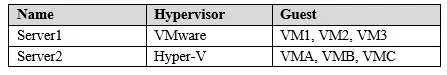

The virtual machines are configured as shown in the following table.

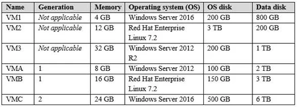

All the virtual machines use basic disks. VM1 is protected by using BitLocker Drive Encryption (BitLocker).

You plan to migrate the virtual machines to Azure by using Azure Site Recovery.

You need to identify which virtual machines can be migrated.

Which virtual machines should you identify for each server? To answer, select the appropriate options in the

answer area.

NOTE: Each correct selection is worth one point.

Hot Area:

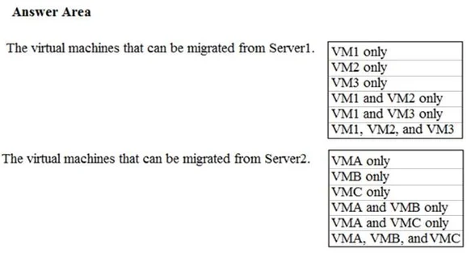

[See the answer](#answer-52)

### Question 53

HOTSPOT

You have an Azure subscription that contains multiple resource groups. You create an availability set as

shown in the following exhibit.

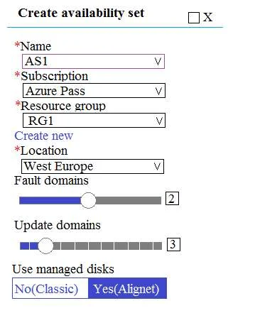

You deploy 10 virtual machines to AS1.

Use the drop-down menus to select the answer choice that completes each statement based on the

information presented in the graphic.

NOTE: Each correct selection is worth one point.

Hot Area:

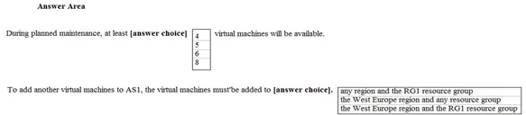

[See the answer](#answer-53)

### Question 54

You have an Azure subscription that contains two storage accounts named storagecontoso1 and

storagecontoso2. Each storage account contains a queue service, a table service, and a blob service.

You develop two apps named App1 and App2. You need to configure the apps to store different types of

data to all the storage services on both the storage accounts.

How many endpoints should you configure for each app?

* A: 2

* B: 3

* C: 6

* D: 12

[See the answer](#answer-54)

### Question 55

HOTSPOT

You have an Azure subscription named Subscription1.

You have a virtualization environment that contains the virtualization servers in the following table.

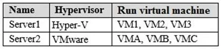

The virtual machines are configured as shown in the following table.

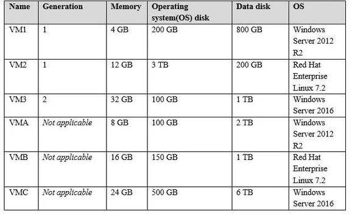

All the virtual machines use basic disks. VM1 is protected by using BitLocker Drive Encryption (BitLocker).

You plan to use Azure Site Recovery to migrate the virtual machines to Azure. 

Which virtual machines can you migrate? To answer, select the appropriate options in the answer area.

NOTE: Each correct selection is worth one point.

Hot Area:

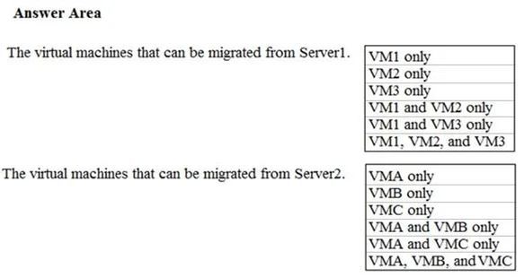

[See the answer](#answer-55)

### Question 56

SIMULATION

Click to expand each objective. To connect to the Azure portal, type https://portal.azure.com in the browser

address bar.

When you are finished performing all the tasks, click the ‘Next’ button.

Note that you cannot return to the lab once you click the ‘Next’ button. Scoring occur in the background

while you complete the rest of the exam.

Overview 

The following section of the exam is a lab. In this section, you will perform a set of tasks in a live

environment. While most functionality will be available to you as it would be in a live environment, some

functionality (e.g., copy and paste, ability to navigate to external websites) will not be possible by design.

Scoring is based on the outcome of performing the tasks stated in the lab. In other words, it doesn’t matter

how you accomplish the task, if you successfully perform it, you will earn credit for that task.

Labs are not timed separately, and this exam may have more than one lab that you must complete. You

can use as much time as you would like to complete each lab. But, you should manage your time

appropriately to ensure that you are able to complete the lab(s) and all other sections of the exam in the

time provided.

Please note that once you submit your work by clicking the Next button within a lab, you will NOT be able to

return to the lab.

To start the lab

You may start the lab by clicking the Next button.

You plan to migrate a large amount of corporate data to Azure Storage and to back up files stored on old

hardware to Azure Storage.

You need to create a storage account named corpdata8548984n1, in the corpdatalod8548984 resource

group. The solution must meet the following requirements:

 - corpdata8548984n1 must be able to host the virtual disk files for Azure virtual machines

 - The cost of accessing the files must be minimized

 - Replication costs must be minimized

What should you do from the Azure portal?

[See the answer](#answer-56)

### Question 57

SIMULATION

Click to expand each objective. To connect to the Azure portal, type https://portal.azure.com in the browser

address bar.

When you are finished performing all the tasks, click the ‘Next’ button.

Note that you cannot return to the lab once you click the ‘Next’ button. Scoring occur in the background

while you complete the rest of the exam.

Overview 

The following section of the exam is a lab. In this section, you will perform a set of tasks in a live

environment. While most functionality will be available to you as it would be in a live environment, some

functionality (e.g., copy and paste, ability to navigate to external websites) will not be possible by design.

Scoring is based on the outcome of performing the tasks stated in the lab. In other words, it doesn’t matter

how you accomplish the task, if you successfully perform it, you will earn credit for that task.

Labs are not timed separately, and this exam may have more than one lab that you must complete. You

can use as much time as you would like to complete each lab. But, you should manage your time

appropriately to ensure that you are able to complete the lab(s) and all other sections of the exam in the

time provided.

Please note that once you submit your work by clicking the Next button within a lab, you will NOT be able to

return to the lab.

To start the lab

You may start the lab by clicking the Next button.

You plan to move backup files and documents from an on-premises Windows file server to Azure Storage.

The backup files will be stored as blobs.

You need to create a storage account named corpdata8548984n2. The solution must meet the following

requirements:

 - Ensure that the documents are accessible via drive mappings from Azure virtual machines that run

Windows Server 2016

 - Provide the highest possible redundancy for the documents

 - Minimize storage access costs

What should you do from the Azure portal?

[See the answer](#answer-57)

### Question 58

SIMULATION

Click to expand each objective. To connect to the Azure portal, type https://portal.azure.com in the browser

address bar.

When you are finished performing all the tasks, click the ‘Next’ button.

Note that you cannot return to the lab once you click the ‘Next’ button. Scoring occur in the background

while you complete the rest of the exam.

Overview 

The following section of the exam is a lab. In this section, you will perform a set of tasks in a live

environment. While most functionality will be available to you as it would be in a live environment, some

functionality (e.g., copy and paste, ability to navigate to external websites) will not be possible by design.

Scoring is based on the outcome of performing the tasks stated in the lab. In other words, it doesn’t matter

how you accomplish the task, if you successfully perform it, you will earn credit for that task.

Labs are not timed separately, and this exam may have more than one lab that you must complete. You

can use as much time as you would like to complete each lab. But, you should manage your time

appropriately to ensure that you are able to complete the lab(s) and all other sections of the exam in the

time provided.

Please note that once you submit your work by clicking the Next button within a lab, you will NOT be able to

return to the lab.

To start the lab

You may start the lab by clicking the Next button.

You need to deploy two Azure virtual machines named VM1003a and VM1003b based on an Ubuntu Server

image. The deployment must meet the following requirements:

 - Provide a Service Level Agreement (SLA) of 99.95 percent availability

 - Use managed disks

What should you do from the Azure portal?

[See the answer](#answer-58)

### Question 59

SIMULATION

Click to expand each objective. To connect to the Azure portal, type https://portal.azure.com in the browser

address bar.

When you are finished performing all the tasks, click the ‘Next’ button.

Note that you cannot return to the lab once you click the ‘Next’ button. Scoring occur in the background

while you complete the rest of the exam.

Overview 

The following section of the exam is a lab. In this section, you will perform a set of tasks in a live

environment. While most functionality will be available to you as it would be in a live environment, some

functionality (e.g., copy and paste, ability to navigate to external websites) will not be possible by design.

Scoring is based on the outcome of performing the tasks stated in the lab. In other words, it doesn’t matter

how you accomplish the task, if you successfully perform it, you will earn credit for that task.

Labs are not timed separately, and this exam may have more than one lab that you must complete. You

can use as much time as you would like to complete each lab. But, you should manage your time

appropriately to ensure that you are able to complete the lab(s) and all other sections of the exam in the

time provided.

Please note that once you submit your work by clicking the Next button within a lab, you will NOT be able to

return to the lab.

To start the lab

You may start the lab by clicking the Next button.

You need to deploy an Azure virtual machine named VM1004a based on an Ubuntu Server image, and then

to configure VM1004a to meet the following requirements:

 - The virtual machines must contain data disks that can store at least 15 TB of data

 - The data disk must be able to provide at least 2,000 IOPS

 - Storage costs must be minimized

What should you do from the Azure portal?

[See the answer](#answer-59)

### Question 60

SIMULATION

Click to expand each objective. To connect to the Azure portal, type https://portal.azure.com in the browser

address bar.

When you are finished performing all the tasks, click the ‘Next’ button.

Note that you cannot return to the lab once you click the ‘Next’ button. Scoring occur in the background

while you complete the rest of the exam.

Overview 

The following section of the exam is a lab. In this section, you will perform a set of tasks in a live

environment. While most functionality will be available to you as it would be in a live environment, some

functionality (e.g., copy and paste, ability to navigate to external websites) will not be possible by design.

Scoring is based on the outcome of performing the tasks stated in the lab. In other words, it doesn’t matter

how you accomplish the task, if you successfully perform it, you will earn credit for that task.

Labs are not timed separately, and this exam may have more than one lab that you must complete. You

can use as much time as you would like to complete each lab. But, you should manage your time

appropriately to ensure that you are able to complete the lab(s) and all other sections of the exam in the

time provided.

Please note that once you submit your work by clicking the Next button within a lab, you will NOT be able to

return to the lab.

To start the lab

You may start the lab by clicking the Next button.

You plan to create 100 Azure virtual machines on each of the following three virtual networks:

 - VNET1005a

 - VNET1005b

 - VNET1005c

All the network traffic between the three virtual networks will be routed through VNET1005a.

You need to create the virtual networks, and then to ensure that all the Azure virtual machines can connect

to other virtual machines by using their private IP address. The solutions must NOT require any virtual

gateways and must minimize the number of peerings.

What should you do from the Azure portal before you configure IP routing?

[See the answer](#answer-60)

### Question 61

SIMULATION

Click to expand each objective. To connect to the Azure portal, type https://portal.azure.com in the browser

address bar.

When you are finished performing all the tasks, click the ‘Next’ button.

Note that you cannot return to the lab once you click the ‘Next’ button. Scoring occur in the background

while you complete the rest of the exam.

Overview 

The following section of the exam is a lab. In this section, you will perform a set of tasks in a live

environment. While most functionality will be available to you as it would be in a live environment, some

functionality (e.g., copy and paste, ability to navigate to external websites) will not be possible by design.

Scoring is based on the outcome of performing the tasks stated in the lab. In other words, it doesn’t matter

how you accomplish the task, if you successfully perform it, you will earn credit for that task.

Labs are not timed separately, and this exam may have more than one lab that you must complete. You

can use as much time as you would like to complete each lab. But, you should manage your time

appropriately to ensure that you are able to complete the lab(s) and all other sections of the exam in the

time provided.

Please note that once you submit your work by clicking the Next button within a lab, you will NOT be able to

return to the lab.

To start the lab

You may start the lab by clicking the Next button.

You plan to deploy several Azure virtual machines and to connect them to a virtual network named

VNET1007.

You need to ensure that future virtual machines on VNET1007 can register their name in an internal DNS

zone named corp8548984.com. The zone must NOT be hosted on a virtual machine.

What should you do from Azure Cloud Shell?

To complete this task, start Azure Cloud Shell and select PowerShell (Linux), Click Show Advanced

Settings, and then enter corp8548984n1 in the Storage account text box and File1 share text box.

Click Create storage, and then complete the task.

[See the answer](#answer-61)

### Question 62

SIMULATION

Click to expand each objective. To connect to the Azure portal, type https://portal.azure.com in the browser

address bar.

When you are finished performing all the tasks, click the ‘Next’ button.

Note that you cannot return to the lab once you click the ‘Next’ button. Scoring occur in the background

while you complete the rest of the exam.

Overview 

The following section of the exam is a lab. In this section, you will perform a set of tasks in a live

environment. While most functionality will be available to you as it would be in a live environment, some

functionality (e.g., copy and paste, ability to navigate to external websites) will not be possible by design.

Scoring is based on the outcome of performing the tasks stated in the lab. In other words, it doesn’t matter

how you accomplish the task, if you successfully perform it, you will earn credit for that task.

Labs are not timed separately, and this exam may have more than one lab that you must complete. You

can use as much time as you would like to complete each lab. But, you should manage your time

appropriately to ensure that you are able to complete the lab(s) and all other sections of the exam in the

time provided.

Please note that once you submit your work by clicking the Next button within a lab, you will NOT be able to

return to the lab.

To start the lab

You may start the lab by clicking the Next button.

Another administrator reports that she is unable to configure a web app named corplod10217507n3 to

prevent all connections from an IP address of 11.0.0.11.

You need to modify corplod10217507n3 to successfully prevent the connections from the IP address. The

solution must minimize Azure-related costs.

What should you do from the Azure portal?

[See the answer](#answer-62)

### Question 63

SIMULATION

Click to expand each objective. To connect to the Azure portal, type https://portal.azure.com in the browser

address bar.

When you are finished performing all the tasks, click the ‘Next’ button.

Note that you cannot return to the lab once you click the ‘Next’ button. Scoring occur in the background

while you complete the rest of the exam.

Overview 

The following section of the exam is a lab. In this section, you will perform a set of tasks in a live

environment. While most functionality will be available to you as it would be in a live environment, some

functionality (e.g., copy and paste, ability to navigate to external websites) will not be possible by design.

Scoring is based on the outcome of performing the tasks stated in the lab. In other words, it doesn’t matter

how you accomplish the task, if you successfully perform it, you will earn credit for that task.

Labs are not timed separately, and this exam may have more than one lab that you must complete. You

can use as much time as you would like to complete each lab. But, you should manage your time

appropriately to ensure that you are able to complete the lab(s) and all other sections of the exam in the

time provided.

Please note that once you submit your work by clicking the Next button within a lab, you will NOT be able to

return to the lab.

To start the lab

You may start the lab by clicking the Next button.

You need to add a deployment slot named staging to an Azure web app named corplod10217507n4. The

solution must meet the following requirements:

 - When new code is deployed to staging, the code must be swapped automatically to the production slot.

 - Azure-related costs must be minimized.

What should you do from the Azure portal?

[See the answer](#answer-63)

### Question 64

SIMULATION

Click to expand each objective. To connect to the Azure portal, type https://portal.azure.com in the browser

address bar.

When you are finished performing all the tasks, click the ‘Next’ button.

Note that you cannot return to the lab once you click the ‘Next’ button. Scoring occur in the background

while you complete the rest of the exam.

Overview 

The following section of the exam is a lab. In this section, you will perform a set of tasks in a live

environment. While most functionality will be available to you as it would be in a live environment, some

functionality (e.g., copy and paste, ability to navigate to external websites) will not be possible by design.

Scoring is based on the outcome of performing the tasks stated in the lab. In other words, it doesn’t matter

how you accomplish the task, if you successfully perform it, you will earn credit for that task.

Labs are not timed separately, and this exam may have more than one lab that you must complete. You

can use as much time as you would like to complete each lab. But, you should manage your time

appropriately to ensure that you are able to complete the lab(s) and all other sections of the exam in the

time provided.

Please note that once you submit your work by clicking the Next button within a lab, you will NOT be able to

return to the lab.

To start the lab

You may start the lab by clicking the Next button.

You plan to deploy an application gateway named appgw1015 to load balance internal IP traffic to the Azure

virtual machines connected to subnet0.

You need to configure a virtual network named VNET1015 to support the planned application gateway.

What should you do from the Azure portal?

[See the answer](#answer-64)

### Question 65

SIMULATION

Click to expand each objective. To connect to the Azure portal, type https://portal.azure.com in the browser

address bar.

When you are finished performing all the tasks, click the ‘Next’ button.

Note that you cannot return to the lab once you click the ‘Next’ button. Scoring occur in the background

while you complete the rest of the exam.

Overview 

The following section of the exam is a lab. In this section, you will perform a set of tasks in a live

environment. While most functionality will be available to you as it would be in a live environment, some

functionality (e.g., copy and paste, ability to navigate to external websites) will not be possible by design.

Scoring is based on the outcome of performing the tasks stated in the lab. In other words, it doesn’t matter

how you accomplish the task, if you successfully perform it, you will earn credit for that task.

Labs are not timed separately, and this exam may have more than one lab that you must complete. You

can use as much time as you would like to complete each lab. But, you should manage your time

appropriately to ensure that you are able to complete the lab(s) and all other sections of the exam in the

time provided.

Please note that once you submit your work by clicking the Next button within a lab, you will NOT be able to

return to the lab.

To start the lab

You may start the lab by clicking the Next button.

You plan to connect a virtual network named VNET1017 to your on-premises network by using both an

Azure ExpressRoute and a site-to-site VPN connection.

You need to prepare the Azure environment for the planned deployment. The solutions must maximize the

IP address space available to Azure virtual machines.

What should you do from the Azure portal before you create the ExpressRoute and the VPN gateway?

[See the answer](#answer-65)

### Question 66

HOTSPOT

You have an Azure subscription named Subscription1 that contains a virtual network named VNet1. You

add the users in the following table. 

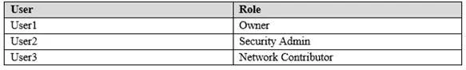

Which user can perform each configuration? To answer, select the appropriate options in the answer area.

NOTE: Each correct selection is worth one point.

Hot Area:

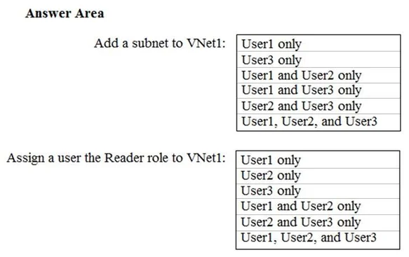

[See the answer](#answer-66)

### Question 67

You have an Azure subscription that contains three virtual networks named VNet1, VNet2, and VNet3.

VNet2 contains a virtual appliance named VM2 that operates as a router. 

You are configuring the virtual networks in a hub and spoke topology that uses VNet2 as the hub network.

You plan to configure peering between VNet1 and VNet2 and between VNet2 and VNet3.

You need to provide connectivity between VNet1 and VNet3 through VNet2.

Which two configurations should you perform? Each correct answer presents part of the solution.

NOTE: Each correct selection is worth one point.

* A: On the peering connections, allow forwarded traffic

* B: Create a route filter

* C: On the peering connections, allow gateway transit

* D: Create route tables and assign the table to subnets

* E: On the peering connections, use remote gateways

[See the answer](#answer-67)

### Question 68

DRAG DROP

You have an Azure subscription that contains two virtual networks named VNet1 and VNet2. Virtual

machines connect to the virtual networks.

The virtual networks have the address spaces and the subnets configured as shown in the following table.

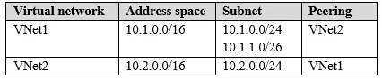

You need to add the address space of 10.33.0.0/16 to VNet1. The solution must ensure that the hosts on

VNet1 and VNet2 can communicate.

Which three actions should you perform in sequence? To answer, move the appropriate actions from the

list of actions to the answer area and arrange them in the correct order.

Select and Place:

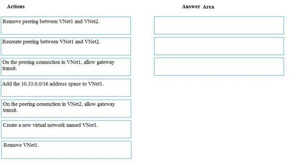

[See the answer](#answer-68)

### Question 69

HOTSPOT

You are designing a virtual network to support a web application. The web application uses Blob storage to

store large images. The web application will be deployed to an Azure App Service Web App.

You have the following requirements:

	-  Secure all communications by using Secured Socket layer (SSL)

	-  SSL encryption and decryption must be processed efficiently to support high traffic load on the web

application

	-  Protect the web application from web vulnerabilities and attacks without modification to backend code

	-  Optimize web application responsiveness and reliability by routing HTTP request and responses to the

endpoint with the lowest network latency for the client.

You need to configure the Azure components to meet the requirements.

What should you do? To answer, select the appropriate options in the answer area.

NOTE: Each correct selection is worth one point.

Hot Area: 

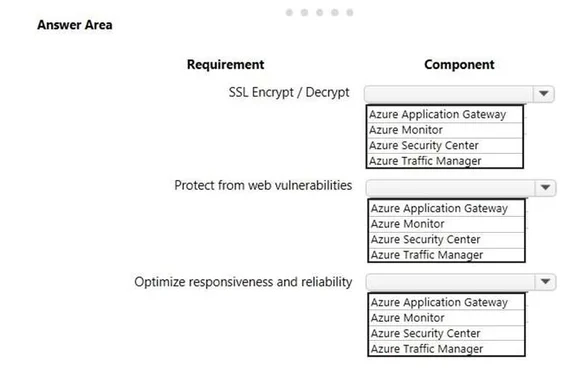

[See the answer](#answer-69)

### Question 70

HOTSPOT

You have Azure Storage accounts as shown in the following exhibit.

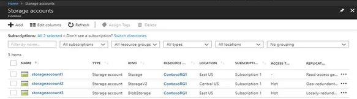

Use the drop-down menus to select the answer choice that completes each statement based on the

information presented in the graphic.

NOTE: Each correct selection is worth one point.

Hot Area:

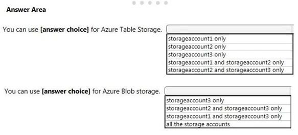

[See the answer](#answer-70)

### Question 71

Note: This question is part of series of questions that present the same scenario. Each question in

the series contains a unique solution that might meet the stated goals. Some question sets might

have more than one correct solution, while others might not have a correct solution.

After you answer a question in this section, you will NOT be able to return to it. As a result, these

questions will not appear in the review screen.

You are planning to create a virtual network that has a scale set that contains six virtual machines (VMs).

A monitoring solution on a different network will need access to the VMs inside the scale set.

You need to define public access to the VMs.

Solution: Deploy a standalone VM that has a public IP address to the virtual network.

Does the solution meet the goal?

* A: Yes

* B: No

[See the answer](#answer-71)

### Question 72

Note: This question is part of series of questions that present the same scenario. Each question in

the series contains a unique solution that might meet the stated goals. Some question sets might

have more than one correct solution, while others might not have a correct solution.

After you answer a question in this section, you will NOT be able to return to it. As a result, these

questions will not appear in the review screen.

You are planning to create a virtual network that has a scale set that contains six virtual machines (VMs).

A monitoring solution on a different network will need access to the VMs inside the scale set.

You need to define public access to the VMs.

Solution: Implement an Azure Load Balancer.

Does the solution meet the goal?

* A: Yes

* B: No

[See the answer](#answer-72)

### Question 73

Note: This question is part of series of questions that present the same scenario. Each question in

the series contains a unique solution that might meet the stated goals. Some question sets might

have more than one correct solution, while others might not have a correct solution.

After you answer a question in this section, you will NOT be able to return to it. As a result, these

questions will not appear in the review screen.

You are planning to create a virtual network that has a scale set that contains six virtual machines (VMs).

A monitoring solution on a different network will need access to the VMs inside the scale set.

You need to define public access to the VMs.

Solution: Design a scale set to automatically assign public IP addresses to all VMs.

Does the solution meet the goal?

* A: Yes

* B: No

[See the answer](#answer-73)

### Question 74

HOTSPOT

You have an on-premises data center and an Azure subscription. The data center contains two VPN

devices. The subscription contains an Azure virtual network named VNet1. VNet1 contains a gateway

subnet.

You need to create a site-to-site VPN. The solution must ensure that is a single instance of an Azure VPN

gateway fails, or a single on-premises VPN device fails, the failure will not cause an interruption that is

longer than two minutes.

What is the minimum number of public IP addresses, virtual network gateways, and local network gateways

required in Azure? To answer, select the appropriate options in the answer area.

NOTE: Each correct selection is worth one point.

Hot Area:

[See the answer](#answer-74)

### Question 75

HOTSPOT

You have peering configured as shown in the following exhibit. 

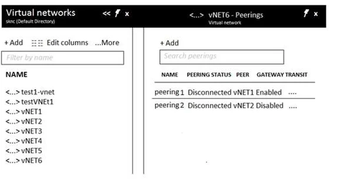

Use the drop-down menus to select the answer choice that completes each statement based on the

information presented in the graphic. 

NOTE: Each correct selection is worth one point. 

Hot Area:

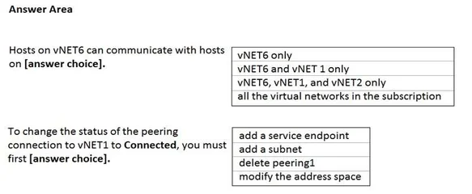

[See the answer](#answer-75)

### Question 76

You have an Azure Kubernetes Service (AKS) cluster named Clus1 in a resource group named RG1.

An administrator plans to manage Clus1 from an Azure AD-joined device.

You need to ensure that the administrator can deploy the YAML application manifest file for a container

application.

You install the Azure CLI on the device.

Which command should you run next?

* A: kubectl get nodes

* B: az aks install-cli

* C: kubectl apply –f appl.yaml

* D: az aks get-credentials --resource-group RG1 --name Clus1

[See the answer](#answer-76)

### Question 77

Note: This question is part of series of questions that present the same scenario. Each question in

the series contains a unique solution that might meet the stated goals. Some question sets might

have more than one correct solution, while others might not have a correct solution.

After you answer a question in this section, you will NOT be able to return to it. As a result, these

questions will not appear in the review screen.

You are planning to create a virtual network that has a scale set that contains six virtual machines (VMs).

A monitoring solution on a different network will need access to the VMs inside the scale set.

You need to define public access to the VMs.

Solution: Use Remote Desktop Protocol (RDP) to connect to the VM in the scale set.

Does the solution meet the goal?

* A: Yes

* B: No

[See the answer](#answer-77)

### Question 78

You have an Azure subscription that contains the virtual networks shown in the following table.

You need to recommend a connectivity solution that will enable the virtual machines on VNET1 and VNET2

to communicate through the Microsoft backbone infrastructure.

What should you include in the recommendation?

* A: Azure ExpressRoute

* B: peering

* C: a site-to-site VPN

* D: a point-to-site VPN

[See the answer](#answer-78)

### Question 79

You create an Azure virtual machine named VM1 in a resource group named RG1.

You discover that VM1 performs slower than expected.

You need to capture a network trace on VM1.

What should you do?

* A: From Diagnostic settings for VM1, configure the performance counters to include network counters.

* B: From the VM1 blade, configure Connection troubleshoot.

* C: From the VM1 blade, install performance diagnostics and run advanced performance analysis

* D: From Diagnostic settings for VM1, configure the log level of the diagnostic agent.

[See the answer](#answer-79)

### Question 80

You have an Azure subscription that contains the resource groups shown in the following table.

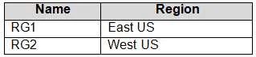

The subscription contains the storage accounts shown in the following table.

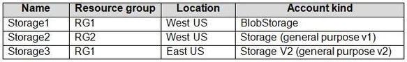

You create a Recovery Services vault named Vault1 in RG1 in the West US location.

You need to identify which storage accounts can be used to archive the diagnostics logs of Vault1.

Which storage accounts should you identify?

* A: Storage1 only

* B: Storage2 only

* C: Storage3 only

* D: Storage1 or Storage2 only

* E: Storage1 or Storage3 only

[See the answer](#answer-80)

### Question 81

HOTSPOT

You have an Azure subscription.

You plan to deploy two Azure web apps that have the requirements shown in the following table.

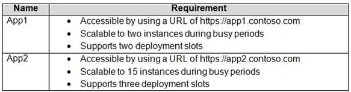

You need to select the App Service plans for the web apps. The solution must minimize costs.

Which App Service plan should you select for each web app? To answer, select the appropriate options in

the answer area.

NOTE: Each correct selection is worth one point.

Hot Area:

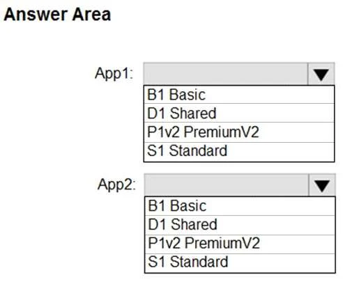

[See the answer](#answer-81)

### Question 82

You have an Azure subscription.

You create a custom role in Azure by using the following Azure Resource Manager template.

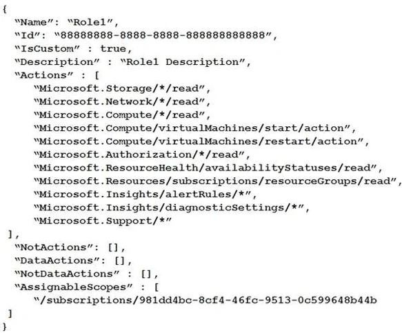

You assign the role to a user named User1.

Which action can User1 perform?

* A: Delete virtual machines.

* B: Create resource groups.

* C: Create virtual machines.

* D: Create support requests.

[See the answer](#answer-82)

### Question 83

A company plans to use third-party application software to perform complex data analysis processes. The

software will use up to 500 identical virtual machines (VMs) based on an Azure Marketplace VM image.

You need to design the infrastructure for the third-party application server. The solution must meet the

following requirements:

	- The number of VMs that are running at any given point in time must change when the user workload

changes.

	- When a new version of the application is available in Azure Marketplace it must be deployed without

causing application downtime.

	- Use VM scale sets.

	- Minimize the need for ongoing maintenance.

Which two technologies should you recommend? Each correct answer presents part of the solution.

NOTE: Each correct selection is worth one point.

* A: single storage account

* B: autoscale

* C: single placement group

* D: managed disks

[See the answer](#answer-83)

### Question 84

HOTSPOT

You have an Azure subscription that contains the storage account shown in the following table.

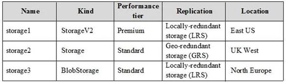

For each of the following statements, select Yes if the statement is true. Otherwise, select No.

NOTE: Each correct selection is worth one point.

Hot Area:

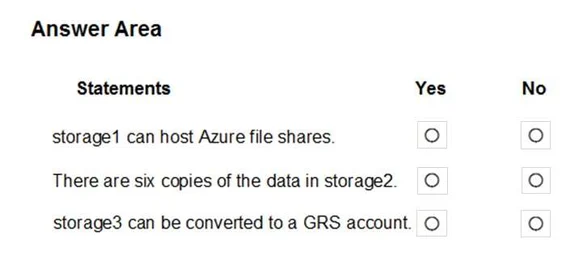

[See the answer](#answer-84)

### Question 85

HOTSPOT

You create and save an Azure Resource Manager template named Template1 that includes the following

four sections.

Section1.

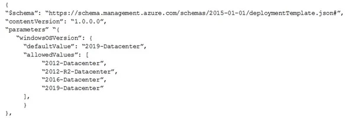

Section2.

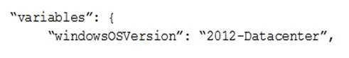

Section3.

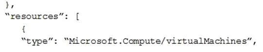

Section4.

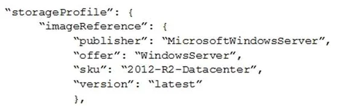

You deploy Template1.

For each of the following statements, select Yes if the statement is true. Otherwise, select No.

NOTE: Each correct selection is worth one point.

Hot Area:

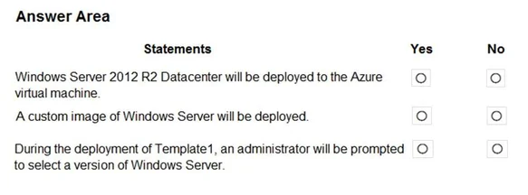

[See the answer](#answer-85)

### Question 86

You have an Azure subscription that contains the storage accounts shown in the following table.

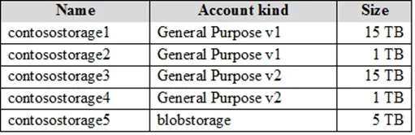

All storage accounts contain blobs only.

You need to implement several lifecycle management rules for all storage accounts.

What should you do first?

* A: Upgrade contosostorage1 and contosostorage2 to General Purpose V2 accounts.

* B: Move 5 TB of blob data from contosostorage3 to contosostorage4.

* C: Move 5 TB of blob data from contosostorage1 to contosostorage2.

* D: Recreate contosostorage5 as General Purpose V2 account.

[See the answer](#answer-86)

### Question 87

HOTSPOT

You have an Azure subscription that contains the resource groups shown in the following table.

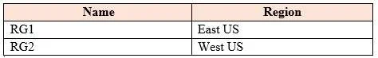

RG1 contains the virtual machines shown in the following table.

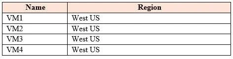

RG2 contains the virtual machines shown in the following table.

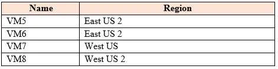

All the virtual machines are configured to use premium disks and are accessible from the Internet.

VM1 and VM2 are in an availability set named AVSET1. VM3 and VM4 are in the same availability zone and

are in an availability set named AVSET2. VM5 and VM6 are in different availability zones.

For each of the following statements, select Yes if the statement is true. Otherwise, select No.

NOTE: Each correct selection is worth one point.

Hot Area:

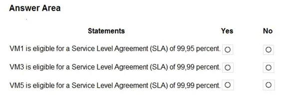

[See the answer](#answer-87)

### Question 88

DRAG DROP

You have an Azure virtual machine named VM1 that runs Windows Server 2016.

You install a line-to-business application on VM1.

You need to create an Azure virtual machine by using VM1 as a custom image.

Which three actions should you perform in sequence? To answer, move the appropriate actions from the

list of actions to the answer area and arrange them in the correct order.

Select and Place:

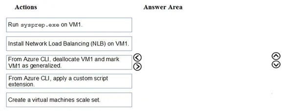

[See the answer](#answer-88)

### Question 89

Note: This question is part of series of questions that present the same scenario. Each question in

the series contains a unique solution that might meet the stated goals. Some question sets might

have more than one correct solution, while others might not have a correct solution.

After you answer a question in this section, you will NOT be able to return to it. As a result, these

questions will not appear in the review screen.

You have an Azure Active Directory (Azure AD) tenant named contoso.com.

A user named Admin1 attempts to create an access review from the Azure Active Directory admin center

and discovers that the Access reviews settings are unavailable. Admin1 discovers that all the other Identity

Governance settings are available.

Admin1 is assigned the User administrator, Compliance administrator, and Security administrator roles.

You need to ensure that the Admin1 can create access reviews in contoso.com.

Solution: You consent to Azure AD Privileged Identity Management (PIM).

Does this meet the goal?

* A: Yes

* B: No

[See the answer](#answer-89)

### Question 90

Note: This question is part of series of questions that present the same scenario. Each question in

the series contains a unique solution that might meet the stated goals. Some question sets might

have more than one correct solution, while others might not have a correct solution.

After you answer a question in this section, you will NOT be able to return to it. As a result, these

questions will not appear in the review screen.

You have an Azure Active Directory (Azure AD) tenant named contoso.com.

A user named Admin1 attempts to create an access review from the Azure Active Directory admin center

and discovers that the Access reviews settings are unavailable. Admin1 discovers that all the other Identity

Governance settings are available.

Admin1 is assigned the User administrator, Compliance administrator, and Security administrator roles.

You need to ensure that the Admin1 can create access reviews in contoso.com.

Solution: You assign the Global administrator role to Admin1.

Does this meet the goal?

* A: Yes

* B: No

[See the answer](#answer-90)

### Question 91

Note: This question is part of series of questions that present the same scenario. Each question in

the series contains a unique solution that might meet the stated goals. Some question sets might

have more than one correct solution, while others might not have a correct solution.

After you answer a question in this section, you will NOT be able to return to it. As a result, these

questions will not appear in the review screen.

You have an Azure Active Directory (Azure AD) tenant named contoso.com.

A user named Admin1 attempts to create an access review from the Azure Active Directory admin center

and discovers that the Access reviews settings are unavailable. Admin1 discovers that all the other Identity

Governance settings are available.

Admin1 is assigned the User administrator, Compliance administrator, and Security administrator roles.

You need to ensure that the Admin1 can create access reviews in contoso.com.

Solution: You purchase an Azure Directory Premium P2 license for contoso.com.

Does this meet the goal?

* A: Yes

* B: No

[See the answer](#answer-91)

### Question 92

You have a resource group named RG1 that contains the following:

	- A virtual network that contains two subnets named Subnet1 and Subnet2

	- An Azure Storage account named contososa1

	- An Azure firewall deployed to Subnet2

You need to ensure that contososa1 is accessible from Subnet1 over the Azure backbone network.

What should you do?

* A: Deploy an Azure firewall to Subnet1.

* B: Remove the Azure firewall.

* C: Implement a virtual network service endpoint.

* D: Create a stored access policy for contososa1.

[See the answer](#answer-92)

### Question 93

Your company has the groups shown in the following table.

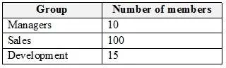

The company has an Azure subscription that contains an Azure Active Directory (Azure AD) tenant named

contoso.com.

An administrator named Admin1 attempts to enable Enterprise State Roaming for all the users in the

Managers group.

Admin1 reports that the options for Enterprise State Roaming are unavailable from Azure AD.

You verify that Admin1 is assigned the Global administrator role.

You need to ensure that Admin1 can enable Enterprise State Roaming.

What should you do?

* A: Enforce Azure Multi-Factor Authentication (MFA) for Admin1.

* B: Purchase an Azure AD Premium P1 license for each user in the Managers group.

* C: Assign an Azure AD Privileged Identity Management (PIM) role to Admin1.

* D: Purchase an Azure Rights Management (Azure RMS) license for each user in the Managers group.

[See the answer](#answer-93)

### Question 94

HOTSPOT

You play to deploy an Azure virtual machine named VM1 by using an Azure Resource Manager template.

You need to complete the template.

What should you include in the template? To answer, select the appropriate options in the answer area.

NOTE: Each correct selection is worth one point.

Hot Area:

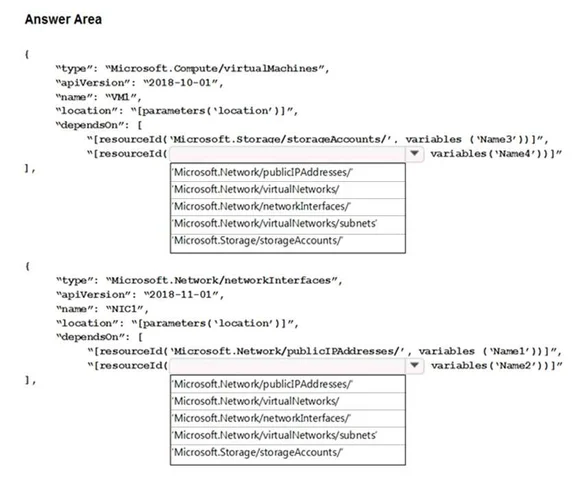

[See the answer](#answer-94)

### Question 95

HOTSPOT

You plan to create a virtual machine as shown in the following exhibit.

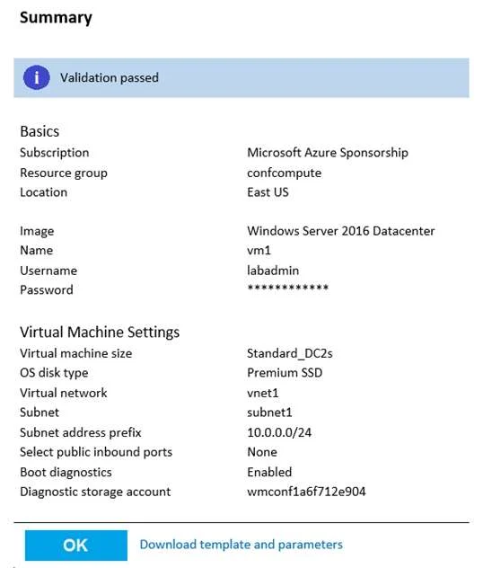

Use the drop-down menus to select the answer choice that completes each statement based on the

information presented in the graphic.

NOTE: Each correct selection is worth one point.

Hot Area:

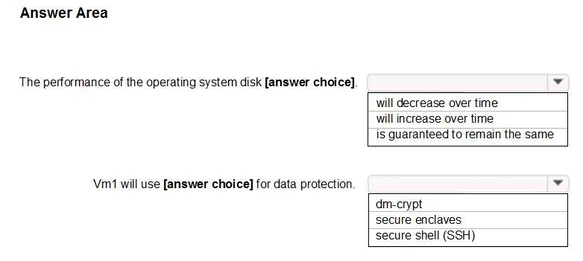

[See the answer](#answer-95)

### Question 96

HOTSPOT

A company runs multiple Windows virtual machines (VMs) in Azure.

The IT operations department wants to apply the same policies as they have for on-premises VMs to the

VMs running in Azure, including domain administrator permissions and schema extensions.

You need to recommend a solution for the hybrid scenario that minimizes the amount of maintenance

required.

What should you recommend? To answer, select the appropriate options in the answer area.

NOTE: Each correct selection is worth one point.

Hot Area:

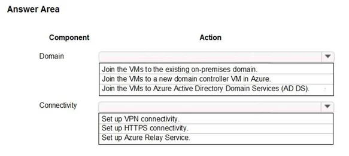

[See the answer](#answer-96)

### Question 97

HOTSPOT

Your company has an Azure Container Registry named Registry1. 

You have an Azure virtual machine named Serverl that runs Windows Server 2019. 

From Serverl, you create a container image named image1. 

You need to add image1 to Registry1. 

Which command should you run on Server1? To answer, select the appropriate options in the answer

area. 

NOTE: Each correct selection is worth one point. 

Hot Area:

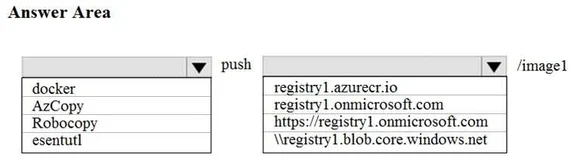

[See the answer](#answer-97)

### Question 98

Your company has an office in Seattle.

You have an Azure subscription that contains a virtual network named VNET1.

You create a site-to-site VPN between the Seattle office and VNET1.

VNET1 contains the subnets shown in the following table.

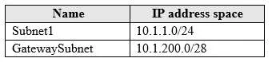

You need to redirect all Internet-bound traffic from Subnet1 to the Seattle office.

What should you create?

* A: a route for GatewaySubnet that uses the virtual network gateway as the next hop

* B: a route for GatewaySubnet that uses the local network gateway as the next hop

* C: a route for Subnet1 that uses the local network gateway as the next hop

* D: a route for Subnet1 that uses the virtual network gateway as the next hop

[See the answer](#answer-98)

### Question 99

**SCENARIO:**

TESTLET-1.

Case Study

This is a case study. Case studies are not timed separately. You can use as much exam time as you

would like to complete each case. However, there may be additional case studies and sections on this

exam. You must manage your time to ensure that you are able to complete all questions included on this

exam in the time provided.

To answer the questions included in a case study, you will need to reference information that is provided in

the case study. Case studies might contain exhibits and other resources that provide more information

about the scenario that is described in the case study. Each question is independent of the other questions

in this case study.

At the end of this case study, a review screen will appear. This screen allows you to review your answers

and to make changes before you move to the next section of the exam. After you begin a new section, you

cannot return to this section.

To start the case study

To display the first question in this case study, click the Next button. Use the buttons in the left pane to

explore the content of the case study before you answer the questions. Clicking these buttons displays

information such as business requirements, existing environment, and problem statements. If the case

study has an All Information tab, note that the information displayed is identical to the information

displayed on the subsequent tabs. When you are ready to answer a question, click the Question button to

return to the question.

Overview

Humongous Insurance is an insurance company that has three offices in Miami, Tokyo and Bangkok. Each

office has 5.000 users.

Existing Environment

Active Directory Environment

Humongous Insurance has a single-domain Active Directory forest named humongousinsurance.com. The

functional level of the forest is Windows Server 2012.

You recently provisioned an Azure Active Directory (Azure AD) tenant.

Network Infrastructure

Each office has a local data center that contains all the servers for that office. Each office has a dedicated

connection to the Internet.

Each office has several link load balancers that provide access to the servers.

Active Directory Issue

Several users in humongousinsurance.com have UPNs that contain special characters.

You suspect that some of the characters are unsupported in Azure AD.

Licensing Issue

You attempt to assign a license in Azure to several users and receive the following error message:

"Licenses not assigned. License agreement failed for one user."

You verify that the Azure subscription has the available licenses.

Requirements

Planned Changes

Humongous Insurance plans to open a new office in Paris. The Paris office will contain 1,000 users who will

be hired during the next 12 months. All the resources used by the Paris office users will be hosted in Azure.

Planned Azure AD Infrastructure

The on-premises Active Directory domain will be synchronized to Azure AD.

All client computers in the Paris office will be joined to an Azure AD domain.

Planned Azure Networking Infrastructure

You plan to create the following networking resources in a resource group named All_Resources:

 - Default Azure system routes that will be the only routes used to route traffic

 - A virtual network named Paris-VNet that will contain two subnets named Subnet1 and Subnet2

 - A virtual network named ClientResources-VNet that will contain one subnet named ClientSubnet

 - A virtual network named AllOffices-VNet that will contain two subnets named Subnet3 and Subnet4

You plan to enable peering between Paris-VNet and AllOffices-VNet. You will enable the Use remote

gateways setting for the Paris-VNet peerings.

You plan to create a private DNS zone named humongousinsurance.local and set the registration network

to the ClientResources-VNet virtual network.

Planned Azure Computer Infrastructure

Each subnet will contain several virtual machines that will run either Windows Server 2012 R2, Windows

Server 2016, or Red Hat Linux.

Department Requirements

Humongous Insurance identifies the following requirements for the company's departments:

 - Web administrators will deploy Azure web apps for the marketing department. Each web app will be

added to a separate resource group. The initial configuration of the web apps will be identical. The web

administrators have permission to deploy web apps to resource groups.

 - During the testing phase, auditors in the finance department must be able to review all Azure costs from

the past week.

Authentication Requirements

Users in the Miami office must use Azure Active Directory Seamless Single Sign-on (Azure AD Seamless

SSO) when accessing resources in Azure.

HOTSPOT

You have an Azure subscription that contains the Azure SQL servers shown in the following table.

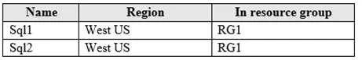

The subscription contains the elastic pools shown in the following table.

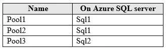

The subscription contains the Azure SQL databases shown in the following table.

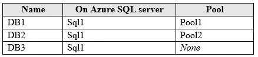

For each of the following statements, select Yes if the statement is true. Otherwise, select No.

NOTE: Each correct selection is worth one point.

Hot Area:

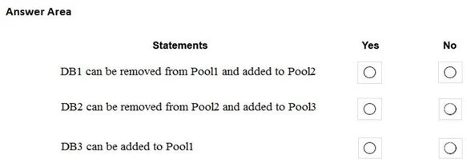

[See the answer](#answer-99)

### Question 100

**SCENARIO:**

TESTLET-1.

Case Study

This is a case study. Case studies are not timed separately. You can use as much exam time as you

would like to complete each case. However, there may be additional case studies and sections on this

exam. You must manage your time to ensure that you are able to complete all questions included on this

exam in the time provided.

To answer the questions included in a case study, you will need to reference information that is provided in

the case study. Case studies might contain exhibits and other resources that provide more information

about the scenario that is described in the case study. Each question is independent of the other questions

in this case study.

At the end of this case study, a review screen will appear. This screen allows you to review your answers

and to make changes before you move to the next section of the exam. After you begin a new section, you

cannot return to this section.

To start the case study

To display the first question in this case study, click the Next button. Use the buttons in the left pane to

explore the content of the case study before you answer the questions. Clicking these buttons displays

information such as business requirements, existing environment, and problem statements. If the case

study has an All Information tab, note that the information displayed is identical to the information

displayed on the subsequent tabs. When you are ready to answer a question, click the Question button to

return to the question.

Overview

Humongous Insurance is an insurance company that has three offices in Miami, Tokyo and Bangkok. Each

office has 5.000 users.

Existing Environment

Active Directory Environment

Humongous Insurance has a single-domain Active Directory forest named humongousinsurance.com. The

functional level of the forest is Windows Server 2012.

You recently provisioned an Azure Active Directory (Azure AD) tenant.

Network Infrastructure

Each office has a local data center that contains all the servers for that office. Each office has a dedicated

connection to the Internet.

Each office has several link load balancers that provide access to the servers.

Active Directory Issue

Several users in humongousinsurance.com have UPNs that contain special characters.

You suspect that some of the characters are unsupported in Azure AD.

Licensing Issue

You attempt to assign a license in Azure to several users and receive the following error message:

"Licenses not assigned. License agreement failed for one user."

You verify that the Azure subscription has the available licenses.

Requirements

Planned Changes

Humongous Insurance plans to open a new office in Paris. The Paris office will contain 1,000 users who will

be hired during the next 12 months. All the resources used by the Paris office users will be hosted in Azure.

Planned Azure AD Infrastructure

The on-premises Active Directory domain will be synchronized to Azure AD.

All client computers in the Paris office will be joined to an Azure AD domain.

Planned Azure Networking Infrastructure

You plan to create the following networking resources in a resource group named All_Resources:

 - Default Azure system routes that will be the only routes used to route traffic

 - A virtual network named Paris-VNet that will contain two subnets named Subnet1 and Subnet2

 - A virtual network named ClientResources-VNet that will contain one subnet named ClientSubnet

 - A virtual network named AllOffices-VNet that will contain two subnets named Subnet3 and Subnet4

You plan to enable peering between Paris-VNet and AllOffices-VNet. You will enable the Use remote

gateways setting for the Paris-VNet peerings.

You plan to create a private DNS zone named humongousinsurance.local and set the registration network

to the ClientResources-VNet virtual network.

Planned Azure Computer Infrastructure

Each subnet will contain several virtual machines that will run either Windows Server 2012 R2, Windows

Server 2016, or Red Hat Linux.

Department Requirements

Humongous Insurance identifies the following requirements for the company's departments:

 - Web administrators will deploy Azure web apps for the marketing department. Each web app will be

added to a separate resource group. The initial configuration of the web apps will be identical. The web

administrators have permission to deploy web apps to resource groups.

 - During the testing phase, auditors in the finance department must be able to review all Azure costs from

the past week.

Authentication Requirements

Users in the Miami office must use Azure Active Directory Seamless Single Sign-on (Azure AD Seamless

SSO) when accessing resources in Azure.

HOTSPOT

You are evaluating the connectivity between the virtual machines after the planned implementation of the

Azure networking infrastructure.

For each of the following statements, select Yes if the statement is true. Otherwise, select No.

Hot Area:

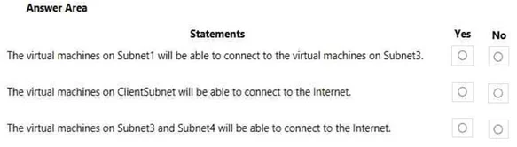

[See the answer](#answer-100)

### Answer 51

**CORRECT ANSWER:** C

**Explanation:**

You apply tags to your Azure resources to logically organize them into a taxonomy. Each tag consists of a

name and a value pair. After you apply tags, you can retrieve all the resources in your subscription with that

tag name and value. 

Tags enable you to retrieve related resources from different resource groups. 

This approach is helpful when you need to organize resources for billing or management.

**Reference:**

https://docs.microsoft.com/en-us/azure/billing/billing-getting-started

https://docs.microsoft.com/en-us/azure/azure-resource-manager/resource-group-using-tags

[Back to question](#question-51)

### Answer 52

**CORRECT ANSWER:**

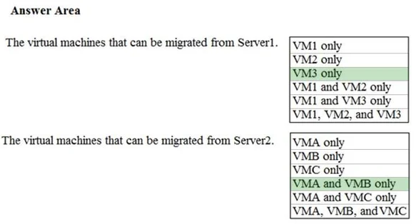

**Explanation:**

Incorrect Answers:

VM1 cannot be migrates as it has BitLocker enabled.

VM2 cannot be migrates as the OS disk on VM2 is larger than 2TB.

VMC cannot be migrates as the Data disk on VMC is larger than 4TB.

References:

https://docs.microsoft.com/en-us/azure/site-recovery/hyper-v-azure-support-matrix#azure-vm-requirements

[Back to question](#question-52)

### Answer 53

**CORRECT ANSWER:**

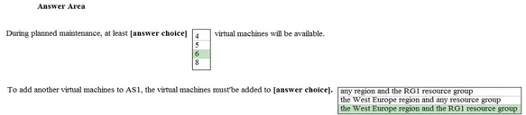

**Explanation:**

Box 1: 6

Two out of three update domains would be available, each with at least 3 VMs.

An update domain is a group of VMs and underlying physical hardware that can be rebooted at the same

time.

As you create VMs within an availability set, the Azure platform automatically distributes your VMs across

these update domains. This approach ensures that at least one instance of your application always remains

running as the Azure platform undergoes periodic maintenance.

Box 2: the West Europe region and the RG1 resource group

**Reference:** 

https://docs.microsoft.com/en-us/azure/virtual-machines/windows/regions

[Back to question](#question-53)

### Answer 54

**CORRECT ANSWER:** A

**Explanation:**

Each app needs a service endpoint in each Storage Account.

References:

https://docs.microsoft.com/en-us/azure/storage/common/storage-network-security

[Back to question](#question-54)

### Answer 55

**CORRECT ANSWER:**

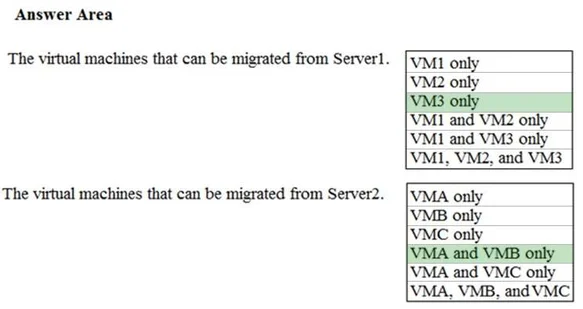

**Explanation:**

Incorrect Answers:

VM1 cannot be migrates as it has BitLocker enabled.

VM2 cannot be migrates as the OS disk on VM2 is larger than 2TB.

VMC cannot be migrates as the Data disk on VMC is larger than 4TB.

References:

https://docs.microsoft.com/en-us/azure/site-recovery/hyper-v-azure-support-matrix#azure-vm-requirements

[Back to question](#question-55)

### Answer 56

**CORRECT ANSWER:** A

**Explanation:**

Step 1: In the Azure portal, click All services. In the list of resources, type Storage Accounts. As you begin

typing, the list filters based on your input. Select Storage Accounts.

Step 2: On the Storage Accounts window that appears, choose Add.

Step 3: Select the subscription in which to create the storage account.

Step 4: Under the Resource group field, select corpdatalod8548984.

Step 5: Enter a name for your storage account: corpdata8548984n1

Step 6: For Account kind select: General-purpose v2 accounts (recommended for most scenarios)

General-purpose v2 accounts is recommended for most scenarios. General-purpose v2 accounts deliver

the lowest per-gigabyte capacity prices for Azure Storage, as well as industry-competitive transaction

prices.

Step 7: For replication select: Read-access geo-redundant storage (RA-GRS)

Read-access geo-redundant storage (RA-GRS) maximizes availability for your storage account. RA-GRS

provides read-only access to the data in the secondary location, in addition to geo-replication across two

regions.

References:

https://docs.microsoft.com/en-us/azure/storage/common/storage-quickstart-create-account

https://docs.microsoft.com/en-us/azure/storage/common/storage-account-overview

[Back to question](#question-56)

### Answer 57

**CORRECT ANSWER:** A

**Explanation:**

Step 1: In the Azure portal, click All services. In the list of resources, type Storage Accounts. As you begin

typing, the list filters based on your input. Select Storage Accounts.

Step 2: On the Storage Accounts window that appears, choose Add.

Step 3: Select the subscription in which to create the storage account.

Step 4: Under the Resource group field, select Create New. Create a new Resource 

Step 5: Enter a name for your storage account: corpdata8548984n2

Step 6: For Account kind select: General-purpose v2 accounts (recommended for most scenarios)

General-purpose v2 accounts is recommended for most scenarios. General-purpose v2 accounts deliver

the lowest per-gigabyte capacity prices for Azure Storage, as well as industry-competitive transaction

prices.

Step 7: For replication select: Read-access geo-redundant storage (RA-GRS)

Read-access geo-redundant storage (RA-GRS) maximizes availability for your storage account. RA-GRS

provides read-only access to the data in the secondary location, in addition to geo-replication across two

regions.

References:

https://docs.microsoft.com/en-us/azure/storage/common/storage-quickstart-create-account

https://docs.microsoft.com/en-us/azure/storage/common/storage-account-overview

[Back to question](#question-57)

### Answer 58

**CORRECT ANSWER:** A

**Explanation:**

Step 1: Open the Azure portal.

Step 2: On the left menu, select All resources. You can sort the resources by Type to easily find your

images.

Step 3: Select the image you want to use from the list. The image Overview page opens.

Step 4: Select Create VM from the menu.

Step 5: Enter the virtual machine information. Select VM1003a as the name for the first Virtual machine.The

user name and password entered here will be used to log in to the virtual machine. When complete, select

OK. You can create the new VM in an existing resource group, or choose Create new to create a new

resource group to store the VM.

Step 6: Select a size for the VM. To see more sizes, select View all or change the Supported disk type filter.

Step 7: Under Settings, make changes as necessary and select OK.

Step 8: On the summary page, you should see your image name listed as a Private image. Select Ok to

start the virtual machine deployment.

Repeat the procedure for the second VM and name it VM1003b.

References:

https://docs.microsoft.com/en-us/azure/virtual-machines/windows/create-vm-generalized-managed

[Back to question](#question-58)

### Answer 59

**CORRECT ANSWER:** A

**Explanation:**

Step 1: Open the Azure portal.

Step 2: On the left menu, select All resources. You can sort the resources by Type to easily find your

images.

Step 3: Select the image you want to use from the list. The image Overview page opens.

Step 4: Select Create VM from the menu.

Step 5: Enter the virtual machine information. Select VM1004a as the name for the first Virtual machine.The

user name and password entered here will be used to log in to the virtual machine. When complete, select

OK. You can create the new VM in an existing resource group, or choose Create new to create a new

resource group to store the VM.

Step 6: Select a size for the VM. To see more sizes, select View all or change the Supported disk type

filter.To support 15 TB of data you would need a Premium disk.

Step 7: Under Settings, make changes as necessary and select OK.

Step 8: On the summary page, you should see your image name listed as a Private image. Select Ok to

start the virtual machine deployment.

References:

https://docs.microsoft.com/en-us/azure/virtual-machines/windows/create-vm-generalized-managed

[Back to question](#question-59)

### Answer 60

**CORRECT ANSWER:** A

**Explanation:**

Step 1: Click Create a resource in the portal.

Step 2: Enter Virtual network in the Search the Marketplace box at the top of the New pane that appears.

Click Virtual network when it appears in the search results.

Step 3: Select Classic in the Select a deployment model box in the Virtual Network pane that appears, then

click Create.

Step 4: Enter the following values on the Create virtual network (classic) pane and then click Create:

Name: VNET1005a

Address space: 10.0.0.0/16

Subnet name: subnet0

Resource group: Create new

Subnet address range: 10.0.0.0/24

Subscription and location: Select your subscription and location.

Step 5: Repeat steps 3-5 for VNET1005b (10.1.0.0/16, 10.1.0.0/24), and for VNET1005c 10.2.0.0/16,

10.2.0.0/24).

References:

https://docs.microsoft.com/en-us/azure/virtual-network/create-virtual-network-classic

[Back to question](#question-60)

### Answer 61

**CORRECT ANSWER:** A

**Explanation:**

Step 1: Launch Cloud Shell from the top navigation of the Azure portal.

Step 2: Select PowerShell

When you start the Azure Cloud Shell for the first time, you will be prompted to create a storage account in

order to associate a new Azure File Share to persist files across sessions.

Step 3: Click Show Advanced settings.

Step 4: Enter corp8548984n1 in the Storage account text box and File1 share text box. Click Create

storage.

Step 5: Enter the following command at the powershell command prompt: 

New-AzDnsZone -Name "corp8548984.com" 

 -ResourceGroupName "mycloudshell"

 -ZoneType Private 

 -RegistrationVirtualNetworkId VNET1007

Note: A DNS zone is created by using the New-AzDnsZone cmdlet with a value of Private for the ZoneType

parameter.

References:

https://docs.microsoft.com/en-us/azure/dns/private-dns-getstarted-powershell

https://docs.microsoft.com/en-us/azure/cloud-shell/quickstart-powershell

https://docs.microsoft.com/en-us/powershell/module/az.dns/new-azdnszone?view=azps-1.5.0

[Back to question](#question-61)

### Answer 62

**CORRECT ANSWER:** A

**Explanation:**

Step 1:

Find and select application corplod10217507n3:

1. In the Azure portal, on the left navigation panel, click Azure Active Directory.

2. In the Azure Active Directory blade, click Enterprise applications.

Step 2:

To add an IP restriction rule to your app, use the menu to open Network>IP Restrictions and click on

Configure IP Restrictions

Step 3:

Click Add rule

You can click on [+] Add to add a new IP restriction rule. Once you add a rule, it will become effective

immediately.

Step 4:

Add name, IP address of 11.0.0.11, select Deny, and click Add Rule

References:

https://docs.microsoft.com/en-us/azure/app-service/app-service-ip-restrictions

[Back to question](#question-62)

### Answer 63

**CORRECT ANSWER:** A

**Explanation:**

Step 1:

Locate and open the corplod10217507n4 web app.

1. In the Azure portal, on the left navigation panel, click Azure Active Directory.

2. In the Azure Active Directory blade, click Enterprise applications.

Step 2:

Open your app's resource blade and Choose the Deployment slots option, then click Add Slot.

Step 3:

In the Add a slot blade, give the slot a name, and select whether to clone app configuration from another

existing deployment slot. Click the check mark to continue.

The first time you add a slot, you only have two choices: clone configuration from the default slot in

production or not at all.

References:

https://docs.microsoft.com/en-us/azure/app-service/web-sites-staged-publishing

[Back to question](#question-63)

### Answer 64

**CORRECT ANSWER:** A

**Explanation:**

Step 1:

Click Networking, Virtual Network, and select VNET1015.

Step 2:

Click Subnets, and Click +Add on the VNET1015 - Subnets pane that appears.

Step 3:

On the Subnets page, click +Gateway subnet at the top to open the Add subnet page.

Step 4:

Locate subnet0 and add it.

References:

https://docs.microsoft.com/en-us/azure/vpn-gateway/vpn-gateway-howto-site-to-site-resource-manager-

portal

[Back to question](#question-64)

### Answer 65

**CORRECT ANSWER:** A

**Explanation:**

We need to create a Gateway subnet

Step 1:

Go to More Services > Virtual Networks

Step 2:

Then click on the VNET1017, and click on subnets. Then click on gateway subnet.

Step 3:

In the next window define the subnet for the gateway and click OK

It is recommended to use /28 or /27 for gateway subnet.

As we want to maximize the IP address space we should use /27.

References:

https://blogs.technet.microsoft.com/canitpro/2017/06/28/step-by-step-configuring-a-site-to-site-vpn-

gateway-between-azure-and-on-premise/

[Back to question](#question-65)

### Answer 66

**CORRECT ANSWER:**

**Explanation:**

Box 1: User1 only.

User1: The Owner Role lets you manage everything, including access to resources.

Not User3: The Network Contributor role lets you manage networks, but not access to them.

Box 2: User1 and User2 only

The Security Admin role: In Security Center only: Can view security policies, view security states, edit

security policies, view alerts and recommendations, dismiss alerts and recommendations.

References:

https://docs.microsoft.com/en-us/azure/role-based-access-control/built-in-roles

[Back to question](#question-66)

### Answer 67

**CORRECT ANSWER:** C, E

**Explanation:**

Allow gateway transit: Check this box if you have a virtual network gateway attached to this virtual network

and want to allow traffic from the peered virtual network to flow through the gateway.

The peered virtual network must have the Use remote gateways checkbox checked when setting up the

peering from the other virtual network to this virtual network.

References:

https://docs.microsoft.com/en-us/azure/virtual-network/virtual-network-manage-peering#requirements-and-

constraints

[Back to question](#question-67)

### Answer 68

**CORRECT ANSWER:**

**Explanation:**

Step 1: Remove peering between Vnet1 and VNet2.

You can't add address ranges to, or delete address ranges from a virtual network's address space once a

virtual network is peered with another virtual network. To add or remove address ranges, delete the

peering, add or remove the address ranges, then re-create the peering.

Step 2: Add the 10.44.0.0/16 address space to VNet1.

Step 3: Recreate peering between VNet1 and VNet2

References:

https://docs.microsoft.com/en-us/azure/virtual-network/virtual-network-manage-peering

[Back to question](#question-68)

### Answer 69

**CORRECT ANSWER:**

**Explanation:**

Box 1: Azure application Gateway

Azure Application Gateway supports end-to-end encryption of traffic. Application Gateway terminates the

SSL connection at the application gateway. The gateway then applies the routing rules to the traffic, re-

encrypts the packet, and forwards the packet to the appropriate back-end server based on the routing rules

defined. Any response from the web server goes through the same process back to the end user.

Box 2: Azure Security Center

Azure Security Center is a unified infrastructure security management system that strengthens the security

posture of your data centers, and provides advanced threat protection across your hybrid workloads in the

cloud - whether they're in Azure or not - as well as on premises.

Box 3: Azure Traffic Manager

Azure Traffic Manager is a DNS-based traffic load balancer that enables you to distribute traffic optimally to

services across global Azure regions, while providing high availability and responsiveness.

References: 

https://docs.microsoft.com/en-us/azure/application-gateway/application-gateway-end-to-end-ssl-powershell

https://docs.microsoft.com/en-us/azure/traffic-manager/traffic-manager-overview

https://docs.microsoft.com/en-us/azure/security-center/security-center-intro

[Back to question](#question-69)

### Answer 70

**CORRECT ANSWER:**

**Explanation:**

Note: The three different storage account options are: General-purpose v2 (GPv2) accounts, General-

purpose v1 (GPv1) accounts, and Blob storage accounts.

	- General-purpose v2 (GPv2) accounts are storage accounts that support all of the latest features for

blobs, files, queues, and tables.

	- Blob storage accounts support all the same block blob features as GPv2, but are limited to supporting

only block blobs.

	- General-purpose v1 (GPv1) accounts provide access to all Azure Storage services, but may not have

the latest features or the lowest per gigabyte pricing.

References:

https://docs.microsoft.com/en-us/azure/storage/common/storage-account-options

[Back to question](#question-70)

### Answer 71

**CORRECT ANSWER:** A

[Back to question](#question-71)

### Answer 72

**CORRECT ANSWER:** B

[Back to question](#question-72)

### Answer 73

**CORRECT ANSWER:** B

[Back to question](#question-73)

### Answer 74

**CORRECT ANSWER:**

**Explanation:**

Box 1: 4

Two public IP addresses in the on-premises data center, and two public IP addresses in the VNET.

The most reliable option is to combine the active-active gateways on both your network and Azure, as

shown in the diagram below.

Box 2: 2

Every Azure VPN gateway consists of two instances in an active-standby configuration. For any planned

maintenance or unplanned disruption that happens to the active instance, the standby instance would take

over (failover) automatically, and resume the S2S VPN or VNet-to-VNet connections.

Box 3: 2

Dual-redundancy: active-active VPN gateways for both Azure and on-premises networks

References:

https://docs.microsoft.com/en-us/azure/vpn-gateway/vpn-gateway-highlyavailable

[Back to question](#question-74)

### Answer 75

**CORRECT ANSWER:**

**Explanation:**

Box 1: vNET6 only

Box 2: Modify the address space

The virtual networks you peer must have non-overlapping IP address spaces.

References:

https://docs.microsoft.com/en-us/azure/virtual-network/virtual-network-manage-peering#requirements-and-

constraints

[Back to question](#question-75)

### Answer 76

**CORRECT ANSWER:** C

**Explanation:**

kubectl apply –f appl.yaml applies a configuration change to a resource from a file or stdin.

Incorrect Answers:

A: kubectl get nodes gets a list of all nodes.

B: az aks install-cli download and install the Kubernetes command-line tool.

D: az aks get-credentials gets access credentials for a managed Kubernetes cluster

References:

https://kubernetes.io/docs/reference/kubectl/overview/

https://docs.microsoft.com/en-us/cli/azure/aks

[Back to question](#question-76)

### Answer 77

**CORRECT ANSWER:** A

**Explanation:**

Instead, deploy a standalone VM that has a public IP address to the virtual network.

[Back to question](#question-77)

### Answer 78

**CORRECT ANSWER:** B

**Explanation:**

Explanation: 

Virtual network peering enables you to seamlessly connect Azure virtual networks. Once peered, the virtual

networks appear as one, for connectivity purposes. The traffic between virtual machines in the peered

virtual networks is routed through the Microsoft backbone infrastructure, much like traffic is routed between

virtual machines in the same virtual network, through private IP addresses only. Azure supports:

	- VNet peering - connecting VNets within the same Azure region

	- Global VNet peering - connecting VNets across Azure regions

References:

https://docs.microsoft.com/en-us/azure/virtual-network/virtual-network-peering-overview

[Back to question](#question-78)

### Answer 79

**CORRECT ANSWER:** C

**Explanation:**

Explanation: 

The performance diagnostics tool helps you troubleshoot performance issues that can affect a Windows or

Linux virtual machine (VM). Supported troubleshooting scenarios include quick checks on known issues

and best practices, and complex problems that involve slow VM performance or high usage of CPU, disk

space, or memory.

Advanced performance analysis, included in the performance diagnostics tool, includes all checks in the

performance analysis, and collects one or more of the traces, as listed in the following sections. Use this

scenario to troubleshoot complex issues that require additional traces. Running this scenario for longer

periods will increase the overall size of diagnostics output, depending on the size of the VM and the trace

options that are selected.

References:

https://docs.microsoft.com/en-us/azure/virtual-machines/troubleshooting/performance-diagnostics

[Back to question](#question-79)

### Answer 80

**CORRECT ANSWER:** D, E

**Explanation:**

The same region or the same resource group.

[Back to question](#question-80)

### Answer 81

**CORRECT ANSWER:**

**Explanation:**

**Reference:**

https://azure.microsoft.com/en-us/pricing/details/app-service/plans/

[Back to question](#question-81)

### Answer 82

**CORRECT ANSWER:** D

**Explanation:**

Explanation: 

The "Microsoft.Support/*" operation will allow the user to create support tickets.

References:

https://docs.microsoft.com/en-us/azure/role-based-access-control/tutorial-custom-role-powershell

[Back to question](#question-82)

### Answer 83

**CORRECT ANSWER:** B, D

[Back to question](#question-83)

### Answer 84

**CORRECT ANSWER:**

**Explanation:**

Explanation: 

Box 1: No

Azure Files supports two storage tiers: premium and standard. Standard file shares are created in general

purpose (GPv1 or GPv2) storage accounts and premium file shares are created in FileStorage storage

accounts.

You cannot create Azure file shares from Blob storage accounts or premium general purpose (GPv1 or

GPv2) storage accounts. Standard Azure file shares must created in standard general purpose accounts

only and premium Azure file shares must be created in FileStorage storage accounts only. Premium

general purpose (GPv1 and GPv2) storage accounts are for premium page blobs only.

Box 2: Yes

Geo-redundant storage (GRS) brings additional redundancy to the data storage over both LRS or ZRS.

Along with the three copies of your data stored within a single region, a further three copies are stored in the

twinned Azure region. So using GRS means you get all the features of the LRS storage within your primary

zone, but you also get a second LRS data storage in a neighbouring Azure region. This data is updated

asynchronously, so there is a small lag between the 2 data sets, but for most cases this is acceptable.

Box 3: Yes

Blob Storage Standard can be used both LRS and GRS.

References: 

https://docs.microsoft.com/en-us/azure/storage/files/storage-files-faq

https://www.skylinesacademy.com/blog/2019/7/31/azure-storage-replication

https://docs.microsoft.com/en-us/azure/storage/common/storage-introduction

[Back to question](#question-84)

### Answer 85

**CORRECT ANSWER:**

**Explanation:**

[Back to question](#question-85)

### Answer 86

**CORRECT ANSWER:** A

**Explanation:**

Explanation: 

Microsoft recommends that you use a general-purpose v2 storage account for most scenarios. You can

easily upgrade a general-purpose v1 or an Azure Blob storage account to a general-purpose v2 account

with no downtime and without the need to copy data.

References:

https://docs.microsoft.com/en-us/azure/storage/common/storage-scalability-targets

[Back to question](#question-86)

### Answer 87

**CORRECT ANSWER:**

**Explanation:**

Explanation: 

Box 1: Yes

VM1 and VM2 are in an available set named AVSET1.

For all Virtual Machines that have two or more instances deployed in the same Availability Set, we

[Microsoft] guarantee you will have Virtual Machine Connectivity to at least one instance at least 99.95% of

the time.

Box 2: No

VM3 and VM4 are in the same availability zone and are in an availability set named AVSET2.

Box 3: Yes

VM5 and VM6 are in different availability zones.

For all Virtual Machines that have two or more instances deployed across two or more Availability Zones in

the same Azure region, we [Microsoft] guarantee you will have Virtual Machine Connectivity to at least one

instance at least 99.99% of the time.

References:

https://azure.microsoft.com/en-us/support/legal/sla/virtual-machines/v1_8/

[Back to question](#question-87)

### Answer 88

**CORRECT ANSWER:**

**Explanation:**

Explanation: 

Step 1: Run sysprep.exe on VM1.

If a template, or system image is used, System administrators must run the Sysprep tool to clear the SID

information. The Sysprep tool is usually one of the last tasks performed by a system administrator when

building a server image/template, that way each clone of the template will generalize a new unique SID for

every server image copied from the template and will prepare the server for a first time boot.

The end result is a System template that functions as a new unique build every time it is deployed.

Step 2:  From Azure CLI, deallocate VM1 and mark VM1 as generalized

To create an image, the VM needs to be deallocated. Deallocate the VM with Stop-AzVm. Then, set the

state of the VM as generalized with Set-AzVm so that the Azure platform knows the VM is ready for use a

custom image

Step 3: Create a virtual machine scale set

Now create a scale set with New-AzVmss that uses the -ImageName parameter to define the custom VM

image created in the previous step.

References:

https://thesolving.com/server-room/when-and-how-to-use-sysprep/

https://docs.microsoft.com/en-us/azure/virtual-machine-scale-sets/tutorial-use-custom-image-powershell

[Back to question](#question-88)

### Answer 89

**CORRECT ANSWER:** A

**Explanation:**

Explanation: 

PIM essentially helps you manage the who, what, when, where, and why for resources that you care about.

Key features of PIM include:

	- Conduct access reviews to ensure users still need roles

Note: Azure Active Directory (Azure AD) Privileged Identity Management (PIM) is a service that enables you

to manage, control, and monitor access to important resources in your organization. This includes access to

resources in Azure AD, Azure resources, and other Microsoft Online Services like Office 365 or Microsoft

Intune.

References:

https://docs.microsoft.com/en-us/azure/active-directory/privileged-identity-management/pim-configure

[Back to question](#question-89)

### Answer 90

**CORRECT ANSWER:** B

**Explanation:**

Explanation: 

Instead use Azure AD Privileged Identity Management.

Note: PIM essentially helps you manage the who, what, when, where, and why for resources that you care

about. Key features of PIM include:

	- Conduct access reviews to ensure users still need roles

References:

https://docs.microsoft.com/en-us/azure/active-directory/privileged-identity-management/pim-configure

[Back to question](#question-90)

### Answer 91

**CORRECT ANSWER:** B

**Explanation:**

Explanation: 

Instead use Azure AD Privileged Identity Management.

Note: PIM essentially helps you manage the who, what, when, where, and why for resources that you care

about. Key features of PIM include:

	- Conduct access reviews to ensure users still need roles

References:

https://docs.microsoft.com/en-us/azure/active-directory/privileged-identity-management/pim-configure

[Back to question](#question-91)

### Answer 92

**CORRECT ANSWER:** C

**Explanation:**

Explanation: 

Virtual Network (VNet) service endpoints extend your virtual network private address space and the identity

of your VNet to the Azure services, over a direct connection. Endpoints allow you to secure your critical

Azure service resources to only your virtual networks. Traffic from your VNet to the Azure service always

remains on the Microsoft Azure backbone network.

References:

https://docs.microsoft.com/en-us/azure/virtual-network/virtual-network-service-endpoints-overview

[Back to question](#question-92)

### Answer 93

**CORRECT ANSWER:** B

**Explanation:**

Explanation: 

Enterprise State Roaming is available to any organization with an Azure AD Premium or Enterprise Mobility

+ Security (EMS) license.

References:

https://docs.microsoft.com/bs-latn-ba/azure/active-directory/devices/enterprise-state-roaming-enable

[Back to question](#question-93)

### Answer 94

**CORRECT ANSWER:**

**Explanation:**

Explanation: 

Within your template, the dependsOn element enables you to define one resource as a dependent on one

or more resources. Its value can be a comma-separated list of resource names.

Box 1: 'Microsoft.Network/networkInterfaces'

This resource is a virtual machine. It depends on two other resources:

Microsoft.Storage/storageAccounts

Microsoft.Network/networkInterfaces

Box 2: 'Microsoft.Network/virtualNetworks/'

The dependsOn element enables you to define one resource as a dependent on one or more resources.

The resource depends on two other resources:

Microsoft.Network/publicIPAddresses

Microsoft.Network/virtualNetworks

References: 

https://docs.microsoft.com/en-us/azure/azure-resource-manager/resource-manager-tutorial-create-

templates-with-dependent-resources

[Back to question](#question-94)

### Answer 95

**CORRECT ANSWER:**

**Explanation:**

Explanation: 

Box 1: is guaranteed to remain the same

OS disk type: Premium SSD

Premium SSD Managed Disks are high performance Solid State Drive (SSD) based Storage designed to

support I/O intensive workloads with significantly high throughput and low latency. With Premium SSD

Managed Disks, you can provision a persistent disk and configure its size and performance characteristics.

Box 2: secure enclaves

Virtual machine size: Standard_DC2s

DC-series virtual machines are a new family of VMs to protect the confidentiality and integrity of your data

and code while it's processed in Azure through the use of secure enclaves.

Incorrect:

Not dm-crypt: Azure Disk Encryption helps protect and safeguard your data to meet your organizational

security and compliance commitments. It uses the BitLocker feature of Windows and the DM-Crypt feature

of Linux to provide volume encryption for the OS and data disks of Azure virtual machines (VMs).

References:

https://docs.microsoft.com/en-us/azure/virtual-machines/windows/disks-types

https://azure.microsoft.com/en-us/pricing/details/virtual-machines/series/

[Back to question](#question-95)

### Answer 96

**CORRECT ANSWER:**

**Explanation:**

Explanation: 

Box 1: Join the VMs to a new domain controller VM in Azure

Azure provides two solutions for implementing directory and identity services in Azure:

	- (Used in this scenario) Extend your existing on-premises Active Directory infrastructure to Azure, by

deploying a VM in Azure that runs AD DS as a Domain Controller. This architecture is more common

when the on-premises network and the Azure virtual network (VNet) are connected by a VPN or

ExpressRoute connection.

	- Use Azure AD to create an Active Directory domain in the cloud and connect it to your on-premises

Active Directory domain. Azure AD Connect integrates your on-premises directories with Azure AD.

Box 2: Set up VPN connectivity.

This architecture is more common when the on-premises network and the Azure virtual network (VNet) are

connected by a VPN or ExpressRoute connection.

References: 

https://docs.microsoft.com/en-us/azure/architecture/reference-architectures/identity/

[Back to question](#question-96)

### Answer 97

**CORRECT ANSWER:**

**Explanation:**

An Azure container registry stores and manages private Docker container images, similar to the way

Docker Hub stores public Docker images. You can use the Docker command-line interface (Docker CLI) for

login, push, pull, and other operations on your container registry.

**Reference:**

https://docs.microsoft.com/en-us/azure/container-registry/container-registry-get-started-docker-cli

https://docs.docker.com/engine/reference/commandline/push/

[Back to question](#question-97)

### Answer 98

**CORRECT ANSWER:** D

**Explanation:**

A route with the 0.0.0.0/0 address prefix instructs Azure how to route traffic destined for an IP address that

is not within the address prefix of any other route in a subnet's route table. When a subnet is created, Azure

creates a default route to the 0.0.0.0/0 address prefix, with the Internet next hop type. We need to create a

custom route in Azure to use a virtual network gateway in the Seattle office as the next hop.

References:

https://docs.microsoft.com/en-us/azure/virtual-network/virtual-networks-udr-overview

[Back to question](#question-98)

### Answer 99

**CORRECT ANSWER:**

**Explanation:**

Note: You cannot add databases from different servers into the same pool

Box 1: Yes

Pool2 contains DB2 but DB1 and DB2 are on Sql1. DB1 can thus be added to Pool2.

Box 2: Yes

Pool3 is empty.

Box 3: Yes

Pool1 contains DB1 but DB3 and DB1 are on Sql1. DB3 can thus be added to Pool1.

References:

https://docs.microsoft.com/en-us/azure/sql-database/sql-database-elastic-pool

[Back to question](#question-99)

### Answer 100

**CORRECT ANSWER:**

**Explanation:**

Once the VNets are peered, all resources on one VNet can communicate with resources on the other

peered VNets. You plan to enable peering between Paris-VNet and AllOffices-VNet. Therefore VMs on

Subnet1, which is on Paris-VNet and VMs on Subnet3, which is on AllOffices-VNet will be able to connect to

each other.

All Azure resources connected to a VNet have outbound connectivity to the Internet by default. Therefore

VMs on ClientSubnet, which is on ClientResources-VNet will have access to the Internet; and VMs on

Subnet3 and Subnet4, which are on AllOffices-VNet will have access to the Internet.

References:

https://docs.microsoft.com/en-us/azure/virtual-network/virtual-network-peering-overview

https://docs.microsoft.com/en-us/azure/networking/networking-overview#internet-connectivity

[Back to question](#question-100)

