### Question 1
You have an Azure subscription that contains a resource group named RG1. RG1 contains 100 virtual
machines.

Your company has three cost centers named Manufacturing, Sales, and Finance.

You need to associate each virtual machine to a specific cost center.

What should you do?

* A: Add an extension to the virtual machines
* B: Modify the inventory settings of the virtual machine
* C: Assign tags to the virtual machines
* D: Configure locks for the virtual machine

[See the answer](#answer-1)

### Question 2
Your company has a virtualization environment that contains the virtualization hosts shown in the following
table.

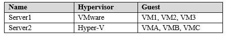

The virtual machines are configured as shown in the following table.

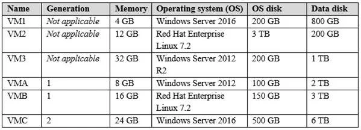

All the virtual machines use basic disks. VM1 is protected by using BitLocker Drive Encryption (BitLocker).
You plan to migrate the virtual machines to Azure by using Azure Site Recovery.
You need to identify which virtual machines can be migrated.

Which virtual machines should you identify for each server? To answer, select the appropriate options in the
answer area.

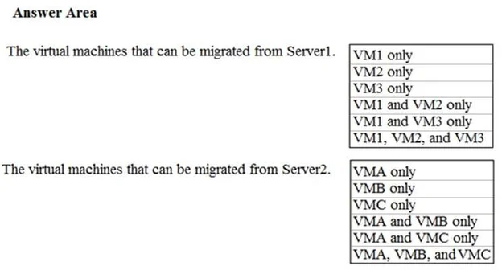

[See the answer](#answer-2)

### Question 3
You have an Azure subscription that contains multiple resource groups. You create an availability set as
shown in the following exhibit.

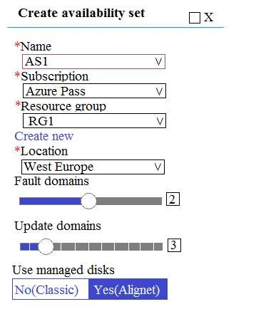

You deploy 10 virtual machines to AS1.
Use the drop-down menus to select the answer choice that completes each statement based on the information presented in the graphic.

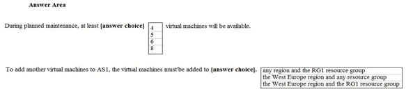

[See the answer](#answer-3)

### Question 4
You have an Azure subscription that contains two storage accounts named storagecontoso1 and
storagecontoso2. Each storage account contains a queue service, a table service, and a blob service.
You develop two apps named App1 and App2. You need to configure the apps to store different types of
data to all the storage services on both the storage accounts.

How many endpoints should you configure for each app?

* A: 2
* B: 3
* C: 6
* D: 12

[See the answer](#answer-4)

### Question 5
You have an Azure subscription named Subscription1.

You have a virtualization environment that contains the virtualization servers in the following table.

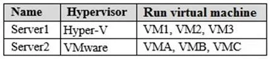

The virtual machines are configured as shown in the following table.

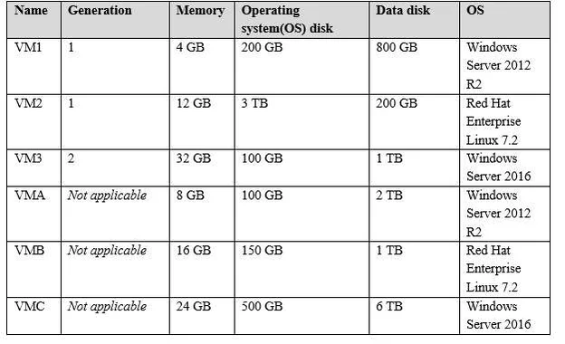

All the virtual machines use basic disks. VM1 is protected by using BitLocker Drive Encryption (BitLocker).

You plan to use Azure Site Recovery to migrate the virtual machines to Azure. 

Which virtual machines can you migrate? To answer, select the appropriate options in the answer area.

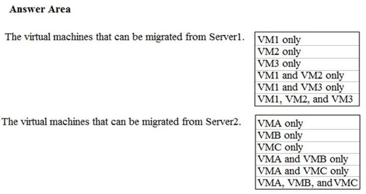

[See the answer](#answer-5)

### Question 6
You plan to migrate a large amount of corporate data to Azure Storage and to back up files stored on old
hardware to Azure Storage.

You need to create a storage account named corpdata8548984n1, in the corpdatalod8548984 resource
group. The solution must meet the following requirements:
- corpdata8548984n1 must be able to host the virtual disk files for Azure virtual machines
- The cost of accessing the files must be minimized
- Replication costs must be minimized

What should you do from the Azure portal?

[See the answer](#answer-6)

### Question 7
You plan to move backup files and documents from an on-premises Windows file server to Azure Storage.
The backup files will be stored as blobs.

You need to create a storage account named corpdata8548984n2. The solution must meet the following
requirements:
- Ensure that the documents are accessible via drive mappings from Azure virtual machines that run
Windows Server 2016
- Provide the highest possible redundancy for the documents
- Minimize storage access costs

What should you do from the Azure portal?

[See the answer](#answer-7)

### Question 8
You need to deploy two Azure virtual machines named VM1003a and VM1003b based on an Ubuntu Server
image. The deployment must meet the following requirements:
- Provide a Service Level Agreement (SLA) of 99.95 percent availability
- Use managed disks

What should you do from the Azure portal?

[See the answer](#answer-8)

### Question 9
You need to deploy an Azure virtual machine named VM1004a based on an Ubuntu Server image, and then
to configure VM1004a to meet the following requirements:
- The virtual machines must contain data disks that can store at least 15 TB of data
- The data disk must be able to provide at least 2,000 IOPS
- Storage costs must be minimized

What should you do from the Azure portal?

[See the answer](#answer-9)

### Question 10
You plan to create 100 Azure virtual machines on each of the following three virtual networks:
- VNET1005a
- VNET1005b
- VNET1005c

All the network traffic between the three virtual networks will be routed through VNET1005a.

You need to create the virtual networks, and then to ensure that all the Azure virtual machines can connect
to other virtual machines by using their private IP address. The solutions must NOT require any virtual
gateways and must minimize the number of peerings.

What should you do from the Azure portal before you configure IP routing?

[See the answer](#answer-10)

### Question 11
You plan to deploy several Azure virtual machines and to connect them to a virtual network named VNET1007.

You need to ensure that future virtual machines on VNET1007 can register their name in an internal DNS
zone named corp8548984.com. The zone must NOT be hosted on a virtual machine.

What should you do from Azure Cloud Shell?

[See the answer](#answer-11)

### Question 12
Another administrator reports that she is unable to configure a web app named corplod10217507n3 to
prevent all connections from an IP address of 11.0.0.11.
You need to modify corplod10217507n3 to successfully prevent the connections from the IP address. The
solution must minimize Azure-related costs.

What should you do from the Azure portal?

[See the answer](#answer-12)

### Question 13
You need to add a deployment slot named staging to an Azure web app named corplod10217507n4. The
solution must meet the following requirements:
- When new code is deployed to staging, the code must be swapped automatically to the production slot.
- Azure-related costs must be minimized.

What should you do from the Azure portal?

[See the answer](#answer-13)

### Question 14
You plan to deploy an application gateway named appgw1015 to load balance internal IP traffic to the Azure virtual machines connected to subnet0.

You need to configure a virtual network named VNET1015 to support the planned application gateway.

What should you do from the Azure portal?

[See the answer](#answer-14)

### Question 15
You plan to connect a virtual network named VNET1017 to your on-premises network by using both an
Azure ExpressRoute and a site-to-site VPN connection.

You need to prepare the Azure environment for the planned deployment. The solutions must maximize the
IP address space available to Azure virtual machines.

What should you do from the Azure portal before you create the ExpressRoute and the VPN gateway?

[See the answer](#answer-15)

### Question 16
You have an Azure subscription named Subscription1 that contains a virtual network named VNet1. You
add the users in the following table. 

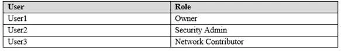

Which user can perform each configuration? To answer, select the appropriate options in the answer area.


[See the answer](#answer-16)

### Question 17
You have an Azure subscription that contains three virtual networks named VNet1, VNet2, and VNet3.
VNet2 contains a virtual appliance named VM2 that operates as a router. 

You are configuring the virtual networks in a hub and spoke topology that uses VNet2 as the hub network.
You plan to configure peering between VNet1 and VNet2 and between VNet2 and VNet3.

You need to provide connectivity between VNet1 and VNet3 through VNet2.

Which two configurations should you perform? Each correct answer presents part of the solution.

* A: On the peering connections, allow forwarded traffic
* B: Create a route filter
* C: On the peering connections, allow gateway transit
* D: Create route tables and assign the table to subnets
* E: On the peering connections, use remote gateways

[See the answer](#answer-17)

### Question 18
You have an Azure subscription that contains two virtual networks named VNet1 and VNet2. Virtual machines connect to the virtual networks. The virtual networks have the address spaces and the subnets configured as shown in the following table.

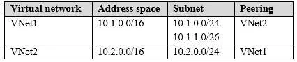

You need to add the address space of 10.33.0.0/16 to VNet1. The solution must ensure that the hosts on
VNet1 and VNet2 can communicate.

Which three actions should you perform in sequence? To answer, move the appropriate actions from the
list of actions to the answer area and arrange them in the correct order.
Select and Place:

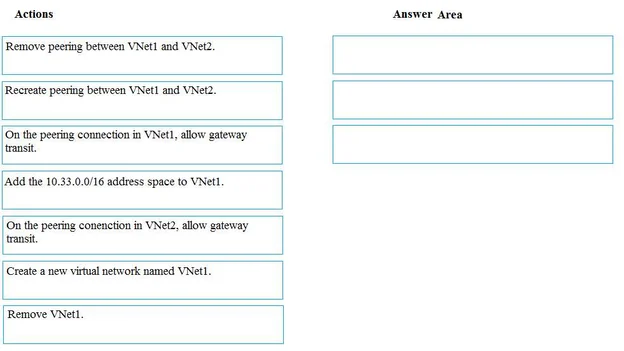

[See the answer](#answer-18)

### Question 19
You are designing a virtual network to support a web application. The web application uses Blob storage to
store large images. The web application will be deployed to an Azure App Service Web App.
You have the following requirements:
-  Secure all communications by using Secured Socket layer (SSL)
-  SSL encryption and decryption must be processed efficiently to support high traffic load on the web
application
-  Protect the web application from web vulnerabilities and attacks without modification to backend code
-  Optimize web application responsiveness and reliability by routing HTTP request and responses to the
endpoint with the lowest network latency for the client.

You need to configure the Azure components to meet the requirements.

What should you do? To answer, select the appropriate options in the answer area. 

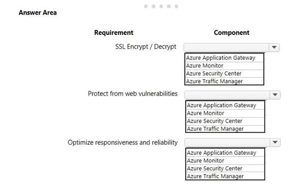

[See the answer](#answer-19)

### Question 20
You have Azure Storage accounts as shown in the following exhibit.

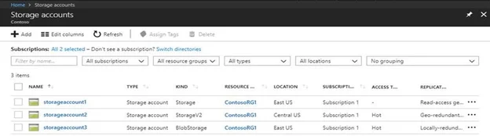

Use the drop-down menus to select the answer choice that completes each statement based on the information presented in the graphic.

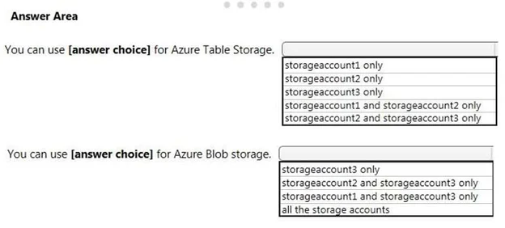

[See the answer](#answer-20)

### Answer 1

**CORRECT ANSWER:** C

**Explanation:**

You apply tags to your Azure resources to logically organize them into a taxonomy. Each tag consists of a
name and a value pair. After you apply tags, you can retrieve all the resources in your subscription with that
tag name and value. 
Tags enable you to retrieve related resources from different resource groups. 
This approach is helpful when you need to organize resources for billing or management.

**Reference:**
* https://docs.microsoft.com/en-us/azure/billing/billing-getting-started
* https://docs.microsoft.com/en-us/azure/azure-resource-manager/resource-group-using-tags

[Back to question](#question-1)

### Answer 2

**CORRECT ANSWER:**

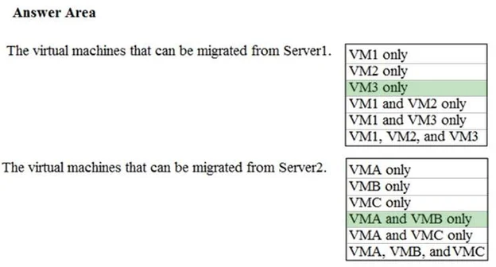

**Explanation:**

Incorrect Answers:
* VM1 cannot be migrates as it has BitLocker enabled.
* VM2 cannot be migrates as the OS disk on VM2 is larger than 2TB.
* VMC cannot be migrates as the Data disk on VMC is larger than 4TB.

**Reference:**
* https://docs.microsoft.com/en-us/azure/site-recovery/hyper-v-azure-support-matrix#azure-vm-requirements

[Back to question](#question-2)

### Answer 3

**CORRECT ANSWER:**

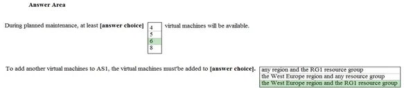

**Explanation:**

Box 1: 6

Two out of three update domains would be available, each with at least 3 VMs.
An update domain is a group of VMs and underlying physical hardware that can be rebooted at the same
time.
As you create VMs within an availability set, the Azure platform automatically distributes your VMs across
these update domains. This approach ensures that at least one instance of your application always remains
running as the Azure platform undergoes periodic maintenance.

Box 2: the West Europe region and the RG1 resource group

**Reference:**
* https://docs.microsoft.com/en-us/azure/virtual-machines/windows/regions

[Back to question](#question-3)

### Answer 4

**CORRECT ANSWER:** A

**Explanation:**

Each app needs a service endpoint in each Storage Account.

**Reference:**
* https://docs.microsoft.com/en-us/azure/storage/common/storage-network-security

[Back to question](#question-4)

### Answer 5

**CORRECT ANSWER:**

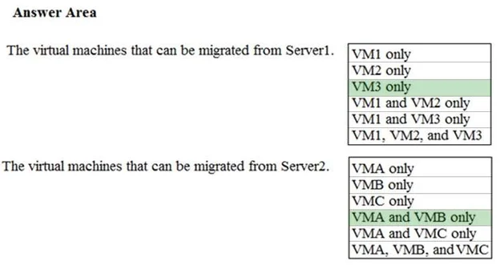

**Explanation:**

Incorrect Answers:
* VM1 cannot be migrates as it has BitLocker enabled.
* VM2 cannot be migrates as the OS disk on VM2 is larger than 2TB.
* VMC cannot be migrates as the Data disk on VMC is larger than 4TB.

**Reference:**
* https://docs.microsoft.com/en-us/azure/site-recovery/hyper-v-azure-support-matrix#azure-vm-requirements

[Back to question](#question-5)

### Answer 6

**CORRECT ANSWER:**

1. In the Azure portal, click All services. In the list of resources, type Storage Accounts. As you begin
typing, the list filters based on your input. Select Storage Accounts.
2. On the Storage Accounts window that appears, choose Add.
3. Select the subscription in which to create the storage account.
4. Under the Resource group field, select corpdatalod8548984.
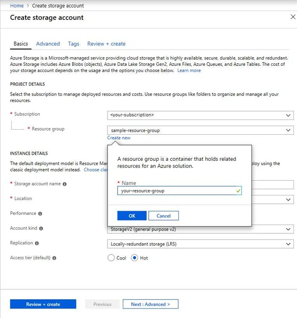
5. Enter a name for your storage account: corpdata8548984n1
6. For Account kind select: General-purpose v2 accounts (recommended for most scenarios)
General-purpose v2 accounts is recommended for most scenarios. General-purpose v2 accounts deliver
the lowest per-gigabyte capacity prices for Azure Storage, as well as industry-competitive transaction
prices.
7. For replication select: Read-access geo-redundant storage (RA-GRS)
Read-access geo-redundant storage (RA-GRS) maximizes availability for your storage account. RA-GRS
provides read-only access to the data in the secondary location, in addition to geo-replication across two
regions.

**Reference:**
* https://docs.microsoft.com/en-us/azure/storage/common/storage-quickstart-create-account
* https://docs.microsoft.com/en-us/azure/storage/common/storage-account-overview

[Back to question](#question-6)

### Answer 7

**CORRECT ANSWER:**

1. In the Azure portal, click All services. In the list of resources, type Storage Accounts. As you begin
typing, the list filters based on your input. Select Storage Accounts.
2. On the Storage Accounts window that appears, choose Add.
3. Select the subscription in which to create the storage account.
4. Under the Resource group field, select Create New. Create a new Resource 

5. Enter a name for your storage account: corpdata8548984n2
6. For Account kind select: General-purpose v2 accounts (recommended for most scenarios)
General-purpose v2 accounts is recommended for most scenarios. General-purpose v2 accounts deliver
the lowest per-gigabyte capacity prices for Azure Storage, as well as industry-competitive transaction
prices.
7. For replication select: Read-access geo-redundant storage (RA-GRS)
Read-access geo-redundant storage (RA-GRS) maximizes availability for your storage account. RA-GRS
provides read-only access to the data in the secondary location, in addition to geo-replication across two
regions.

**References:**
* https://docs.microsoft.com/en-us/azure/storage/common/storage-quickstart-create-account
* https://docs.microsoft.com/en-us/azure/storage/common/storage-account-overview

[Back to question](#question-7)

### Answer 8

**CORRECT ANSWER:**

1. Open the Azure portal.
2. On the left menu, select All resources. You can sort the resources by Type to easily find your
images.
3. Select the image you want to use from the list. The image Overview page opens.
4. Select Create VM from the menu.
5. Enter the virtual machine information. Select VM1003a as the name for the first Virtual machine.The
user name and password entered here will be used to log in to the virtual machine. When complete, select
OK. You can create the new VM in an existing resource group, or choose Create new to create a new
resource group to store the VM.
6. Select a size for the VM. To see more sizes, select View all or change the Supported disk type filter.
7. Under Settings, make changes as necessary and select OK.
8. On the summary page, you should see your image name listed as a Private image. Select Ok to
start the virtual machine deployment.
Repeat the procedure for the second VM and name it VM1003b.

**References:**
* https://docs.microsoft.com/en-us/azure/virtual-machines/windows/create-vm-generalized-managed

[Back to question](#question-8)

### Answer 9

**CORRECT ANSWER:**

1. Open the Azure portal.
2. On the left menu, select All resources. You can sort the resources by Type to easily find your
images.
3. Select the image you want to use from the list. The image Overview page opens.
4. Select Create VM from the menu.
5. Enter the virtual machine information. Select VM1004a as the name for the first Virtual machine.The
user name and password entered here will be used to log in to the virtual machine. When complete, select
OK. You can create the new VM in an existing resource group, or choose Create new to create a new
resource group to store the VM.
6. Select a size for the VM. To see more sizes, select View all or change the Supported disk type
filter.To support 15 TB of data you would need a Premium disk.
7. Under Settings, make changes as necessary and select OK.
8. On the summary page, you should see your image name listed as a Private image. Select Ok to
start the virtual machine deployment.

**References:**
* https://docs.microsoft.com/en-us/azure/virtual-machines/windows/create-vm-generalized-managed

[Back to question](#question-9)

### Answer 10

**CORRECT ANSWER:**

1. Click Create a resource in the portal.
2. Enter Virtual network in the Search the Marketplace box at the top of the New pane that appears.
Click Virtual network when it appears in the search results.
3. Select Classic in the Select a deployment model box in the Virtual Network pane that appears, then
click Create.
4. Enter the following values on the Create virtual network (classic) pane and then click Create:
Name: VNET1005a
Address space: 10.0.0.0/16
Subnet name: subnet0
Resource group: Create new
Subnet address range: 10.0.0.0/24
Subscription and location: Select your subscription and location.
5. Repeat steps 3-5 for VNET1005b (10.1.0.0/16, 10.1.0.0/24), and for VNET1005c 10.2.0.0/16,
10.2.0.0/24).

**References:**
* https://docs.microsoft.com/en-us/azure/virtual-network/create-virtual-network-classic

[Back to question](#question-10)

### Answer 11

**CORRECT ANSWER:**

Enter the following command at the powershell command prompt: 
```powershell
New-AzDnsZone -Name "corp8548984.com" 
 -ResourceGroupName "mycloudshell"
 -ZoneType Private 
 -RegistrationVirtualNetworkId VNET1007
```
>**Note:** A DNS zone is created by using the New-AzDnsZone cmdlet with a value of Private for the ZoneType parameter.

**References:**
* https://docs.microsoft.com/en-us/azure/dns/private-dns-getstarted-powershell
* https://docs.microsoft.com/en-us/azure/cloud-shell/quickstart-powershell
* https://docs.microsoft.com/en-us/powershell/module/az.dns/new-azdnszone?view=azps-1.5.0

[Back to question](#question-11)

### Answer 12

**CORRECT ANSWER:**

1. Find and select application corplod10217507n3:
    * In the Azure portal, on the left navigation panel, click Azure Active Directory.
    * In the Azure Active Directory blade, click Enterprise applications.
2. To add an IP restriction rule to your app, use the menu to open Network>IP Restrictions and click on
Configure IP Restrictions
3. Click Add rule
You can click on [+] Add to add a new IP restriction rule. Once you add a rule, it will become effective
immediately.

4. Add name, IP address of 11.0.0.11, select Deny, and click Add Rule

**References:**
* https://docs.microsoft.com/en-us/azure/app-service/app-service-ip-restrictions

[Back to question](#question-12)

### Answer 13

**CORRECT ANSWER:**

1. Locate and open the corplod10217507n4 web app.
    * In the Azure portal, on the left navigation panel, click Azure Active Directory.
    * In the Azure Active Directory blade, click Enterprise applications.
2. Open your app's resource blade and Choose the Deployment slots option, then click Add Slot.
3. In the Add a slot blade, give the slot a name, and select whether to clone app configuration from another
existing deployment slot. Click the check mark to continue.
The first time you add a slot, you only have two choices: clone configuration from the default slot in
production or not at all.

**References:**
* https://docs.microsoft.com/en-us/azure/app-service/web-sites-staged-publishing

[Back to question](#question-13)

### Answer 14

**CORRECT ANSWER:**

1. Click Networking, Virtual Network, and select VNET1015.
2. Click Subnets, and Click +Add on the VNET1015 - Subnets pane that appears.
3. On the Subnets page, click +Gateway subnet at the top to open the Add subnet page.
4. Locate subnet0 and add it.

**References:**
* https://docs.microsoft.com/en-us/azure/vpn-gateway/vpn-gateway-howto-site-to-site-resource-manager-portal

[Back to question](#question-14)

### Answer 15

**CORRECT ANSWER:**

We need to create a Gateway subnet
1. Go to More Services > Virtual Networks
2. Then click on the VNET1017, and click on subnets. Then click on gateway subnet.
3. In the next window define the subnet for the gateway and click OK
It is recommended to use /28 or /27 for gateway subnet.
As we want to maximize the IP address space we should use /27.

**References:**
* https://blogs.technet.microsoft.com/canitpro/2017/06/28/step-by-step-configuring-a-site-to-site-vpn-gateway-between-azure-and-on-premise/

[Back to question](#question-15)

### Answer 16

**CORRECT ANSWER:**

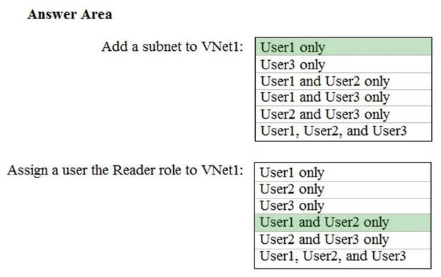

**Explanation:**

Box 1: User1 only.

User1: The Owner Role lets you manage everything, including access to resources.
Not User3: The Network Contributor role lets you manage networks, but not access to them.

Box 2: User1 and User2 only

The Security Admin role: In Security Center only: Can view security policies, view security states, edit
security policies, view alerts and recommendations, dismiss alerts and recommendations.

**References:**
* https://docs.microsoft.com/en-us/azure/role-based-access-control/built-in-roles

[Back to question](#question-16)

### Answer 17

**CORRECT ANSWER:** C, E

**Explanation:**

Allow gateway transit: Check this box if you have a virtual network gateway attached to this virtual network
and want to allow traffic from the peered virtual network to flow through the gateway.

The peered virtual network must have the Use remote gateways checkbox checked when setting up the
peering from the other virtual network to this virtual network.

**References:**
* https://docs.microsoft.com/en-us/azure/virtual-network/virtual-network-manage-peering#requirements-and-constraints

[Back to question](#question-17)

### Answer 18

**CORRECT ANSWER:**

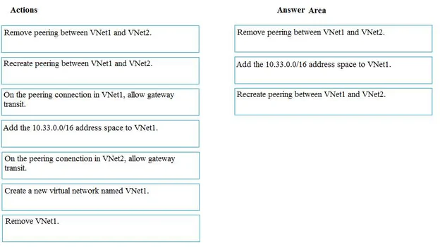

**Explanation:**

1. Remove peering between Vnet1 and VNet2.
You can't add address ranges to, or delete address ranges from a virtual network's address space once a
virtual network is peered with another virtual network. To add or remove address ranges, delete the
peering, add or remove the address ranges, then re-create the peering.
2. Add the 10.44.0.0/16 address space to VNet1.
3. Recreate peering between VNet1 and VNet2

**References:**
* https://docs.microsoft.com/en-us/azure/virtual-network/virtual-network-manage-peering

[Back to question](#question-18)

### Answer 19

**CORRECT ANSWER:**

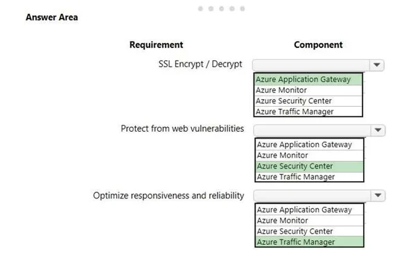

**Explanation:**

Box 1: Azure application Gateway

Azure Application Gateway supports end-to-end encryption of traffic. Application Gateway terminates the
SSL connection at the application gateway. The gateway then applies the routing rules to the traffic, re-
encrypts the packet, and forwards the packet to the appropriate back-end server based on the routing rules
defined. Any response from the web server goes through the same process back to the end user.

Box 2: Azure Security Center

Azure Security Center is a unified infrastructure security management system that strengthens the security
posture of your data centers, and provides advanced threat protection across your hybrid workloads in the
cloud - whether they're in Azure or not - as well as on premises.

Box 3: Azure Traffic Manager

Azure Traffic Manager is a DNS-based traffic load balancer that enables you to distribute traffic optimally to
services across global Azure regions, while providing high availability and responsiveness.

**References:**
* https://docs.microsoft.com/en-us/azure/application-gateway/application-gateway-end-to-end-ssl-powershell
* https://docs.microsoft.com/en-us/azure/traffic-manager/traffic-manager-overview
* https://docs.microsoft.com/en-us/azure/security-center/security-center-intro

[Back to question](#question-19)

### Answer 20

**CORRECT ANSWER:**

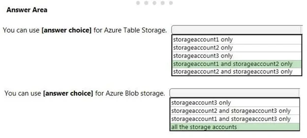

**Explanation:**

Note: The three different storage account options are: General-purpose v2 (GPv2) accounts, General-
purpose v1 (GPv1) accounts, and Blob storage accounts.
- General-purpose v2 (GPv2) accounts are storage accounts that support all of the latest features for
blobs, files, queues, and tables.
- Blob storage accounts support all the same block blob features as GPv2, but are limited to supporting
only block blobs.
- General-purpose v1 (GPv1) accounts provide access to all Azure Storage services, but may not have
the latest features or the lowest per gigabyte pricing.

**References:**
* https://docs.microsoft.com/en-us/azure/storage/common/storage-account-options

[Back to question](#question-20)