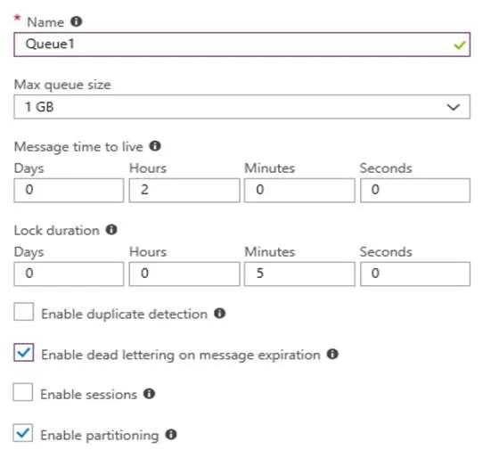
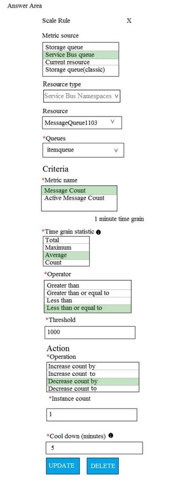

### Question 101

**SCENARIO:**

[Case-1](scenario.md#case-1)

You need to prepare the environment to ensure that the web administrators can deploy the web apps as quickly as possible.

Which three actions should you perform in sequence? To answer, move the appropriate actions from the list of actions to the answer area and arrange them in the correct order.

[See the answer](#answer-101)

### Question 102

**SCENARIO:**

[Case-1](scenario.md#case-1)

You need to resolve the licensing issue before you attempt to assign the license again.

What should you do?

* A: From the Directory role blade, modify the directory role

* B: From the Groups blade, invite the user accounts to a new group

* C: From the Profile blade, modify the usage location

[See the answer](#answer-102)

### Question 103

**SCENARIO:**

[Case-2](scenario.md#case-2)

You need to define a custom domain name for Azure AD to support the planned infrastructure.

Which domain name should you use?

* A: ad.humongousinsurance.com

* B: humongousinsurance.local

* C: humongousinsurance.com

* D: humongousinsurance.onmicrosoft.com

[See the answer](#answer-103)

### Question 104

**SCENARIO:**

[Case-3](scenario.md#case-3)

You need to meet the connection requirements for the New York office.

What should you do? To answer, select the appropriate options in the answer area.

[See the answer](#answer-104)

### Question 105

**SCENARIO:**

[Case-3](scenario.md#case-3)

What should you create to configure AG2?

* A: multi-site listeners

* B: URL path-based routing rules

* C: basic routing rules

* D: an additional public IP address

* E: basic listeners

[See the answer](#answer-105)

### Question 106

**SCENARIO:**

[Case-3](scenario.md#case-3)

You have an Azure subscription that contains the resources shown in the following table.

Subnet1 is on VNET1. VM1 connects to Subnet1.

You plan to create a virtual network gateway on VNET1.

You need to prepare the environment for the planned virtual network gateway.

What are two ways to achieve this goal? Each correct answer presents a complete solution.

* A: Modify the address space used by VNET1.

* B: Modify the address space used by Subnet1.

* C: Create a subnet named GatewaySubnet on VNET1.

* D: Create a local network gateway.

* E: Delete Subnet1.

[See the answer](#answer-106)

### Question 107

**SCENARIO:**

[Case-3](scenario.md#case-3)

A company hosts virtual machines (VMs) in an on-premises datacenter and in Azure. The on-premises and Azure-based VMs communicate using ExpressRoute.

The company wants to be able to continue regular operations if the ExpressRoute connection fails. Failover connections must use the Internet and must not require Multiprotocol Label Switching (MPLS) support.

You need to recommend a solution that provides continued operations.

What should you recommend?

* A: Set up a second ExpressRoute connection.

* B: Increase the bandwidth of the existing ExpressRoute connection.

* C: Increase the bandwidth for the on-premises internet connection.

* D: Set up a VPN connection.

[See the answer](#answer-107)

### Question 108

**SCENARIO:**

[Case-3](scenario.md#case-3)

You have a web app named WebApp1 that uses an Azure App Service plan named Plan1. Plan1 uses the D1 pricing tier and has an instance count of 1.

You need to ensure that all connections to WebApp1 use HTTPS.

What should you do first?

* A: Scale up Plan1.

* B: Modify the connection strings for WebApp1.

* C: Scale out Plan1.

* D: Disable anonymous access to WebApp1.

[See the answer](#answer-108)

### Question 109

**SCENARIO:**

[Case-3](scenario.md#case-3)

You have an Azure subscription that contains an Azure Service Fabric cluster and a Service Fabric application named FabricApp.

You develop and package a Service Fabric application named AppPackage. AppPackage is saved in a compressed folder named AppPackage.zip.

You upload AppPackage.zip to an external store.

You need to register AppPackage in the Azure subscription.

What should you do first?

* A: Run the New-ServiceFabricApplication cmdlet.

* B: Repackage the application in a file named App.sfpkg.

* C: Create a new Service Fabric cluster.

* D: Copy AppPackage.zip to a blob storage account.

[See the answer](#answer-109)

### Question 110

**SCENARIO:**

[Case-3](scenario.md#case-3)

Your company runs several Windows and Linux virtual machines (VMs).

You must design a solution that implements data privacy, compliance, and data sovereignty for all storage uses in Azure. You plan to secure all Azure storage accounts by using Role-Based Access Controls (RBAC) and Azure Active Directory (Azure AD).

You need to secure the data used by the VMs.

Which solution should you use? To answer, select the appropriate solutions in the answer area.

Hot Area:

[See the answer](#answer-110)

### Question 111

**SCENARIO:**

[Case-3](scenario.md#case-3)

You develop an entertainment application where users can buy and trade virtual real estate. The application must scale to support thousands of users.

The current architecture includes five Azure virtual machines (VM) that connect to an Azure SQL Database for account information and Azure Table Storage for backend services. A user interacts with these components in the cloud at any given time.

- Routing Service – Routes a request to the appropriate service and must not persist data across sessions.

- Account Service – Stores and manages all account information and authentication and requires data to persist across sessions

- User Service – Stores and manages all user information and requires data to persist across sessions.

- Housing Network Service – Stores and manages the current real-estate economy and requires data to persist across sessions.

- Trade Service – Stores and manages virtual trade between accounts and requires data to persist across sessions.

Due to volatile user traffic, a microservices solution is selected for scale agility.

You need to migrate to a distributed microservices solution on Azure Service Fabric.

Solution: Create a Service Fabric Cluster with a stateful Reliable Service for each component.

Does the solution meet the goal?

* A: Yes

* B: No

[See the answer](#answer-111)

### Question 112

**SCENARIO:**

[Case-3](scenario.md#case-3)

You develop an entertainment application where users can buy and trade virtual real estate. The application must scale to support thousands of users.

The current architecture includes five Azure virtual machines (VM) that connect to an Azure SQL Database for account information and Azure Table Storage for backend services. A user interacts with these components in the cloud at any given time.

- Routing Service – Routes a request to the appropriate service and must not persist data across sessions.

- Account Service – Stores and manages all account information and authentication and requires data to persist across sessions

- User Service – Stores and manages all user information and requires data to persist across sessions.

- Housing Network Service – Stores and manages the current real-estate economy and requires data to persist across sessions.

- Trade Service – Stores and manages virtual trade between accounts and requires data to persist across sessions.

Due to volatile user traffic, a microservices solution is selected for scale agility.

You need to migrate to a distributed microservices solution on Azure Service Fabric.

Solution: Create a Service Fabric Cluster with a stateless Reliable Service for Routing Service. Create stateful Reliable Services for all other components.

Does the solution meet the goal?

* A: Yes

* B: No

[See the answer](#answer-112)

### Question 113

**SCENARIO:**

[Case-3](scenario.md#case-3)

You develop an entertainment application where users can buy and trade virtual real estate. The application must scale to support thousands of users.

The current architecture includes five Azure virtual machines (VM) that connect to an Azure SQL Database for account information and Azure Table Storage for backend services. A user interacts with these components in the cloud at any given time.

- Routing Service – Routes a request to the appropriate service and must not persist data across sessions.

- Account Service – Stores and manages all account information and authentication and requires data to persist across sessions

- User Service – Stores and manages all user information and requires data to persist across sessions.

- Housing Network Service – Stores and manages the current real-estate economy and requires data to persist across sessions.

- Trade Service – Stores and manages virtual trade between accounts and requires data to persist across sessions.

Due to volatile user traffic, a microservices solution is selected for scale agility.

You need to migrate to a distributed microservices solution on Azure Service Fabric.

Solution: Create a Service Fabric Cluster with a stateful Reliable Service for Routing Service. Deploy a Guest Executable to Service Fabric for each component.

Does the solution meet the goal?

* A: Yes

* B: No

[See the answer](#answer-113)

### Question 114

**SCENARIO:**

[Case-3](scenario.md#case-3)

You are developing a web app that uses a REST interface to connect to Azure Storage with HTTPS. This app uploads and streams video content that can be accessed from anywhere in the world.

You have different storage requirements for each part of the app. A hierarchical namespace must be created.

Which storage services should you implement? To answer, select the appropriate services to the correct actions. Each service may be used once, more than once, or not at all. You may need to drag the split bar between panes or scroll to view content.

[See the answer](#answer-114)

### Question 115

**SCENARIO:**

[Case-3](scenario.md#case-3)

You create an Azure Time Series Insights event handler. You need to send data over the network as efficiently as possible and optimize query performance.

What should you do?

* A: Create a query plan

* B: Send all properties

* C: Use a Tag ID

* D: Use reference data

[See the answer](#answer-115)

### Question 116

**SCENARIO:**

[Case-3](scenario.md#case-3)

You are creating an IoT solution using Azure Time Series Insights.

You configure the environment to ensure that all data for the current year is available.

What should you do?

* A: Add a disaster recovery (DR) strategy.

* B: Set a value for the Data retention time setting.

* C: Change the pricing tier.

* D: Create a reference data set.

[See the answer](#answer-116)

### Question 117

**SCENARIO:**

[Case-3](scenario.md#case-3)

You have an Azure subscription that contains a storage account.

You have an on-premises server named Server1 that runs Windows Server 2016. Server1 has 2 TB of data.

You need to transfer the data to the storage account by using the Azure Import/Export service.

In which order should you perform the actions? To answer, move all actions form the list of actions to the answer area and arrange them in the correct order.

[See the answer](#answer-117)

### Question 118

**SCENARIO:**

[Case-3](scenario.md#case-3)

You have an Azure subscription named Subscription1.

You have 5 TB of data that you need to transfer to Subscription1.

You plan to use an Azure Import/Export job.

What can you use as the destination of the imported data?

* A: an Azure Cosmos DB database

* B: Azure SQL Database

* C: Azure File Storage

* D: Azure Data Lake Store

[See the answer](#answer-118)

### Question 119

**SCENARIO:**

[Case-3](scenario.md#case-3)

You have an Azure subscription that contains the resources in the following table.

Store1 contains a file share named Data. Data contains 5,000 files.

You need to synchronize the files in Data to an on-premises server named Server1.

Which three actions should you perform? Each correct answer presents part of the solution.

* A: Download an automation script

* B: Create a sync group

* C: Install the Azure File Sync agent on Server1

* D: Create a container instance

* E: Register Server1

[See the answer](#answer-119)

### Question 120

**SCENARIO:**

[Case-3](scenario.md#case-3)

You have an Azure subscription named Subscription1. Subscription1 contains a virtual machine named VM1.

You install and configure a web server and a DNS server on VM1.

VM1 has the effective network security rules shown in the following exhibit.

Use the drop-down menus to select the answer choice that completes each statement based on the information presented in the graphic.

[See the answer](#answer-120)

### Question 121

**SCENARIO:**

[Case-3](scenario.md#case-3)

You plan to back up an Azure virtual machine named VM1. 

You discover that the Backup Pre-Check status displays a status of Warning.

What is a possible cause of the Warning status?

* A: VM1 does not have the latest version of WaAppAgent.exe installed

* B: A Recovery Services vault is unavailable

* C: VM1 has an unmanaged disk

* D: VM1 is stopped

[See the answer](#answer-121)

### Question 122

**SCENARIO:**

[Case-3](scenario.md#case-3)

You have an Azure subscription named Subscription1. Subscription1 contains a virtual machine named VM1. You have a computer Computer1 that runs Windows 10. Computer1 is connected to the Internet.

You add a network interface named Interface1 to VM1 as shown in the exhibit. (Click the Exhibit tab.)

From Computer1, you attempt to connect to VM1 by using Remote Desktop, but the connection fails.

You need to establish a Remote Desktop connection to VM1.

What should you do first?

* A: Attach a network interface

* B: Start VM1

* C: Delete the DenyAllOutBound outbound port rule

* D: Delete the DenyAllInBound inbound port rule

[See the answer](#answer-122)

### Question 123

**SCENARIO:**

[Case-3](scenario.md#case-3)

You are designing an Azure solution.

The solution must meet the following requirements:

- Distribute traffic to different pools of dedicated virtual machines (VMs) based on rules

- Provide SSL offloading capabilities

You need to recommend a solution to distribute network traffic.

Which technology should you recommend?

* A: server-level firewall rules

* B: Azure Application Gateway

* C: Azure Traffic Manager

* D: Azure Load Balancer

[See the answer](#answer-123)

### Question 124

**SCENARIO:**

[Case-3](scenario.md#case-3)

You have an Azure subscription named Subscription1.

In Subscription1, you create an alert rule named Alert1. The Alert1 action group is configured as shown in the following exhibit.

Alert1 alert criteria is triggered every minute.

Use the drop-down menus to select the answer choice that completes each statement based on the information presented in the graphic.

[See the answer](#answer-124)

### Question 125

**SCENARIO:**

[Case-3](scenario.md#case-3)

You have an Azure subscription named Subscription1 that contains the resources in the following table.

 

A web server runs on VM1 and VM2.

When you request a webpage named Page1.htm from the Internet, LB1 balances the web requests to VM1 and VM2., and you receive a response.

On LB1, you have a rule named Rule1 as shown in the Rule1 exhibit. (Click the Exhibit tab.)

You have a health probe named Probe1 as shown in the Probe1 exhibit. (Click the Exhibit tab.)

For each of the following statements, select Yes if the statement is true. Otherwise, select No.

[See the answer](#answer-125)

### Question 126

**SCENARIO:**

[Case-3](scenario.md#case-3)

You develop an entertainment application where users can buy and trade virtual real estate. The application must scale to support thousands of users.

The current architecture includes five Azure virtual machines (VM) that connect to an Azure SQL Database for account information and Azure Table Storage for backend services. A user interacts with these components in the cloud at any given time.

- Routing Service – Routes a request to the appropriate service and must not persist data across sessions.

- Account Service – Stores and manages all account information and authentication and requires data to persist across sessions

- User Service – Stores and manages all user information and requires data to persist across sessions.

- Housing Network Service – Stores and manages the current real-estate economy and requires data to persist across sessions.

- Trade Service – Stores and manages virtual trade between accounts and requires data to persist across sessions.

Due to volatile user traffic, a microservices solution is selected for scale agility.

You need to migrate to a distributed microservices solution on Azure Service Fabric.

Solution: Deploy a Windows container to Azure Service Fabric for each component.

Does the solution meet the goal?

* A: Yes

* B: No

[See the answer](#answer-126)

### Question 127

**SCENARIO:**

[Case-3](scenario.md#case-3)

You plan to create several virtual machines in different availability zones, and then to configure the virtual machines to load balanced connections from the Internet.

You need to create an IP address resource named ip1006 to support the planned load balancing solution.

The solution must minimize costs.

What should you do from the Azure portal?

[See the answer](#answer-127)

### Question 128

**SCENARIO:**

[Case-3](scenario.md#case-3)

You have an Azure subscription that contains the storage accounts shown in the following table.

You enable Azure Advanced Threat Protection (ATP) for all the storage accounts.

You need to identify which storage accounts will generate Azure ATP alerts.

Which two storage accounts should you identify? Each correct answer presents part of the solution.

* A: storagecontoso1

* B: storagecontoso2

* C: storagecontoso3

* D: storagecontoso4

* E: storagecontoso5

[See the answer](#answer-128)

### Question 129

**SCENARIO:**

[Case-3](scenario.md#case-3)

You have an Azure Active Directory (Azure AD) tenant named Adatum and an Azure Subscription named Subscription1. Adatum contains a group named Developers. Subscription1 contains a resource group named Dev.

You need to provide the Developers group with the ability to create Azure logic apps in the Dev resource group.

Solution: On Subscription1, you assign the DevTest Labs User role to the Developers group.

Does this meet the goal?

* A: Yes

* B: No

[See the answer](#answer-129)

### Question 130

**SCENARIO:**

[Case-3](scenario.md#case-3)

You have an Azure Active Directory (Azure AD) tenant named Adatum and an Azure Subscription named Subscription1. Adatum contains a group named Developers. Subscription1 contains a resource group named Dev.

You need to provide the Developers group with the ability to create Azure logic apps in the Dev resource group.

Solution: On Dev, you assign the Logic App Contributor role to the Developers group.

Does this meet the goal?

* A: Yes

* B: No

[See the answer](#answer-130)

### Question 131

**SCENARIO:**

[Case-3](scenario.md#case-3)

You have an Azure Service Bus and a queue named Queue1. Queue1 is configured as shown in the following exhibit.

Use the drop-down menus to select the answer choice that completes each statement based on the information presented in the graphic.

[See the answer](#answer-131)

### Question 132

**SCENARIO:**

[Case-3](scenario.md#case-3)

You have an Azure Active Directory (Azure AD) tenant named Adatum and an Azure Subscription named Subscription1. Adatum contains a group named Developers. Subscription1 contains a resource group named Dev.

You need to provide the Developers group with the ability to create Azure logic apps in the Dev resource group.

Solution: On Dev, you assign the Contributor role to the Developers group.

Does this meet the goal?

* A: Yes

* B: No

[See the answer](#answer-132)

### Question 133

**SCENARIO:**

[Case-3](scenario.md#case-3)

A company backs up data to on-premises servers at their main facility. The company currently has 30 TB of archived data that infrequently used. The facility has download speeds of 100 Mbps and upload speeds of 20 Mbps.

You need to securely transfer all backups to Azure Blob Storage for long-term archival. All backup data must be sent within seven days.

Solution: Backup data to local disks and use the Azure Import/Export service to send backups to Azure Blob Storage.

Does this meet the goal?

* A: Yes

* B: No

[See the answer](#answer-133)

### Question 134

**SCENARIO:**

[Case-3](scenario.md#case-3)

A company backs up data to on-premises servers at their main facility. The company currently has 30 TB of archived data that infrequently used. The facility has download speeds of 100 Mbps and upload speeds of 20 Mbps.

You need to securely transfer all backups to Azure Blob Storage for long-term archival. All backup data must be sent within seven days.

Solution: Create a file share in Azure Files. Mount the file share to the server and upload the files to the file share. Transfer the files to Azure Blob Storage.

Does this meet the goal?

* A: Yes

* B: No

[See the answer](#answer-134)

### Question 135

**SCENARIO:**

[Case-3](scenario.md#case-3)

A company backs up data to on-premises servers at their main facility. The company currently has 30 TB of archived data that infrequently used. The facility has download speeds of 100 Mbps and upload speeds of 20 Mbps.

You need to securely transfer all backups to Azure Blob Storage for long-term archival. All backup data must be sent within seven days.

Solution: Use the Set-AzureStorageBlobContent Azure PowerShell command to copy all backups asynchronously to Azure Blob Storage.

Does this meet the goal?

* A: Yes

* B: No

[See the answer](#answer-135)

### Question 136

**SCENARIO:**

[Case-3](scenario.md#case-3)

You are developing a back-end Azure App Service that scales based on the number of messages contained in a Service Bus queue.

A rule already exists to scale up the App Service when the average queue length of unprocessed and valid queue messages is greater than 1000.

You need to add a new rule that will continuously scale down the App Service as long as the scale up condition is not met.

How should you configure the Scale rule? To answer, select the appropriate options in the answer area.

[See the answer](#answer-136)

### Question 137

**SCENARIO:**

[Case-3](scenario.md#case-3)

You have an on-premises network that contains a Hyper-V host named Host1. Host1 runs Windows Server 2016 and hosts 10 virtual machines that run Windows Server 2016.

You plan to replicate the virtual machines to Azure by using Azure Site Recovery.

You create a Recovery Services vault named ASR1 and a Hyper-V site named Site1.

You need to add Host1 to ASR1.

What should you do?

* A: 
	- Download the installation file for the Azure Site Recovery Provider.

	- Download the storage account key.

	- Install the Azure Site Recovery Provider on each virtual machine and register the virtual machines.

* B: 
	- Download the installation file for the Azure Site Recovery Provider.

	- Download the vault registration key.

	- Install the Azure Site Recovery Provider on Host1 and register the server.

* C: 
	- Download the installation file for the Azure Site Recovery Provider.

	- Download the storage account key.

	- Install the Azure Site Recovery Provider on Host1 and register the server.

* D: 
	- Download the installation file for the Azure Site Recovery Provider.

	- Download the vault registration key.

	- Install the Azure Site Recovery Provider on each virtual machine and register the virtual machines.

[See the answer](#answer-137)

### Question 138

**SCENARIO:**

[Case-3](scenario.md#case-3)

You plan to migrate an on-premises Hyper-V environment to Azure by using Azure Site Recovery. The Hyper-V environment is managed by using Microsoft System Center Virtual Machine Manager (VMM). 

The Hyper-V environment contains the virtual machines in the following table:

Which virtual machine can be migrated by using Azure Site Recovery?

* A: FS1

* B: CA1

* C: DC1

* D: SQL1

[See the answer](#answer-138)

### Question 139

**SCENARIO:**

[Case-3](scenario.md#case-3)

You have an on-premises network that you plan to connect to Azure by using a site-to-site VPN.

In Azure, you have an Azure virtual network named VNet1 that uses an address space of 10.0.0.0/16.

VNet1 contains a subnet named Subnet1 that uses an address space of 10.0.0.0/24.

You need to create a site-to-site VPN to Azure.

Which four actions should you perform in sequence? To answer, move the appropriate actions from the list of actions to the answer area and arrange them in the correct order.

[See the answer](#answer-139)

### Question 140

**SCENARIO:**

[Case-3](scenario.md#case-3)

You have an Azure subscription named Subscription1 that contains two Azure networks named VNet1 and VNet2. VNet1 contains a VPN gateway named VPNGW1 that uses static routing. There is a site-to-site VPN connection between your on-premises network and VNet1.

On a computer named Client1 that runs Windows 10, you configure a point-to-site VPN connection to VNet1.

You configure virtual network peering between VNet1 and VNet2. You verify that you can connect to VNet2 from the on-premises network. Client1 is unable to connect to VNet2.

You need to ensure that you can connect Client1 to VNet2.

What should you do?

* A: Select Allow gateway transit on VNet1.

* B: Download and re-install the VPN client configuration package on Client1.

* C: Enable BGP on VPNGW1.

* D: Select Allow gateway transit on VNet2.

[See the answer](#answer-140)

### Question 141

**SCENARIO:**

[Case-3](scenario.md#case-3)

Your company has offices in New York and Los Angeles.

You have an Azure subscription that contains an Azure virtual network named VNet1. Each office has a site-to-site VPN connection to VNet1.

Each network uses the address spaces shown in the following table:

You need to ensure that all Internet-bound traffic from VNet1 is routed through the New York office.

What should you do? To answer, select the appropriate options in the answer area.

[See the answer](#answer-141)

### Question 142

**SCENARIO:**

[Case-3](scenario.md#case-3)

You have a Microsoft SQL Server Always On availability group on Azure virtual machines.

You need to configure an Azure internal load balancer as a listener for the availability group.

What should you do?

* A: Create an HTTP health probe on port 1433.

* B: Set Session persistence to Client IP.

* C: Set Session persistence to Client IP and protocol.

* D: Enable Floating IP.

[See the answer](#answer-142)

### Question 143

**SCENARIO:**

[Case-3](scenario.md#case-3)

You set the multi-factor authentication status for a user named admin1@contoso.com to Enabled.

Admin1 accesses the Azure portal by using a web browser.

Which additional security verifications can Admin1 use when accessing the Azure portal?

* A: an app password, a text message that contains a verification code, and a verification code sent from the Microsoft Authenticator app

* B: a phone call, a text message that contains a verification code, and a notification or a verification code sent from the Microsoft Authenticator app

* C: a phone call, an email message that contains a verification code, and a text message that contains an app password

* D: an app password, a text message that contains a verification code, and a notification sent from the Microsoft Authenticator app

[See the answer](#answer-143)

### Question 144

**SCENARIO:**

[Case-3](scenario.md#case-3)

You have an Azure Active Directory (Azure AD) tenant that contains three global administrators named Admin1, Admin2, and Admin3.

The tenant is associated to an Azure subscription. Access control for the subscription is configured as shown in the Access control exhibit. (Click the Exhibit tab.)

You sign in to the Azure portal as Admin1 and configure the tenant as shown in the Tenant exhibit. (Click the Exhibit tab.)

For each of the following statement, select Yes if the statement is true. Otherwise, select No.

[See the answer](#answer-144)

### Question 145

**SCENARIO:**

[Case-3](scenario.md#case-3)

You have an Azure Active Directory (Azure AD) tenant.

All administrators must enter a verification code to access the Azure portal.

You need to ensure that the administrators can access the Azure portal only from your on-premises network.

What should you configure?

* A: the default for all the roles in Azure AD Privileged Identity Management

* B: an Azure AD Identity Protection user risk policy

* C: an Azure AD Identity Protection sign-in risk policy

* D: the multi-factor authentication service settings

[See the answer](#answer-145)

### Question 146

**SCENARIO:**

[Case-3](scenario.md#case-3)

You have an Azure subscription named Subscription1 that contains a virtual network named VNet1. VNet1 is in a resource group named RG1.

Subscription1 has a user named User1. User1 has the following roles:

- Reader

- Security Admin

- Security Reader

You need to ensure that User1 can assign the Reader role for VNet1 to other users.

What should you do?

* A: Assign User1 the Owner role for VNet1.

* B: Assign User1 the Network Contributor role for VNet1.

* C: Remove User1 from the Security Reader and Reader roles for Subscription1. Assign User1 the Contributor role for Subscription1.

* D: Remove User1 from the Security Reader and Reader roles for Subscription1.

[See the answer](#answer-146)

### Question 147

**SCENARIO:**

[Case-3](scenario.md#case-3)

You are creating an app that uses Event Grid to connect with other services. Your app’s event data will be sent to a serverless function that checks compliance. This function is maintained by your company.

You write a new event subscription at the scope of your resource. The event must be invalidated after a specific period of time.

You need to configure Event Grid to ensure security.

What should you implement? To answer, select the appropriate options in the answer area.

[See the answer](#answer-147)

### Question 148

**SCENARIO:**

[Case-3](scenario.md#case-3)

You are building a custom Azure function app to connect to Azure Event Grid.

You need to ensure that resources are allocated dynamically to the function app. Billing must be based on the executions of the app.

What should you configure when you create the function app?

* A: the Windows operating system and the App Service plan hosting plan

* B: the Docker container and an App Service plan that uses the B1 pricing tier

* C: the Windows operating system and the Consumption plan hosting plan

* D: the Docker container and an App Service plan that uses the S1 pricing tier

[See the answer](#answer-148)

### Question 149

**SCENARIO:**

[Case-3](scenario.md#case-3)

You have an Azure Service Bus.

You need to implement a Service Bus queue that guarantees first-in-first-out (FIFO) delivery of messages.

What should you do?

* A: Enable partitioning

* B: Enable duplicate detection

* C: Set the Lock Duration setting to 10 seconds

* D: Enable sessions

* E: Set the Max Size setting of the queue to 5 GB

[See the answer](#answer-149)

### Question 150

**SCENARIO:**

[Case-3](scenario.md#case-3)

You have an Azure subscription that contains a policy-based virtual network gateway named GW1 and a virtual network named VNet1.

You need to ensure that you can configure a point-to-site connection from VNet1 to an on-premises computer.

Which two actions should you perform? Each correct answer presents part of the solution.

* A: Add a service endpoint to VNet1.

* B: Add a public IP address space to VNet1.

* C: Create a route-based virtual network gateway.

* D: Reset GW1.

* E: Delete GW1.

* F: Add a connection to GW1.

[See the answer](#answer-150)

### Answer 101

**CORRECT ANSWER:**

**Explanation:**

Step 1: First you create a storage account using the Azure portal.

Step 2: Select Automation options at the bottom of the screen. The portal shows the template on the Template tab. Add the storage account to the library.

Step 3: Share the template.

Scenario: Web administrators will deploy Azure web apps for the marketing department. Each web app will be added to a separate resource group. The initial configuration of the web apps will be identical. The web administrators have permission to deploy web apps to resource groups.

**Reference:**

https://docs.microsoft.com/en-us/azure/azure-resource-manager/resource-manager-quickstart-create-templates-use-the-portal

[Back to question](#question-101)

### Answer 102

**CORRECT ANSWER:** C

**Explanation:**

License cannot be assigned to a user without a usage location specified.

Scenario: Licensing Issue You attempt to assign a license in Azure to several users and receive the following error message: "Licenses not assigned. License agreement failed for one user."

You verify that the Azure subscription has the available licenses.

[Back to question](#question-102)

### Answer 103

**CORRECT ANSWER:** C

**Explanation:**

Every Azure AD directory comes with an initial domain name in the form of domainname.onmicrosoft.com.

The initial domain name cannot be changed or deleted, but you can add your corporate domain name to Azure AD as well. For example, your organization probably has other domain names used to do business and users who sign in using your corporate domain name. Adding custom domain names to Azure AD allows you to assign user names in the directory that are familiar to your users, such as ‘alice@contoso.com.’ instead of 'alice@domain name.onmicrosoft.com'.

Scenario: Network Infrastructure: Each office has a local data center that contains all the servers for that office. Each office has a dedicated connection to the Internet.

Humongous Insurance has a single-domain Active Directory forest named humongousinsurance.com

Planned Azure AD Infrastructure: The on-premises Active Directory domain will be synchronized to Azure AD.

**Reference:**

https://docs.microsoft.com/en-us/azure/active-directory/fundamentals/add-custom-domain

[Back to question](#question-103)

### Answer 104

**CORRECT ANSWER:**

**Explanation:**

Box 1: Create a virtual network gateway and a local network gateway.

Azure VPN gateway. The VPN gateway service enables you to connect the VNet to the on-premises network through a VPN appliance. For more information, see Connect an on-premises network to a Microsoft Azure virtual network. The VPN gateway includes the following elements:

- Virtual network gateway. A resource that provides a virtual VPN appliance for the VNet. It is responsible for routing traffic from the on-premises network to the VNet.

- Local network gateway. An abstraction of the on-premises VPN appliance. Network traffic from the cloud application to the on-premises network is routed through this gateway.

- Connection. The connection has properties that specify the connection type (IPSec) and the key shared with the on-premises VPN appliance to encrypt traffic.

- Gateway subnet. The virtual network gateway is held in its own subnet, which is subject to various requirements, described in the Recommendations section below.

Box 2: Configure a site-to-site VPN connection

On premises create a site-to-site connection for the virtual network gateway and the local network gateway.

Scenario: Connect the New York office to VNet1 over the Internet by using an encrypted connection.

Incorrect Answers:

Azure ExpressRoute: Established between your network and Azure, through an ExpressRoute partner. This connection is private. Traffic does not go over the internet.

**Reference:**

https://docs.microsoft.com/en-us/azure/architecture/reference-architectures/hybrid-networking/vpn

[Back to question](#question-104)

### Answer 105

**CORRECT ANSWER:** A

**Explanation:**

AG2 must load balance incoming traffic in the following manner:

- http://www.adatum.com will be load balanced across Pool21.

- http://fabrikam.com will be load balanced across Pool22.

You need to configure an Azure Application Gateway with multi-site listeners to direct different URLs to different pools.

**Reference:**

https://docs.microsoft.com/en-us/azure/application-gateway/multiple-site-overview Question Set 1

[Back to question](#question-105)

### Answer 106

**CORRECT ANSWER:** A, E

[Back to question](#question-106)

### Answer 107

**CORRECT ANSWER:** D

**Reference:**

https://docs.microsoft.com/en-us/azure/architecture/reference-architectures/hybrid-networking/expressroute-vpn-failover

[Back to question](#question-107)

### Answer 108

**CORRECT ANSWER:** A

**Explanation:**

The D1 (Shared) pricing tier does not support HTTPS.

[Back to question](#question-108)

### Answer 109

**CORRECT ANSWER:** B

**Reference:**

https://docs.microsoft.com/en-us/azure/service-fabric/service-fabric-package-apps#create-an-sfpkg

[Back to question](#question-109)

### Answer 110

**CORRECT ANSWER:**

**Reference:**

https://docs.microsoft.com/en-us/azure/security/security-storage-overview

[Back to question](#question-110)

### Answer 111

**CORRECT ANSWER:** B

[Back to question](#question-111)

### Answer 112

**CORRECT ANSWER:** A

[Back to question](#question-112)

### Answer 113

**CORRECT ANSWER:** B

[Back to question](#question-113)

### Answer 114

**CORRECT ANSWER:**

[Back to question](#question-114)

### Answer 115

**CORRECT ANSWER:** D

**Reference:**

https://docs.microsoft.com/en-us/azure/time-series-insights/how-to-shape-query-json

[Back to question](#question-115)

### Answer 116

**CORRECT ANSWER:** D

[Back to question](#question-116)

### Answer 117

**CORRECT ANSWER:**

**Explanation:**

At a high level, an import job involves the following steps:

Step 1: Attach an external disk to Server1 and then run waimportexport.exe

Determine data to be imported, number of drives you need, destination blob location for your data in Azure storage.

Use the WAImportExport tool to copy data to disk drives. Encrypt the disk drives with BitLocker.

Step 2: From the Azure portal, create an import job.

Create an import job in your target storage account in Azure portal. Upload the drive journal files.

Step 3: Detach the external disks from Server1 and ship the disks to an Azure data center.

Provide the return address and carrier account number for shipping the drives back to you.

Ship the disk drives to the shipping address provided during job creation.

Step 4: From the Azure portal, update the import job

Update the delivery tracking number in the import job details and submit the import job.

The drives are received and processed at the Azure data center.

The drives are shipped using your carrier account to the return address provided in the import job.

**Reference:**

https://docs.microsoft.com/en-us/azure/storage/common/storage-import-export-service

[Back to question](#question-117)

### Answer 118

**CORRECT ANSWER:** C

**Explanation:**

Azure Import/Export service is used to securely import large amounts of data to Azure Blob storage and Azure Files by shipping disk drives to an Azure datacenter.

**Reference:**

https://docs.microsoft.com/en-us/azure/storage/common/storage-import-export-service

[Back to question](#question-118)

### Answer 119

**CORRECT ANSWER:** B, C, E

**Explanation:**

Step 1 (C): Install the Azure File Sync agent on Server1

The Azure File Sync agent is a downloadable package that enables Windows Server to be synced with an Azure file share

Step 2 (E): Register Server1.

Register Windows Server with Storage Sync Service

Registering your Windows Server with a Storage Sync Service establishes a trust relationship between your server (or cluster) and the Storage Sync Service.

Step 3 (B): Create a sync group and a cloud endpoint.

A sync group defines the sync topology for a set of files. Endpoints within a sync group are kept in sync with each other. A sync group must contain one cloud endpoint, which represents an Azure file share and one or more server endpoints. A server endpoint represents a path on registered server.

**Reference:**

https://docs.microsoft.com/en-us/azure/storage/files/storage-sync-files-deployment-guide

[Back to question](#question-119)

### Answer 120

**CORRECT ANSWER:**

**Explanation:**

Box 1:

Rule2 blocks ports 50-60, which includes port 53, the DNS port. Internet users can reach to the Web server, since it uses port 80.

Box 2:

If Rule2 is removed internet users can reach the DNS server as well.

>**Note:** Rules are processed in priority order, with lower numbers processed before higher numbers, because lower numbers have higher priority. Processing stops once traffic matches a rule, as a result, any rules that exist with lower priorities (higher numbers) that have the same attributes as rules with higher priorities are not processed.

**Reference:**

https://docs.microsoft.com/en-us/azure/virtual-network/security-overview

[Back to question](#question-120)

### Answer 121

**CORRECT ANSWER:** A

**Explanation:**

The Warning state indicates one or more issues in VM’s configuration that might lead to backup failures and provides recommended steps to ensure successful backups. Not having the latest VM Agent installed, for example, can cause backups to fail intermittently and falls in this class of issues.

**Reference:**

https://azure.microsoft.com/en-us/blog/azure-vm-backup-pre-checks/

[Back to question](#question-121)

### Answer 122

**CORRECT ANSWER:** B

**Explanation:**

The exclamation icon next to the inbound port rule for port 3389, which is used for Remote Desktop, indicates an underlying problem. Restart the VM to correct any underlying issues the VM itself is having.

Incorrect Answers:

A: The network interface has already been added to VM.

C: The DenyAllOutBound outbound port rule will not affect inbound Remote Desktop connectivity.

D: An inbound rule for port 3389, which is used for Remote Desktop has been added and has a higher priority than the DenyAllInBound inbound port rule.

>**Note:** Rules are processed in priority order, with lower numbers processed before higher numbers, because lower numbers have higher priority. Processing stops once traffic matches a rule. As a result, any rules that exist with lower priorities (higher numbers) that have the same attributes as rules with higher priorities are not processed.

**Reference:**

https://docs.microsoft.com/en-us/azure/virtual-network/security-overview

[Back to question](#question-122)

### Answer 123

**CORRECT ANSWER:** B

**Explanation:**

If you require "SSL offloading", application layer treatment, or wish to delegate certificate management to Azure, you should use Azure's layer 7 load balancer Application Gateway instead of the Load Balanacer.

Incorrect Answers:

D: Because Load Balancer is agnostic to the TCP payload and TLS offload ("SSL") is not provided.

**Reference:** https://docs.microsoft.com/en-us/azure/application-gateway/overview

[Back to question](#question-123)

### Answer 124

**CORRECT ANSWER:**

**Explanation:**

Box 1: 60

One alert per minute will trigger one email per minute.

Box 2: 12

No more than 1 SMS every 5 minutes can be send, which equals 12 per hour.

>**Note:** Rate limiting is a suspension of notifications that occurs when too many are sent to a particular phone number, email address or device. Rate limiting ensures that alerts are manageable and actionable.

The rate limit thresholds are:

- SMS: No more than 1 SMS every 5 minutes.

- Voice: No more than 1 Voice call every 5 minutes.

- Email: No more than 100 emails in an hour.

- Other actions are not rate limited.

**Reference:**

https://github.com/MicrosoftDocs/azure-docs/blob/master/articles/azure-monitor/overview.md

[Back to question](#question-124)

### Answer 125

**CORRECT ANSWER:**

**Explanation:**

Box 1: No

Session Persistence is None.

Box 2: Yes

Web requests uses the HTTP protocol, not the TCP protocol.

Box 3: No

>**Note:** Azure Load Balancer provides health probes for use with load-balancing rules. Health probe configuration and probe responses determine which backend pool instances will receive new flows. You can use health probes to detect the failure of an application on a backend instance. You can also generate a custom response to a health probe and use the health probe for flow control to manage load or planned downtime. When a health probe fails, Load Balancer stops sending new flows to the respective unhealthy instance.

**Reference:**

https://docs.microsoft.com/en-us/azure/load-balancer/load-balancer-custom-probe-overview

[Back to question](#question-125)

### Answer 126

**CORRECT ANSWER:** B

[Back to question](#question-126)

### Answer 127

**CORRECT ANSWER:**

We should create a public IP address.

Step 1: At the top, left corner of the portal, select + Create a resource.

Step 2: Enter public ip address in the Search the Marketplace box. When Public IP address appears in the search results, select it.

Step 3: Under Public IP address, select Create.

Step 4: Enter, or select values for the following settings, under Create public IP address, then select Create:

| Field | Value |
| --- | --- |
| Name | ip1006 |
| SKU | Basic SKU |
| IP Version | IPv6 |
| IP address assignment | Dynamic |
| Subscription | Select appropriate |
| Resource group | Select appropriate |

**Reference:**

https://docs.microsoft.com/en-us/azure/virtual-network/virtual-network-public-ip-address

[Back to question](#question-127)

### Answer 128

**CORRECT ANSWER:** A, E

**Explanation:**

Example: Storage Threat Detection is available for the Blob Service.

**Reference:** 

https://azure.microsoft.com/en-us/blog/advanced-threat-protection-for-azure-storage-now-in-public-preview/

[Back to question](#question-128)

### Answer 129

**CORRECT ANSWER:** B

**Explanation:**

The DevTest Labs User role lets you connect, start, restart, and shutdown your virtual machines in your Azure DevTest Labs.

**Reference:**

https://docs.microsoft.com/en-us/azure/role-based-access-control/built-in-roles#devtest-labs-user

[Back to question](#question-129)

### Answer 130

**CORRECT ANSWER:** B

**Explanation:**

The Logic App Contributor role lets you read, enable and disable logic app.

**Reference:**

https://docs.microsoft.com/en-us/azure/role-based-access-control/built-in-roles#logic-app-contributor

[Back to question](#question-130)

### Answer 131

**CORRECT ANSWER:**

[Back to question](#question-131)

### Answer 132

**CORRECT ANSWER:** A

**Explanation:**

The Contributor role lets you manage everything except access to resources. It allows you to create and manage resources of all types, including creating Azure logic apps.

**Reference:**

https://docs.microsoft.com/en-us/azure/role-based-access-control/built-in-roles#contributor

[Back to question](#question-132)

### Answer 133

**CORRECT ANSWER:** A

[Back to question](#question-133)

### Answer 134

**CORRECT ANSWER:** B

[Back to question](#question-134)

### Answer 135

**CORRECT ANSWER:** B

[Back to question](#question-135)

### Answer 136

**CORRECT ANSWER:**

[Back to question](#question-136)

### Answer 137

**CORRECT ANSWER:** B

**Reference:**

https://docs.microsoft.com/en-us/azure/site-recovery/hyper-v-azure-tutorial

[Back to question](#question-137)

### Answer 138

**CORRECT ANSWER:** D

**Reference:**

https://docs.microsoft.com/en-us/azure/site-recovery/hyper-v-azure-support-matrix#azure-vm-requirements

[Back to question](#question-138)

### Answer 139

**CORRECT ANSWER:**

[Back to question](#question-139)

### Answer 140

**CORRECT ANSWER:** B

**Explanation:**

Point-to-Site certificate authentication connections require the following prerequisites:

- A Dynamic VPN gateway.

- The public key (.cer file) for a root certificate, which is uploaded to Azure. This key is considered a trusted certificate and is used for authentication.

- A client certificate generated from the root certificate, and installed on each client computer that will connect. This certificate is used for client authentication.

- A VPN client configuration package must be generated and installed on every client computer that connects. The client configuration package configures the native VPN client that's already on the operating system with the necessary information to connect to the VNet.

**Reference:**

https://docs.microsoft.com/en-us/azure/vpn-gateway/vpn-gateway-about-point-to-site-routing

[Back to question](#question-140)

### Answer 141

**CORRECT ANSWER:**

[Back to question](#question-141)

### Answer 142

**CORRECT ANSWER:** D

**Reference:**

https://docs.microsoft.com/en-us/azure/virtual-machines/windows/sql/virtual-machines-windows-portal-sql-alwayson-int-listener

[Back to question](#question-142)

### Answer 143

**CORRECT ANSWER:** B

**Explanation:**

The Microsoft Authenticator app can help prevent unauthorized access to accounts and stop fraudulent transactions by pushing a notification to your smartphone or tablet. Users view the notification, and if it's legitimate, select Verify. Otherwise, they can select Deny.

**Reference:**

https://docs.microsoft.com/en-us/azure/active-directory/authentication/concept-authentication-methods

[Back to question](#question-143)

### Answer 144

**CORRECT ANSWER:**

[Back to question](#question-144)

### Answer 145

**CORRECT ANSWER:** D

**Reference:**

https://docs.microsoft.com/en-us/azure/active-directory/authentication/howto-mfa-mfasettings

[Back to question](#question-145)

### Answer 146

**CORRECT ANSWER:** A

[Back to question](#question-146)

### Answer 147

**CORRECT ANSWER:**

**Reference:**

https://docs.microsoft.com/en-us/azure/event-grid/security-authentication

[Back to question](#question-147)

### Answer 148

**CORRECT ANSWER:** C

**Reference:**

https://docs.microsoft.com/en-us/azure/azure-functions/functions-scale

[Back to question](#question-148)

### Answer 149

**CORRECT ANSWER:** D

**Reference:**

https://docs.microsoft.com/en-us/azure/service-bus-messaging/service-bus-azure-and-service-bus-queues-compared-contrasted

[Back to question](#question-149)

### Answer 150

**CORRECT ANSWER:** C, E

[Back to question](#question-150)