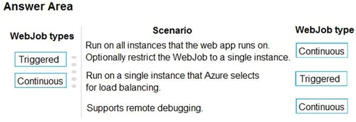

### Question 151

**SCENARIO:**

[Case-3](scenario.md#case-3)

Your network contains an Active Directory domain that is synced to Azure Active Directory (Azure AD) as shown in the following exhibit.


You have a user account configured as shown in the following exhibit.


For each of the following statements, select Yes if the statement is true. Otherwise, select No.


[See the answer](#answer-151)

### Question 152

**SCENARIO:**

[Case-3](scenario.md#case-3)

You create a new Azure subscription. You create a resource group named RG1. In RG1, you create the resources shown in the following table.


You need to configure an encrypted tunnel between your on-premises network and VNET1.

Which two additional resources should you create in Azure? Each correct answer presents part of the solution.

* A: a site-to-site connection

* B: a VPN gateway

* C: a VNet-to- VNet connection

* D: a local network gateway

* E: a point-to-site configuration

[See the answer](#answer-152)

### Question 153

**SCENARIO:**

[Case-3](scenario.md#case-3)

You have an Azure subscription.

You have an on-premises file server named Server1 that runs Windows Server 2019.

You manage Server1 by using Windows Admin Center.

You need to ensure that if Server1 fails, you can recover the data from Azure.

Solution: From the Azure portal, you create a Recovery Services vault. On VM1, you install the Azure Backup agent and you schedule a backup.

Does this meet the goal?

* A: Yes

* B: No

[See the answer](#answer-153)

### Question 154

**SCENARIO:**

[Case-3](scenario.md#case-3)

You have an Azure subscription.

You have an on-premises file server named Server1 that runs Windows Server 2019.

You manage Server1 by using Windows Admin Center.

You need to ensure that if Server1 fails, you can recover Server1 files from Azure.

Solution: You create a Recovery Services vault and configure a backup by using Windows Server Backup.

Does this meet the goal?

* A: Yes

* B: No

[See the answer](#answer-154)

### Question 155

**SCENARIO:**

[Case-3](scenario.md#case-3)

You have an Azure subscription.

You have an on-premises file server named Server1 that runs Windows Server 2019.

You manage Server1 by using Windows Admin Center.

You need to ensure that if Server1 fails, you can recover Server1 files from Azure.

Solution: You create an Azure Storage account and an Azure Storage Sync service. You configure Azure File Sync for Server1.

Does this meet the goal?

* A: Yes

* B: No

[See the answer](#answer-155)

### Question 156

**SCENARIO:**

[Case-3](scenario.md#case-3)

You have an Azure subscription.

You plan to deploy an app that has a web front end and an application tier.

You need to recommend a load balancing solution that meets the following requirements:

- Internet to web tier:

	- Provides URL-based routing

	- Supports connection draining

	- Prevents SQL injection attacks

- Web tier to application tier:

	- Provides port forwarding

	- Supports HTTPS health probes

	- Supports an availability set as a backend pool

Which load balancing solution should you recommend for each tier? To answer, select the appropriate options in the answer area.


[See the answer](#answer-156)

### Question 157

**SCENARIO:**

[Case-3](scenario.md#case-3)

You have virtual machines (VMs) that run a mission-critical application.

You need to ensure that the VMs never experience down time.

What should you recommend? To answer, drag the appropriate solutions to the correct scenarios. Each solution may be used once, more than once, or not at all. You may need to drag the split bar between panes or scroll to view content.


[See the answer](#answer-157)

### Question 158

**SCENARIO:**

[Case-3](scenario.md#case-3)

You have an on-premises network that includes a Microsoft SQL Server instance named SQL1.

You create an Azure Logic App named App1.

You need to ensure that App1 can query a database on SQL1.

Which three actions should you perform in sequence? To answer, move the appropriate actions from the list of actions to the answer area and arrange them in the correct order.


[See the answer](#answer-158)

### Question 159

**SCENARIO:**

[Case-3](scenario.md#case-3)

You have an Azure subscription.

You have an on-premises file server named Server1 that runs Windows Server 2019.

You manage Server1 by using Windows Admin Center.

You need to ensure that if Server1 fails, you can recover Server1 files from Azure.

Solution: You register Windows Admin Center in Azure and configure Azure Backup.

Does this meet the goal?

* A: Yes

* B: No

[See the answer](#answer-159)

### Question 160

**SCENARIO:**

[Case-3](scenario.md#case-3)

You are designing a solution to secure a company’s Azure resources. The environment hosts 10 teams.

Each team manages a project and has a project manager, a virtual machine (VM) operator, developers, and contractors.

Project managers must be able to manage everything except access and authentication for users. VM operators must be able to manage VMs, but not the virtual network or storage account to which they are connected. Developers and contractors must be able to manage storage accounts.

You need to recommend roles for each member.

What should you recommend? To answer, drag the appropriate roles to the correct employee types. Each role may be used once, more than once, or not at all. You may need to drag the split bar between panes or scroll to view content.


[See the answer](#answer-160)

### Question 161

**SCENARIO:**

[Case-4](scenario.md#case-4)

You have an Azure subscription that contains an Azure Service Bus named Bus1.

Your company plans to deploy two Azure web apps named App1 and App2. The web app will create messages that have the following requirements:

- Each message created by App1 must be consumed by only a single consumer.

- Each message created by App2 will consumed by multiple consumers.

Which resource should you create for each web app? To answer, drag the appropriate resources to the correct web apps. Each resource may be used once, more than once, or not at all. You may need to drag the split bar between panes or scroll to view content.


[See the answer](#answer-161)

### Question 162

**SCENARIO:**

[Case-4](scenario.md#case-4)

You need to configure AG1. 

What should you create?

* A: a multi-site listener

* B: a basic routing rule

* C: a URL path-based routing rule

* D: a basic listener

[See the answer](#answer-162)

### Question 163

**SCENARIO:**

[Case-4](scenario.md#case-4)

You need to configure the Azure ExpressRoute circuits.

How should you configure Azure ExpressRoute routing? To answer, drag the appropriate configurations to the correct locations. Each configuration may be used once, more than once, or not at all. You may need to drag the split bar between panes or scroll to view content.


[See the answer](#answer-163)

### Question 164

**SCENARIO:**

[Case-4](scenario.md#case-4)

You need to prepare the New York office infrastructure for the migration of the on-premises virtual machines to Azure.

Which four actions should you perform in sequence? To answer, move the appropriate actions from the list of actions to the answer area and arrange them in the correct order.


[See the answer](#answer-164)

### Question 165

**SCENARIO:**

[Case-4](scenario.md#case-4)

You need to provision the resources in Azure to support the virtual machine that will be migrated from the New York office.

What should you include in the solution? To answer, select the appropriate options in the answer area.


[See the answer](#answer-165)

### Question 166

**SCENARIO:**

[Case-5](scenario.md#case-5)

You need to identify the appropriate sizes for the Azure virtual machines.

Which five actions should you perform in sequence? To answer, move the appropriate actions from the list of actions to the answer area and arrange them in the correct order.


[See the answer](#answer-166)

### Question 167

**SCENARIO:**

[Case-5](scenario.md#case-5)

You need to meet the technical requirement for VM4.

What should you create and configure?

* A: an Azure Logic App

* B: an Azure Service Bus

* C: an Azure Notification Hub

* D: an Azure Event Hub

[See the answer](#answer-167)

### Question 168

**SCENARIO:**

[Case-5](scenario.md#case-5)

You need to use an Azure logic app to receive a notification when an administrator modifies the settings of a virtual machine in a resource group named RG1.

Which three components should you create next in the Logic Apps Designer? To answer, move the appropriate components from the list of components to the answer area and arrange them in the correct order.


[See the answer](#answer-168)

### Question 169

**SCENARIO:**

[Case-5](scenario.md#case-5)

You have an Azure subscription that contains the resources shown in the following table.


You need to deploy a load-balancing solution for two Azure web apps named App1 and App2 to meet the following requirements:

- App1 must support command injection protection.

- App2 must be able to use a static public IP address.

- App1 must have a Service Level Agreement (SLA) of 99.99 percent.

Which resource should you use as the load-balancing solution for each app? To answer, select the appropriate options in the answer area.


[See the answer](#answer-169)

### Question 170

**SCENARIO:**

[Case-5](scenario.md#case-5)

You have a task that includes a WebJob that should run continuously. The WebJob Log exhibit shows the text that is displayed when the WebJob runs. (Click the WebJob Log tab.)


The WebJob is configured as shown in the WebJob Configuration exhibit. (Click the WebJob Configuration tab.)


The WebJob is not functioning as expected. The WebJob Code exhibit has a comment that shows where code should be added. (Click the WebJob Code tab.)


You need to identify any issues with the WebJob. For each of the following statements, select Yes if the statement is true. Otherwise, select No.


[See the answer](#answer-170)

### Question 171

**SCENARIO:**

[Case-5](scenario.md#case-5)

You have an Azure App Service API that allows users to upload documents to the cloud with a mobile device. A mobile app connects to the service by using REST API calls. 

When a new document is uploaded to the service, the service extracts the document metadata. Usage statistics for the app show significant increases in app usage.

The extraction process is CPU-intensive. You plan to modify the API to use a queue.

You need to ensure that the solution scales, handles request spikes, and reduces costs between request spikes.

What should you do?

* A: Configure a CPU Optimized virtual machine (VM) and install the Web App service on the new instance.

* B: Configure a series of CPU Optimized virtual machine (VM) instances and install extraction logic to process a queue.

* C: Move the extraction logic into an Azure Function. Create a queue triggered function to process the queue.

* D: Configure Azure Container Service to retrieve items from a queue and run across a pool of virtual machine (VM) nodes using the extraction logic.

[See the answer](#answer-171)

### Question 172

**SCENARIO:**

[Case-5](scenario.md#case-5)

Fourth Coffee has an ASP.Net Core web app that runs in Docker. The app is mapped to the www.fourthcoffee.com domain.

Fourth Coffee is migrating this application to Azure.

You need to provision an App Service Web App to host this docker image and map the custom domain to the App Service web app.

A resource group named FourthCofeePublicWebResourceGroup has been created in the WestUS region that contains an App Service Plan named AppServiceLinuxDockerPlan.

Which order should the CLI commands be used to develop the solution? To answer, move all of the Azure CLI commands from the list of commands to the answer area and arrange them in the correct order.


[See the answer](#answer-172)

### Question 173

**SCENARIO:**

[Case-5](scenario.md#case-5)

You create a social media application that users can use to upload images and other content.

Users report that adult content is being posted in an area of the site that is accessible to and intended for young children.

You need to automatically detect and flag potentially offensive content. The solution must not require any custom coding other than code to scan and evaluate images.

What should you implement?

* A: Bing Visual Search

* B: Bing Image Search

* C: Custom Vision Search

* D: Computer Vision API

[See the answer](#answer-173)

### Question 174

**SCENARIO:**

[Case-5](scenario.md#case-5)

You plan to create a Docker image that runs an ASP.NET Core application named ContosoApp. You have a setup script named setupScript.ps1 and a series of application files including ContosoApp.dll.

You need to create a Dockerfile document that meets the following requirements:

- Call setupScript.ps1 when the container is built.

- Run ContosoApp.dll when the container starts.

The Dockerfile document must be created in the same folder where ContosoApp.dll and setupScript.ps1 are stored.

Which four commands should you use to develop the solution? To answer, move the appropriate commands from the list of commands to the answer area and arrange them in the correct order.


[See the answer](#answer-174)

### Question 175

**SCENARIO:**

[Case-5](scenario.md#case-5)

You have a web app named MainApp. You are developing a triggered App Service background task by using the WebJobs SDK.

This task automatically invokes a function in the code whenever any new data is received in a queue.

You need to configure the services.

Which service should you use for each scenario? To answer, drag the appropriate services to the correct scenarios. Each service may be used once, more than once, or not at all. You may need to drag the split bar between panes or scroll to view content.


[See the answer](#answer-175)

### Question 176

**SCENARIO:**

[Case-5](scenario.md#case-5)

You are developing Azure WebJobs.

You need to recommend a WebJob type for each scenario.

Which WebJob type should you recommend? To answer, drag the appropriate WebJob types to the correct scenarios. Each WebJob type may be used once, more than once, or not at all. You may need to drag the split bar between panes or scroll to view content.


[See the answer](#answer-176)

### Question 177

**SCENARIO:**

[Case-5](scenario.md#case-5)

You have an Azure web app named App1 that has the following configurations:

- The app runs on three instances.

- The minimum number of instances is one.

- The maximum number of instances is five.

You create the following autoscale rules for App1:

- Decrease the instance count by one when the CPU percentage is less than 30.

- Decrease the instance count by one when the memory percentage is less than 50.

- Increase the instance count by one when the CPU percentage is greater than 80.

- Increase the instance count by one when the memory percentage is greater than 75.

You expect App1 to be utilized as shown in the following table.


You need to identify the maximum number of instances that will be used by App1 during the expected periods of utilization.

What should you identify? To answer, select the appropriate options in the answer area.


[See the answer](#answer-177)

### Question 178

**SCENARIO:**

[Case-5](scenario.md#case-5)

You have an Azure subscription named Subscription1. Subscription1 contains the resource groups in the following table.

RG1 has a web app named WebApp1. WebApp1 is located in West Europe.


You move WebApp1 to RG2.

What is the effect of the move?

* A: The App Service plan for WebApp1 moves to North Europe. Policy1 applies to WebApp1.

* B: The App Service plan for WebApp1 remains in West Europe. Policy1 applies to WebApp1.

* C: The App Service plan for WebApp1 moves to North Europe. Policy2 applies to WebApp1.

* D: The App Service plan for WebApp1 remains in West Europe. Policy2 applies to WebApp1.

[See the answer](#answer-178)

### Question 179

**SCENARIO:**

[Case-5](scenario.md#case-5)

You create the following Azure role definition.


You need to create Role1 by using the role definition. 

Which two values should you modify before you create Role1? Each correct answer presents part of solution.

* A: IsCustom

* B: DataActions

* C: Id

* D: AssignableScopes

* E: Description

[See the answer](#answer-179)

### Question 180

**SCENARIO:**

[Case-5](scenario.md#case-5)

You have an Azure App Service named WebApp1.

You plan to add a WebJob named WebJob1 to WebApp1.

You need to ensure that WebJob1 is triggered every 15 minutes.

What should you do?

* A: Change the Web.config file to include the 1-31 1-12 1-7 0\*/15\* CRON expression

* B: From the properties of WebJob1, change the CRON expression to 0\*/15\*\*\*\*.

* C: Add a file named Settings.job to the ZIP file that contains the WebJob script. Add the 1-31 1-12 1-7 0\*/15\* CRON expression to the JOB file

* D: Create an Azure Automation account and add a schedule to the account. Set the recurrence for the schedule

[See the answer](#answer-180)

### Question 181

**SCENARIO:**

[Case-6](scenario.md#case-6)

You have an on-premises virtual machine named VM1 configured as shown in the following exhibit.


VM is started.

You need to create a new virtual machine image in Azure from VM1.

Which three actions should you perform before you create the new image? Each correct answer presents part of the solution.

* A: Remove the Backup (volume shadow copy) integration service

* B: Generalize VM1

* C: Run Add-AzureRmVhd and specify a blob service container as the destination

* D: Run Add-AzureRmVhd and specify a file share as the destination

* E: Reduce the amount of memory to 16 GB

* F: Convert the disk type to VHD

[See the answer](#answer-181)

### Question 182

**SCENARIO:**

[Case-7](scenario.md#case-7)

You need to implement App2 to meet the application requirements. What should you include in the implementation? To answer, select the appropriate options in the answer area.


[See the answer](#answer-182)

### Question 183

**SCENARIO:**

[Case-7](scenario.md#case-7)

You need to configure a host name for WebApp2.

What should you do first?

* A: In Azure AD, add contoso.com as a custom domain name

* B: In the public DNS zone of contoso.onmicrosoft.com, add an NS record

* C: In Azure AD, add webapp2.azurewebsites.net as a custom domain name

* D: In the public DNS zone of contoso.com, add a CNAME record

[See the answer](#answer-183)

### Question 184

**SCENARIO:**

[Case-7](scenario.md#case-7)

Which pricing tier should you recommend for WebApp1?

* A: D1

* B: P1v2

* C: S1

* D: B1

[See the answer](#answer-184)

### Question 185

**SCENARIO:**

[Case-7](scenario.md#case-7)

You have an Azure subscription that includes an Azure key vault named Vault1.

You create the Azure virtual machines shown in the following table.


You enable Azure Disk Encryption for all the virtual machines and use the –VolumeType All parameter.

You add data disks to the virtual machines as shown in the following table.


For each of the following statements, select Yes if the statement is true. Otherwise, select No.


[See the answer](#answer-185)

### Question 186

**SCENARIO:**

[Case-7](scenario.md#case-7)

Your company has an Azure subscription.

You enable multi-factor authentication (MFA) for all users.

The company’s help desk reports an increase in calls from users who receive MFA requests while they work from the company’s main office.

You need to prevent the users from receiving MFA requests when they sign in from the main office.

What should you do?

* A: From Azure Active Directory (Azure AD), configure organizational relationships.

* B: From the MFA service settings, create a trusted IP range.

* C: From Conditional access in Azure Active Directory (Azure AD), create a custom control.

* D: From Conditional access in Azure Active Directory (Azure AD), create a named location.

[See the answer](#answer-186)

### Question 187

**SCENARIO:**

[Case-7](scenario.md#case-7)

You have an Azure subscription.

You are planning data security for Azure resources.

You need to ensure that the data meets the following requirements:

- Data in Azure SQL databases that is at rest, in transit, and in use must be encrypted.

- The confidentiality of code on virtual machines must be protected while the code is being processed.

Which feature should you use for each requirement? To answer, select the appropriate options in the answer area.


[See the answer](#answer-187)

### Question 188

**SCENARIO:**

[Case-7](scenario.md#case-7)

You have an Azure virtual machine named VM1 that you use for testing. VM1 is protected by Azure Backup.

You delete VM1. 

You need to remove the backup data stored for VM1.

What should you do first?

* A: Delete the storage account

* B: Stop the backup

* C: Modify the backup policy

* D: Delete the Recovery Services vault

[See the answer](#answer-188)

### Question 189

**SCENARIO:**

[Case-7](scenario.md#case-7)

You have an Azure subscription named Subscription1. You deploy a Linux virtual machine named VM1 to Subscription1.

You need to monitor the metrics and the logs of VM1.

What should you use?

* A: the AzurePerformanceDiagnostics extension

* B: Linux Diagnostic Extension (LAD) 3.0

* C: Azure Analysis Services

* D: Azure HDInsight

[See the answer](#answer-189)

### Question 190

**SCENARIO:**

[Case-7](scenario.md#case-7)

You have two Azure virtual machines named VM1 and VM2.

You have two Recovery Services vaults named RSV1 and RSV2. VM2 is protected by RSV1.

You need to use RSV2 to protect VM2.

What should you do first?

* A: From the RSV2 blade, click Backup. From the Backup blade, select the backup for the virtual machine, and then click Backup

* B: From the RSV1 blade, click Backup items and stop the VM2 backup

* C: From the VM2 blade, click Disaster recovery, click Replication settings, and then select RSV2 as the Recovery Services vault

* D: From the RSV1 blade, click Backup Jobs and export the VM2 job

[See the answer](#answer-190)

### Question 191

**SCENARIO:**

[Case-7](scenario.md#case-7)

You have a resource group named RG1. RG1 contains an Azure Storage account named storageaccount1 and a virtual machine named VM1 that runs Windows Server 2016. 

Storageaccount1 contains the disk files for VM1.

You apply a ReadOnly lock to RG1.

What can you do from the Azure portal?

* A: Start VM1

* B: Upload a blob to storageaccount1

* C: View the keys of storageaccount1

* D: generate an automation script for RG1

[See the answer](#answer-191)

### Question 192

**SCENARIO:**

[Case-7](scenario.md#case-7)

You plan to grant the members of a new Azure AD group named corp10217507 the rights to delegate administrative access to any resource in the resource group named corp10217507.

You need to create the Azure AD group, and then to assign the correct role to the group. The solution must use the principle of least privilege and minimize the number of role assignments.

What should you do from the Azure portal?

[See the answer](#answer-192)

### Question 193

**SCENARIO:**

[Case-7](scenario.md#case-7)

You download an Azure Resource Manager template based on an existing virtual machine. The template will be used to deploy 100 virtual machines.

You need to modify the template to reference an administrative password. You must prevent the password from being stored in plain text.

What should you create to store the password?

* A: an Azure Key Vault and an access policy.

* B: an Azure Storage account and an access policy.

* C: Azure Active Directory (AD) Identity Protection and an Azure policy.

* D: a Recovery Services vault and a backup policy.

[See the answer](#answer-193)

### Question 194

**SCENARIO:**

[Case-7](scenario.md#case-7)

You maintain an existing Azure SQL Database instance. Management of the database is performed by an external party. All cryptographic keys are stored in an Azure Key Vault.

You must ensure that the external party cannot access the data in the SSN column of the Person Table.

Will each protection method meet the requirement? To answer, drag the appropriate responses to the correct protection methods.

Each response may be used once, more than once, or not at all. You may need to drag the split bar between panes or scroll to view content.


[See the answer](#answer-194)

### Question 195

**SCENARIO:**

[Case-7](scenario.md#case-7)

Your network contains an Active Directory forest named fabrikam.com. The forest contains two child domains named corp.fabrikam.com and research.fabrikam.com.

You have an Azure subscription that contains an Azure Active Directory (Azure AD) tenant named contoso.com.

You install Azure AD Connect and sync all the on-premises user accounts to the Azure AD tenant. You implement seamless single sign-on (SSO).

You plan to change the source of authority for all the user accounts in research.fabrikam.com to Azure AD.

You need to prevent research.fabrikam.com from resyncing to Azure AD.

Solution: From the Azure Active Directory admin center, you delete a custom domain.

Does this meet the goal?

* A: Yes

* B: No

[See the answer](#answer-195)

### Question 196

**SCENARIO:**

[Case-7](scenario.md#case-7)

Your network contains an Active Directory forest named fabrikam.com. The forest contains two child domains named corp.fabrikam.com and research.fabrikam.com.

You have an Azure subscription that contains an Azure Active Directory (Azure AD) tenant named contoso.com.

You install Azure AD Connect and sync all the on-premises user accounts to the Azure AD tenant. You implement seamless single sign-on (SSO).

You plan to change the source of authority for all the user accounts in research.fabrikam.com to Azure AD.

You need to prevent research.fabrikam.com from resyncing to Azure AD.

Solution: You use the Synchronization Service Manager.

Does this meet the goal?

* A: Yes

* B: No

[See the answer](#answer-196)

### Question 197

**SCENARIO:**

[Case-7](scenario.md#case-7)

You have an Azure solution that uses Multi-Factor Authentication for added security when users are outside of the office. The usage model has been set to Per Authentication.

Your company acquires another company and adds the new staff to Azure Active Directory (Azure AD).

New staff members must use Multi-Factor Authentication.

You need to change the usage model to Per Enabled User.

What should you recommend?

* A: Create a new Multi-Factor Authentication provider and reconfigure the usage model.

* B: Create a new Multi-Factor Authentication provider with a backup from the current Multi-Factor Authentication provider data.

* C: Use the Azure portal to change the current usage model.

* D: Use Azure CLI to change the current usage model.

[See the answer](#answer-197)

### Question 198

**SCENARIO:**

[Case-7](scenario.md#case-7)

Your network contains an on-premises Active Directory and an Azure Active Directory (Azure AD) tenant.

You deploy Azure AD Connect and configure pass-through authentication?

Your Azure subscription contains several web apps that are accessed from the Internet.

You plan to enable Azure Multi-Factor Authentication (MFA) for the Azure tenant.

You need to recommend a solution to prevent users from being prompted for Azure MFA when they access the web apps from the on-premises network.

What should you include in the recommendation?

* A: a site-to-site VPN between the on-premises network and Azure

* B: an Azure policy

* C: an Azure ExpressRoute circuit

* D: trusted IPs

[See the answer](#answer-198)

### Question 199

**SCENARIO:**

[Case-7](scenario.md#case-7)

You are the global administrator for an Azure Active Directory (Azure AD) tenant named adatum.com.

You need to enable two-step verification for Azure users.

What should you do?

* A: Create an Azure AD conditional access policy.

* B: Configure a playbook in Azure Security Center.

* C: Enable Azure AD Privileged Identity Management.

* D: Install an MFA Server.

[See the answer](#answer-199)

### Question 200

**SCENARIO:**

[Case-7](scenario.md#case-7)

Your network contains an Active Directory forest named fabrikam.com. The forest contains two child domains named corp.fabrikam.com and research.fabrikam.com.

You have an Azure subscription that contains an Azure Active Directory (Azure AD) tenant named contoso.com.

You install Azure AD Connect and sync all the on-premises user accounts to the Azure AD tenant. You implement seamless single sign-on (SSO).

You plan to change the source of authority for all the user accounts in research.fabrikam.com to Azure AD.

You need to prevent research.fabrikam.com from resyncing to Azure AD.

Solution: You use the Azure AD Connect wizard.

Does this meet the goal?

* A: Yes

* B: No

[See the answer](#answer-200)

### Answer 151

**CORRECT ANSWER:**


**Explanation:**

Box 1: No

Password writeback is disabled.

>**Note:** Having a cloud-based password reset utility is great but most companies still have an on-premises directory where their users exist. How does Microsoft support keeping traditional on-premises Active Directory (AD) in sync with password changes in the cloud? Password writeback is a feature enabled with Azure AD Connect that allows password changes in the cloud to be written back to an existing on-premises directory in real time.

Box 2: No

Box 3: Yes

Yes, there is an Edit link for Location Info.

**Reference:**

https://docs.microsoft.com/en-us/azure/active-directory/authentication/concept-sspr-writeback

[Back to question](#question-151)

### Answer 152

**CORRECT ANSWER:** A, B, D

**Explanation:**

A Site-to-Site VPN gateway connection is used to connect your on-premises network to an Azure virtual network over an IPsec/IKE (IKEv1 or IKEv2) VPN tunnel. This type of connection requires a VPN device, a local network gateway, located on-premises that has an externally facing public IP address assigned to it.

Finally, create a Site-to-Site VPN connection between your virtual network gateway and your on-premises VPN device.

**Reference:**

https://docs.microsoft.com/en-us/azure/vpn-gateway/vpn-gateway-howto-site-to-site-resource-manager-portal

[Back to question](#question-152)

### Answer 153

**CORRECT ANSWER:** B

**Explanation:**

Instead use Azure Storage Sync service and configure Azure File.

Use Azure File Sync to centralize your organization's file shares in Azure Files, while keeping the flexibility, performance, and compatibility of an on-premises file server. Azure File Sync transforms Windows Server into a quick cache of your Azure file share.

**Reference:**

https://docs.microsoft.com/en-us/azure/storage/files/storage-files-introduction

[Back to question](#question-153)

### Answer 154

**CORRECT ANSWER:** B

**Explanation:**

Instead use Azure Storage Sync service and configure Azure File.

Use Azure File Sync to centralize your organization's file shares in Azure Files, while keeping the flexibility, performance, and compatibility of an on-premises file server. Azure File Sync transforms Windows Server into a quick cache of your Azure file share.

**Reference:**

https://docs.microsoft.com/en-us/azure/storage/files/storage-files-introduction

[Back to question](#question-154)

### Answer 155

**CORRECT ANSWER:** A

**Explanation:**

Use Azure File Sync to centralize your organization's file shares in Azure Files, while keeping the flexibility, performance, and compatibility of an on-premises file server. Azure File Sync transforms Windows Server into a quick cache of your Azure file share.

Azure Files offers fully managed file shares in the cloud that are accessible via the industry standard Server Message Block (SMB) protocol. Azure file shares can be mounted concurrently by cloud or on-premises deployments of Windows, Linux, and macOS. Additionally, Azure file shares can be cached on Windows Servers with Azure File Sync for fast access near where the data is being used.

Azure file shares can be used to:

Replace or supplement on-premises file servers:

Azure Files can be used to completely replace or supplement traditional on-premises file servers or NAS devices. Popular operating systems such as Windows, macOS, and Linux can directly mount Azure file shares wherever they are in the world. Azure file shares can also be replicated with Azure File Sync to Windows Servers, either on-premises or in the cloud, for performance and distributed caching of the data where it's being used.

**Reference:**

https://docs.microsoft.com/en-us/azure/storage/files/storage-files-introduction

https://docs.microsoft.com/en-us/azure/storage/files/storage-sync-files-deployment-guide?tabs=azure-portal

[Back to question](#question-155)

### Answer 156

**CORRECT ANSWER:**


**Explanation:**

Box 1: An Azure Application Gateway that has a web application firewall (WAF)

Azure Application Gateway offers a web application firewall (WAF) that provides centralized protection of your web applications from common exploits and vulnerabilities. Web applications are increasingly targeted by malicious attacks that exploit commonly known vulnerabilities. SQL injection and cross-site scripting are among the most common attacks.

Application Gateway operates as an application delivery controller (ADC). It offers Secure Sockets Layer (SSL) termination, cookie-based session affinity, round-robin load distribution, content-based routing, ability to host multiple websites, and security enhancements.

Box 2: An internal Azure Standard Load Balancer

The internet to web tier is the public interface, while the web tier to application tier should be internal.

>**Note:** When using load-balancing rules with Azure Load Balancer, you need to specify a health probes to allow Load Balancer to detect the backend endpoint status.

Health probes support the TCP, HTTP, HTTPS protocols.

**Reference:** 

https://docs.microsoft.com/en-us/azure/application-gateway/waf-overview

https://docs.microsoft.com/en-us/azure/load-balancer/load-balancer-custom-probe-overview

[Back to question](#question-156)

### Answer 157

**CORRECT ANSWER:**


**Explanation:**

Box 1: Scale set

A virtual machine scale set allows you to deploy and manage a set of identical, autoscaling virtual machines.

Box 2: Availability Set

An Availability Set is a logical grouping capability for isolating VM resources from each other when they're deployed. Azure makes sure that the VMs you place within an Availability Set run across multiple physical servers, compute racks, storage units, and network switches. If a hardware or software failure happens, only a subset of your VMs are impacted and your overall solution stays operational. Availability Sets are essential for building reliable cloud solutions.

Box 3: Fault domain

A fault domain is a logical group of underlying hardware that share a common power source and network switch, similar to a rack within an on-premises datacenter. As you create VMs within an availability set, the Azure platform automatically distributes your VMs across these fault domains. This approach limits the impact of potential physical hardware failures, network outages, or power interruptions.

Incorrect Answers: 

An update domain is a group of VMs and underlying physical hardware that can be rebooted at the same time.

**Reference:** 

https://docs.microsoft.com/en-us/azure/virtual-machines/windows/tutorial-create-vmss

https://docs.microsoft.com/en-us/azure/virtual-machines/windows/tutorial-availability-sets

[Back to question](#question-157)

### Answer 158

**CORRECT ANSWER:**


**Reference:**

https://docs.microsoft.com/en-us/azure/logic-apps/logic-apps-gateway-connection

[Back to question](#question-158)

### Answer 159

**CORRECT ANSWER:** B

**Explanation:**

Instead use Azure Storage Sync service and configure Azure File.

Use Azure File Sync to centralize your organization's file shares in Azure Files, while keeping the flexibility, performance, and compatibility of an on-premises file server. Azure File Sync transforms Windows Server into a quick cache of your Azure file share.

**Reference:**

https://docs.microsoft.com/en-us/azure/storage/files/storage-files-introduction

[Back to question](#question-159)

### Answer 160

**CORRECT ANSWER:**


[Back to question](#question-160)

### Answer 161

**CORRECT ANSWER:**


[Back to question](#question-161)

### Answer 162

**CORRECT ANSWER:** C

**Reference:**

https://docs.microsoft.com/en-us/azure/application-gateway/application-gateway-create-url-route-portal

[Back to question](#question-162)

### Answer 163

**CORRECT ANSWER:**


**Explanation:**

Azure compute services, namely virtual machines (IaaS) and cloud services (PaaS), that are deployed within a virtual network can be connected through the private peering domain. The private peering domain is considered to be a trusted extension of your core network into Microsoft Azure.

Services such as Azure Storage, SQL databases, and Websites are offered on public IP addresses. You can privately connect to services hosted on public IP addresses, including VIPs of your cloud services, through the public peering routing domain. You can connect the public peering domain to your DMZ and connect to all Azure services on their public IP addresses from your WAN without having to connect through the internet.

**Reference:**

https://docs.microsoft.com/en-us/azure/expressroute/expressroute-circuit-peerings

[Back to question](#question-163)

### Answer 164

**CORRECT ANSWER:**


**Reference:**

https://docs.microsoft.com/en-us/azure/site-recovery/vmware-azure-tutorial

[Back to question](#question-164)

### Answer 165

**CORRECT ANSWER:**


[Back to question](#question-165)

### Answer 166

**CORRECT ANSWER:**


**Reference:**

https://docs.microsoft.com/en-us/azure/migrate/tutorial-assessment-vmware

[Back to question](#question-166)

### Answer 167

**CORRECT ANSWER:** D

**Explanation:**

Scenario: Create a workflow to send an email message when the settings of VM4 are modified.

You can start an automated logic app workflow when specific events happen in Azure resources or third-party resources. These resources can publish those events to an Azure event grid. In turn, the event grid pushes those events to subscribers that have queues, webhooks, or event hubs as endpoints. As a subscriber, your logic app can wait for those events from the event grid before running automated workflows to perform tasks - without you writing any code.

**Reference:**

https://docs.microsoft.com/en-us/azure/event-grid/monitor-virtual-machine-changes-event-grid-logic-app Question Set 1

[Back to question](#question-167)

### Answer 168

**CORRECT ANSWER:**


**Explanation:**

Step 1: an Azure Event Grid trigger

First add an Event grid trigger that monitors the resource group for your virtual machine.

Step 2: a conditional control

To run your logic app workflow only when a specific event happens, add a condition that checks for virtual machine "write" operations.

Step 3: an action

Now add an action so that you get an email when the specified condition is true.

**Reference:**

https://docs.microsoft.com/en-us/azure/event-grid/monitor-virtual-machine-changes-event-grid-logic-app

[Back to question](#question-168)

### Answer 169

**CORRECT ANSWER:**


**Explanation:**

Box 1: AGW1

Azure Application Gateway offers a web application firewall (WAF) that provides centralized protection of your web applications from common exploits and vulnerabilities. Web applications are increasingly targeted by malicious attacks that exploit commonly known vulnerabilities. SQL injection and cross-site scripting are among the most common attacks.

Box 2: ELB1

Public IP addresses allow Internet resources to communicate inbound to Azure resources. Public IP addresses also enable Azure resources to communicate outbound to Internet and public-facing Azure services with an IP address assigned to the resource. 

>**Note:** In Azure Resource Manager, a public IP address is a resource that has its own properties. Some of the resources you can associate a public IP address resource with are:

- Virtual machine network interfaces

- Internet-facing load balancers

- VPN gateways

- Application gateways

**Reference:**

https://docs.microsoft.com/en-us/azure/application-gateway/waf-overview

https://docs.microsoft.com/en-us/azure/virtual-network/virtual-network-ip-addresses-overview-arm

[Back to question](#question-169)

### Answer 170

**CORRECT ANSWER:**


[Back to question](#question-170)

### Answer 171

**CORRECT ANSWER:** C

[Back to question](#question-171)

### Answer 172

**CORRECT ANSWER:**


**Explanation:**

[Back to question](#question-172)

### Answer 173

**CORRECT ANSWER:** D

[Back to question](#question-173)

### Answer 174

**CORRECT ANSWER:**


[Back to question](#question-174)

### Answer 175

**CORRECT ANSWER:**


**Reference:**

https://docs.microsoft.com/en-us/azure/azure-functions/functions-compare-logic-apps-ms-flow-webjobs

[Back to question](#question-175)

### Answer 176

**CORRECT ANSWER:**



**Reference:**

https://docs.microsoft.com/en-us/azure/app-service/webjobs-create#webjob-types

[Back to question](#question-176)

### Answer 177

**CORRECT ANSWER:**


**Explanation:**

On scale out, autoscale runs if any rule is met. On scale-in, autoscale requires all rules to be met.

Therefore, the web app will scale out but will never scale back in because there is no time where the CPU is less than 30% AND the memory is less than 50%.

[Back to question](#question-177)

### Answer 178

**CORRECT ANSWER:** D

**Explanation:**

You can move an app to another App Service plan, as long as the source plan and the target plan are in the same resource group and geographical region.

The region in which your app runs is the region of the App Service plan it's in. However, you cannot change an App Service plan's region.

**Reference:**

https://docs.microsoft.com/en-us/azure/app-service/app-service-plan-manage

[Back to question](#question-178)

### Answer 179

**CORRECT ANSWER:** A, D

**Explanation:**

Part of example: 

```json
{
	"IsCustom": true,
	"AssignableScopes": [
		"/subscriptions/{subscriptionId1}",
		"/subscriptions/{subscriptionId2}",
		"/subscriptions/{subscriptionId3}"
	]
}
```

The following shows what a custom role looks like as displayed in JSON format. This custom role can be used for monitoring and restarting virtual machines.

```json
{
	"Name": "Virtual Machine Operator",
	"Id": "88888888-8888-8888-8888-888888888888",
	"IsCustom": true,
	"Description": "Can monitor and restart virtual machines.",
	"Actions": [
		"Microsoft.Storage/*/read",
		"Microsoft.Network/*/read",
		"Microsoft.Compute/*/read",
		"Microsoft.Compute/virtualMachines/start/action",
		"Microsoft.Compute/virtualMachines/restart/action",
		"Microsoft.Authorization/*/read",
		"Microsoft.ResourceHealth/availabilityStatuses/read",
		"Microsoft.Resources/subscriptions/resourceGroups/read",
		"Microsoft.Insights/alertRules/*",
		"Microsoft.Insights/diagnosticSettings/*",
		"Microsoft.Support/*"
	],
	"NotActions": [],
	"DataActions": [],
	"NotDataActions": [],
	"AssignableScopes": [
		"/subscriptions/{subscriptionId1}",
		"/subscriptions/{subscriptionId2}",
		"/subscriptions/{subscriptionId3}"
	]
}
```

**Reference:**

https://docs.microsoft.com/en-us/azure/role-based-access-control/custom-roles

[Back to question](#question-179)

### Answer 180

**CORRECT ANSWER:** B

**Explanation:**

You can enter a CRON expression in the portal or include a settings.job file at the root of your WebJob .zip file, as in the following example:

```json
{
	"schedule": "0 */15 * * * *"
}
```

**Reference:**

https://docs.microsoft.com/en-us/azure/app-service/webjobs-create

[Back to question](#question-180)

### Answer 181

**CORRECT ANSWER:** B, C, F

**Explanation:**

B: Sysprep removes all your personal account and security information, and then prepares the machine to be used as an image.

C, F: The Add-AzureRmVhd cmdlet uploads on-premises virtual hard disks, in .vhd file format, to a blob storage account as fixed virtual hard disks.

**Reference:**

https://docs.microsoft.com/en-us/powershell/module/azurerm.compute/add-azurermvhd?view=azurermps-6.13.0

https://docs.microsoft.com/en-us/azure/virtual-machines/windows/capture-image-resource

[Back to question](#question-181)

### Answer 182

**CORRECT ANSWER:**


**Reference:**

https://azure.microsoft.com/en-us/pricing/details/app-service/plans/

https://docs.microsoft.com/en-us/azure/azure-functions/functions-scale

[Back to question](#question-182)

### Answer 183

**CORRECT ANSWER:** C

**Explanation:**

Scenario: Ensure that webapp2.azurewebsites.net can be accessed by using the name app2.contoso.com 

When you create a Cloud Service, Azure assigns it to a subdomain of cloudapp.net. For example, if your Cloud Service is named "contoso", your users will be able to access your application on a URL like http://contoso.cloudapp.net. Azure also assigns a virtual IP address.

However, you can also expose your application on your own domain name, such as contoso.com. 

**Reference:**

https://docs.microsoft.com/en-us/azure/cloud-services/cloud-services-custom-domain-name-portal

[Back to question](#question-183)

### Answer 184

**CORRECT ANSWER:** C

**Explanation:**

Standard supports up to 10 instances, and would be enough as the Standard plan includes auto scale that can automatically adjust the number of virtual machine instances running to match your traffic needs.

Scenario: Ensure that WebApp1 can adjust the number of instances automatically based on the load and can scale up to five instances

Incorrect Answers:

D: Basic supports only up to 3 instances.

**Reference:**

https://azure.microsoft.com/en-us/pricing/details/app-service/windows/ Question Set 1

[Back to question](#question-184)

### Answer 185

**CORRECT ANSWER:**


**Explanation:**

Premium and standard, but not basic, account types support disk encryption.

Disk encryption requires managed disks.

**Reference:**

https://docs.microsoft.com/en-us/azure/security/azure-security-disk-encryption-overview

[Back to question](#question-185)

### Answer 186

**CORRECT ANSWER:** B

**Explanation:**

The first thing you may want to do, before enabling Multi-Factor Authentication for any users, is to consider configuring some of the available settings. One of the most important features is a trusted IPs list.  This will allow you to whitelist a range of IPs for your network. This way, when users are in the office, they will not get prompted with MFA, and when they take their devices elsewhere, they will.  Here’s how to do it:

Log in to your Azure Portal.

Navigate to Azure AD > Conditional Access > Named locations.

From the top toolbar select Configure MFA trusted IPs.

**Reference:**

https://www.kraftkennedy.com/implementing-azure-multi-factor-authentication/

[Back to question](#question-186)

### Answer 187

**CORRECT ANSWER:**


**Explanation:**

SQL Databases: Transparent Data Encryption (TDE)

Azure SQL Database currently supports encryption at rest for Microsoft-managed service side and client-side encryption scenarios.

Support for server encryption is currently provided through the SQL feature called Transparent Data Encryption. Once an Azure SQL Database customer enables TDE key are automatically created and managed for them. Encryption at rest can be enabled at the database and server levels.

Virtual machine code: Azure confidential compute

Azure confidential computing protects your data while it’s in use. It is the final piece to enable data protection through its lifecycle whether at rest, in transit, or in use. It is the cornerstone of Microsoft's ‘Confidential Cloud’ vision, which aims to make data and code opaque to the cloud provider.

**Reference:**

https://docs.microsoft.com/en-us/azure/security/fundamentals/encryption-atrest

https://azure.microsoft.com/en-us/blog/protect-data-in-use-with-the-public-preview-of-azure-confidential-computing/

[Back to question](#question-187)

### Answer 188

**CORRECT ANSWER:** C

**Explanation:**

Azure Backup provides backup for virtual machines — created through both the classic deployment model and the Azure Resource Manager deployment model — by using custom-defined backup policies in a Recovery Services vault.

With the release of backup policy management, customers can manage backup policies and model them to meet their changing requirements from a single window. Customers can edit a policy, associate more virtual machines to a policy, and delete unnecessary policies to meet their compliance requirements.

Incorrect Answers:

D: You can't delete a Recovery Services vault if it is registered to a server and holds backup data. If you try to delete a vault, but can't, the vault is still configured to receive backup data.

**Reference:**

https://azure.microsoft.com/en-in/updates/azure-vm-backup-policy-management/

[Back to question](#question-188)

### Answer 189

**CORRECT ANSWER:** A

**Explanation:**

You can use extensions to configure diagnostics on your VMs to collect additional metric data.

The basic host metrics are available, but to see more granular and VM-specific metrics, you need to install the Azure diagnostics extension on the VM. The Azure diagnostics extension allows additional monitoring and diagnostics data to be retrieved from the VM.

**Reference:**

https://docs.microsoft.com/en-us/azure/virtual-machines/linux/tutorial-monitoring

[Back to question](#question-189)

### Answer 190

**CORRECT ANSWER:** C

**Reference:**

https://docs.microsoft.com/en-us/azure/backup/backup-azure-vms-first-look-arm

[Back to question](#question-190)

### Answer 191

**CORRECT ANSWER:** C

**Explanation:**

ReadOnly allows authorized users to read a resource, but they can't delete or update the resource. Applying this lock is similar to restricting all authorized users to the permissions granted by the Reader role.

**Reference:**

https://docs.microsoft.com/en-us/azure/azure-resource-manager/resource-group-lock-resources

[Back to question](#question-191)

### Answer 192

**CORRECT ANSWER:**

Step 1: Click Resource groups from the menu of services to access the Resource Groups blade


Step 2: Click Add (+) to create a new resource group. The Create Resource Group blade appears. Enter corp10217507 as the Resource group name, and click the Create button.


Step 3: Select Create. Your group is created and ready for you to add members. Now we need to assign a role to this resource group scope.

Step 4: Choose the newly created Resource group, and Access control (IAM) to see the current list of role assignments at the resource group scope. Click +Add to open the Add permissions pane.


Step 5: In the Role drop-down list, select a role Delegate administration, and select Assign access to: resource group corp10217507.


**Reference:**

https://docs.microsoft.com/en-us/azure/role-based-access-control/role-assignments-portal

https://www.juniper.net/documentation/en_US/vsrx/topics/task/multi-task/security-vsrx-azure-marketplace-resource-group.html

[Back to question](#question-192)

### Answer 193

**CORRECT ANSWER:** A

[Back to question](#question-193)

### Answer 194

**CORRECT ANSWER:**


**Reference:**

https://docs.microsoft.com/en-us/azure/security/azure-database-security-overview

[Back to question](#question-194)

### Answer 195

**CORRECT ANSWER:** B

**Explanation:**

Instead you should customize the default synchronization rule.

>**Note:** To delete a custom domain name, you must first ensure that no resources in your directory rely on the domain name. You can't delete a domain name from your directory if:
	- Any user has a user name, email address, or proxy address that includes the domain name.
	- Any group has an email address or proxy address that includes the domain name.
	- Any application in your Azure AD has an app ID URI that includes the domain name.

**Reference:**

https://docs.microsoft.com/en-us/azure/active-directory/hybrid/how-to-connect-create-custom-sync-rule

[Back to question](#question-195)

### Answer 196

**CORRECT ANSWER:** B

**Explanation:**

Instead you should customize the default synchronization rule.

>**Note:** The Synchronization Service Manager UI is used to configure more advanced aspects of the sync engine and to see the operational aspects of the service.

**Reference:**

https://docs.microsoft.com/en-us/azure/active-directory/hybrid/how-to-connect-create-custom-sync-rule

[Back to question](#question-196)

### Answer 197

**CORRECT ANSWER:** B

**Explanation:**

Since it is not possible to change the usage model of an existing provider as it is right now, you have to create a new one and reactivate your existing server with activation credentials from the new provider.

**Reference:**

https://365lab.net/2015/04/11/switch-usage-model-in-azure-multi-factor-authentication-server/

[Back to question](#question-197)

### Answer 198

**CORRECT ANSWER:** D

**Explanation:**

The Trusted IPs feature of Azure Multi-Factor Authentication is used by administrators of a managed or federated tenant. The feature bypasses two-step verification for users who sign in from the company intranet. The feature is available with the full version of Azure Multi-Factor Authentication, and not the free version for administrators.

**Reference:**

https://docs.microsoft.com/en-us/azure/active-directory/authentication/howto-mfa-mfasettings#trusted-ips

[Back to question](#question-198)

### Answer 199

**CORRECT ANSWER:** A

**Reference:**

https://docs.microsoft.com/en-us/azure/active-directory/authentication/howto-mfa-getstarted

[Back to question](#question-199)

### Answer 200

**CORRECT ANSWER:** B

**Explanation:**

Instead you should customize the default synchronization rule.

>**Note:** The Synchronization Service Manager UI is used to configure more advanced aspects of the sync engine and to see the operational aspects of the service.

**Reference:**

https://docs.microsoft.com/en-us/azure/active-directory/hybrid/how-to-connect-create-custom-sync-rule

[Back to question](#question-200)