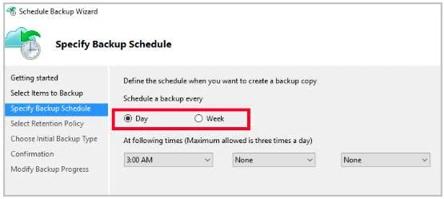

### Question 201

**SCENARIO:**

[Case-7](scenario.md#case-7)

You are developing an Azure Web App. You configure TLS mutual authentication for the web app.

You need to validate the client certificate in the web app. To answer, select the appropriate options in the answer area.

[See the answer](#answer-201)

### Question 202

**SCENARIO:**

[Case-7](scenario.md#case-7)

You have a Recovery Service vault that you use to test backups. The test backups contain two protected virtual machines.

You need to delete the Recovery Services vault.

What should you do first?

* A: From the Recovery Service vault, delete the backup data

* B: Modify the disaster recovery properties of each virtual machines

* C: Modify the locks of each virtual machine

* D: From the Recovery Service vault, stop the backup of each backup item

[See the answer](#answer-202)

### Question 203

**SCENARIO:**

[Case-7](scenario.md#case-7)

Your network contains an Active Directory forest named fabrikam.com. The forest contains two child domains named corp.fabrikam.com and research.fabrikam.com.

You have an Azure subscription that contains an Azure Active Directory (Azure AD) tenant named contoso.com.

You install Azure AD Connect and sync all the on-premises user accounts to the Azure AD tenant. You implement seamless single sign-on (SSO).

You plan to change the source of authority for all the user accounts in research.fabrikam.com to Azure AD.

You need to prevent research.fabrikam.com from resyncing to Azure AD.

Solution: You use Active Directory Domains and Trusts from a computer joined to fabrikam.com.

Does this meet the goal?

* A: Yes

* B: No

[See the answer](#answer-203)

### Question 204

**SCENARIO:**

[Case-7](scenario.md#case-7)

Your organization has developed and deployed several Azure App Service Web and API applications. The applications use Azure SQL Database to store and retrieve data. Several departments have the following requests to support the applications:

You need to recommend the appropriate Azure service for each department request.

What should you recommend? To answer, configure the appropriate options in the dialog box in the answer area.

[See the answer](#answer-204)

### Question 205

**SCENARIO:**

[Case-7](scenario.md#case-7)

You have the Azure virtual machines shown in the following table.

You have a Recovery Services vault that protects VM1 and VM2.

You need to protect VM3 and VM4 by using Recovery Services.

What should you do first?

* A: Create a new backup policy

* B: Create a new Recovery Services vault

* C: Configure the extensions for VM3 and VM4

* D: Create a storage account

[See the answer](#answer-205)

### Question 206

**SCENARIO:**

[Case-7](scenario.md#case-7)

You have an Azure Active Directory (Azure AD) domain that contains 5,000 user accounts. You create a new user account named AdminUser1.

You need to assign the User administrator administrative role to AdminUser1.

What should you do from the user account properties?

* A: From the Directory role blade, modify the directory role

* B: From the Licenses blade, assign a new license

* C: From the Groups blade, invite the user account to a new group

[See the answer](#answer-206)

### Question 207

**SCENARIO:**

[Case-7](scenario.md#case-7)

You plan to prevent users from accidentally deleting blob data from Azure.

You need to ensure that administrators can recover any blob data that is deleted accidentally from the storagelod8322489 storage account for 14 days after the deletion occurred.

What should you do from the Azure portal?

[See the answer](#answer-207)

### Question 208

**SCENARIO:**

[Case-7](scenario.md#case-7)

You have an Azure subscription that contains the Azure virtual machines shown in the following table.

You create an Azure key vault named Vault1 in the East US location.

You need to identify which virtual machines can enable Azure Disk Encryption by using Vault1.

Which virtual machines should you identify?

* A: VM2 and VM3 only

* B: VM1, VM2, and VM4 only

* C: VM1, VM2, and VM3 only

* D: VM3 only

[See the answer](#answer-208)

### Question 209

**SCENARIO:**

[Case-7](scenario.md#case-7)

You have two Azure Active Directory (Azure AD) tenants named contoso.com and fabrikam.com.

You have a Microsoft account that you use to sign in to both tenants.

You need to configure the default sign-in tenant for the Azure portal.

What should you do?

* A: From the Azure portal, configure the portal settings

* B: From the Azure portal, change the directory

* C: From Azure Cloud Shell, run Set-AzureRmContext

* D: From Azure Cloud Shell, run Set-AzureRmSubscription

[See the answer](#answer-209)

### Question 210

**SCENARIO:**

[Case-7](scenario.md#case-7)

You network contains an Active Directory domain named adatum.com and an Azure Active Directory (Azure AD) tenant named adatum.onmicrosoft.com.

Adatum.com contains the user accounts in the following table.

Adatum.onmicrosoft.com contains the user accounts in the following table.

You need to implement Azure AD Connect. The solution must follow the principle of least privilege.

Which user accounts should you use? To answer, select the appropriate options in the answer area.

[See the answer](#answer-210)

### Question 211

**SCENARIO:**

[Case-7](scenario.md#case-7)

You sign up for Azure Active Directory (Azure AD) Premium.

You need to add a user named admin1@contoso.com ad an administrator on all the computers that will be joined to the Azure AD domain.

What should you configure in Azure AD?

* A: Providers from the MFA Server blade

* B: General settings from the Groups blade

* C: Device settings from the Devices blade

* D: User settings from the Users blade

[See the answer](#answer-211)

### Question 212

**SCENARIO:**

[Case-8](scenario.md#case-8)

You plan to protect on-premises virtual machines and Azure virtual machines by using Azure Backup.

You need to prepare the backup infrastructure in Azure. The solution must minimize the cost of storing the backups in Azure.

What should you do from the Azure portal?

[See the answer](#answer-212)

### Question 213

**SCENARIO:**

[Case-8](scenario.md#case-8)

You need to prepare the environment to meet the authentication requirements.

Which two actions should you perform? Each correct answer presents part of the solution

* A: Allow inbound TCP port 8080 to the domain controllers in the Miami office

* B: Install Azure AD Connect on a server in the Miami office and enable Pass-through Authentication

* C: Install the Active Directory Federation Services (AD FS) role on a domain controller in the Miami office

* D: Join the client computers in the Miami office to Azure AD

* E: Add http://autologon.microsoftazuread-sso.com to the intranet zone of each client computer in the Miami office.

[See the answer](#answer-213)

### Question 214

**SCENARIO:**

[Case-9](scenario.md#case-9)

Which blade should you instruct the finance department auditors to use?

* A: Partner information

* B: Cost analysis

* C: Resource providers

* D: Invoices

[See the answer](#answer-214)

### Question 215

**SCENARIO:**

[Case-9](scenario.md#case-9)

You need to recommend a solution to automate the configuration for the finance department users. The solution must meet the technical requirements.

What should you include in the recommendation?

* A: an Azure logic app and the Microsoft Identity Management (MIM) client

* B: Azure AD Identity Protection

* C: dynamic groups and conditional access policies

* D: Azure AD B2C

[See the answer](#answer-215)

### Question 216

**SCENARIO:**

[Case-9](scenario.md#case-9)

You need to prepare the environment to implement the planned changes for Server2.

What should you do? To answer, select the appropriate options in the answer area.

[See the answer](#answer-216)

### Question 217

**SCENARIO:**

[Case-9](scenario.md#case-9)

You discover that VM3 does NOT meet the technical requirements.

You need to verify whether the issue relates to the NSGs.

What should you use?

* A: Diagram in VNet1

* B: Diagnostic settings in Azure Monitor

* C: IP flow verify in Azure Network Watcher

* D: Diagnose and solve problems in Traffic Manager profiles

* E: the security recommendations in Azure Advisor

[See the answer](#answer-217)

### Question 218

**SCENARIO:**

[Case-10](scenario.md#case-10)

You need to implement Role1.

Which command should you run before you create Role1? To answer, select the appropriate options in the answer area.

[See the answer](#answer-218)

### Question 219

**SCENARIO:**

[Case-10](scenario.md#case-10)

You need to meet the vendor notification requirement.

Solution: Update the Delivery API to send emails by using a Microsoft Office 365 SMTP server.

Does the solution meet the goal?

* A: Yes

* B: No

[See the answer](#answer-219)

### Question 220

**SCENARIO:**

[Case-10](scenario.md#case-10)

You need to meet the vendor notification requirement.

Solution: Configure notifications in the Azure API Management instance.

Does the solution meet the goal?

* A: Yes

* B: No

[See the answer](#answer-220)

### Question 221

**SCENARIO:**

[Case-10](scenario.md#case-10)

You need to meet the vendor notification requirement.

Solution: Update the Delivery API to send emails by using a cloud-based email service.

Does the solution meet the goal?

* A: Yes

* B: No

[See the answer](#answer-221)

### Question 222

**SCENARIO:**

[Case-10](scenario.md#case-10)

You need to meet the vendor notification requirement.

Solution: Create and apply a custom outbound Azure API Management policy.

Does the solution meet the goal?

* A: Yes

* B: No

[See the answer](#answer-222)

### Question 223

**SCENARIO:**

[Case-10](scenario.md#case-10)

You need to resolve the delivery API error.

What should you do?

* A: Implement simple retry by using the EnableRetryOnFailure feature of Entity Framework.

* B: Implement exponential backoff by using the EnableRetryOnFailure feature of Entity Framework.

* C: Implement a Circuit Breaker pattern by using the EnableRetryOnFailure feature of Entity Framework.

* D: Invoke a custom execution strategy in Entity Framework.

[See the answer](#answer-223)

### Question 224

**SCENARIO:**

[Case-10](scenario.md#case-10)

You need to implement the purchase requirement.

What should you do?

* A: Use the Bot Framework REST API conversation operations to send the user’s voice and the Speech Service API to recognize intents.

* B: Use the Direct Line REST API to send the user’s voice and the Speech Service API to recognize intents.

* C: Use the Speech Service API to send the user’s voice and the Bot Framework REST API conversation operations to recognize intents.

* D: Use the Bot Framework REST API attachment operations to send the user’s voice and the Speech Service API to recognize intents.

[See the answer](#answer-224)

### Question 225

**SCENARIO:**

[Case-10](scenario.md#case-10)

You need to meet the security requirements.

What should you use?

* A: HTTP Strict Transport Security (HSTS)

* B: Direct Line API

* C: Multi-Factor Authentication (MFA)

* D: Bot Framework Portal

* E: Bot Framework authentication

[See the answer](#answer-225)

### Question 226

**SCENARIO:**

[Case-10](scenario.md#case-10)

You need to create a web app named corp10217507n2 that can be scaled horizontally. The solution must use the lowest possible pricing tier for the App Service plan.

What should you do from the Azure portal?

[See the answer](#answer-226)

### Question 227

**SCENARIO:**

[Case-10](scenario.md#case-10)

You need to deploy an application gateway named appgw1015 to meet the following requirements:

- Load balance internal IP traffic to the Azure virtual machines connected to subnet0.

- Provide a Service Level Agreement (SLA) of 99,99 percent availability for the Azure virtual machines.

What should you do from the Azure portal?

[See the answer](#answer-227)

### Question 228

**SCENARIO:**

[Case-10](scenario.md#case-10)

You need to deploy an Azure load balancer named ib1016 to your Azure subscription. The solution must meet the following requirements:

- Support the load balancing of IP traffic from the Internet to Azure virtual machines connected to VNET1016\subnet0.

- Provide a Service Level Agreement (SLA) of 99,99 percent availability for the Azure virtual machines.

- Minimize Azure-related costs.

What should you do from the Azure portal?

[See the answer](#answer-228)

### Question 229

**SCENARIO:**

[Case-10](scenario.md#case-10)

Your company is developing an e-commerce Azure App Service Web App to support hundreds of restaurant locations around the world.

You are designing the messaging solution architecture to support the e-commerce transactions and messages. The solution will include the following features:

You need to design a solution for the Inventory Distribution feature.

Which Azure service should you use?

* A: Azure Service Bus

* B: Azure Relay

* C: Azure Event Grid

* D: Azure Event Hub

[See the answer](#answer-229)

### Question 230

**SCENARIO:**

[Case-10](scenario.md#case-10)

You are responsible for mobile app development for a company. The company develops apps on Windows Mobile, IOS, and Android.

You plan to integrate push notifications into every app.

You need to be able to send users alerts from a backend server.

Which two options can you use to achieve this goal? Each correct answer presents a complete solution.

* A: Azure Web App

* B: Azure Mobile App Service

* C: Azure SQL Database

* D: Azure Notification Hubs

* E: a virtual machine

[See the answer](#answer-230)

### Question 231

**SCENARIO:**

[Case-10](scenario.md#case-10)

You are developing an Azure Function that will be triggered using a webhook from an external application.

The Azure Function will receive JSON data in the body of the request.

Calling applications send an account ID as part of the URL. The number at the end of the URL is an integer.

The format for the URL resembles the following: /api/account/1

The Azure Function must accept all incoming requests without requiring keys or tokens.

You need to complete the attributes for the Azure Function.

How should you complete the code? To answer, select the appropriate options in the answer area.

[See the answer](#answer-231)

### Question 232

**SCENARIO:**

[Case-10](scenario.md#case-10)

You are developing a workflow solution using Azure technologies.

What should you implement to meet each requirement? To answer, select the appropriate options in the answer area.

[See the answer](#answer-232)

### Question 233

**SCENARIO:**

[Case-10](scenario.md#case-10)

You are developing a SMS-based testing solution. The solution sends users a question by using SMS. Early responders may qualify for prizes.

Users must respond with an answer choice within 90 seconds. You must be able to track how long it takes each user to respond. You create a durable Azure Function named SendSmsQuizQuestion that uses Twilio to send messages.

You need to write the code for MessageQuiz.

How should you complete the code? To answer, select the appropriate options in the answer area.

[See the answer](#answer-233)

### Question 234

**SCENARIO:**

[Case-10](scenario.md#case-10)

You are developing a solution that requires serverless code execution in Azure.

The solution has two functions that must run in a specific order.

You need to ensure that the second function can use the output from the first function.

How should you complete the code? To answer, select the appropriate options in the answer area.

[See the answer](#answer-234)

### Question 235

**SCENARIO:**

[Case-10](scenario.md#case-10)

You are developing an app that references data which is sharded across multiple Azure SQL databases.

The app must guarantee transactional consistency for changes across several different sharding key values.

You need to manage the transactions.

What should you implement?

* A: Elastic database transactions with horizontal partitioning.

* B: Distributed transactions coordinated by Microsoft Distributed Transaction Coordinator (MSDTC).

* C: Server-coordinated transactions from .NET application.

* D: Elastic database transactions with vertical partitioning.

[See the answer](#answer-235)

### Question 236

**SCENARIO:**

[Case-10](scenario.md#case-10)

You are creating a bot for a company by using QnA Maker.

You need to ensure that the company can update the bot without third-party assistance.

What should you use? To answer, select the appropriate options in the answer area.

[See the answer](#answer-236)

### Question 237

**SCENARIO:**

[Case-10](scenario.md#case-10)

You are developing a speech-enabled home automation control bot.

The bot interprets some spoken words incorrectly.

You need to improve the spoken word recognition for the bot.

What should you implement?

* A: The Skype for Business Channel and use scorable dialogs for improving conversation flow.

* B: The Web Chat Channel and Speech priming using a Bing Speech Service and LUIS app.

* C: The Skype Channel and use scorable dialogs for improving conversation flow.

* D: The Cortana Channel and use scorable dialogs for improving conversation flow.

[See the answer](#answer-237)

### Question 238

**SCENARIO:**

[Case-10](scenario.md#case-10)

Your company develops a bot that uses QnA Maker knowledge bases and Language Understanding Intelligence Services  (LUIS). You create the QnA Maker service, knowledge bases, and the LUIS app.

The bot application must use LUIS to determine which QnA Maker knowledge base to use.

You need to integrate LUIS with the QnA Maker knowledge bases and maximize the effectiveness for selecting the QnA Maker knowledge bases before testing the bot.

Which four actions should you perform in sequence? To answer, move the appropriate actions from the list of actions to the answer area and arrange them in the correct order.

[See the answer](#answer-238)

### Question 239

**SCENARIO:**

[Case-10](scenario.md#case-10)

You create a virtual machine scale set named Scale1. Scale1 is configured as shown in the following exhibit.

Use the drop-down menus to select the answer choice that completes each statement based on the information presented in the graphic.

[See the answer](#answer-239)

### Question 240

**SCENARIO:**

[Case-10](scenario.md#case-10)

Your company hosts multiple website by using Azure virtual machine scale sets (VMSS) that run Internet Information Server (IIS).

All network communications must be secured by using end to end Secure Socket Layer (SSL) encryption.

User sessions must be routed to the same server by using cookie-based session affinity.

The image shown depicts the network traffic flow for the web sites to the VMSS.

Use the drop-down menus to select the answer choice that answers each question.

[See the answer](#answer-240)

### Question 241

**SCENARIO:**

[Case-10](scenario.md#case-10)

You need to create a virtual network named VNET1008 that contains three subnets named subnet0, subnet1, and subnet2. The solution must meet the following requirements:

- Connections from any of the subnets to the Internet must be blocked

- Connections from the Internet to any of the subnets must be blocked

- The number of network security groups (NSGs) and NSG rules must be minimized

What should you do from the Azure portal?

[See the answer](#answer-241)

### Question 242

**SCENARIO:**

[Case-10](scenario.md#case-10)

A company is migrating an existing on-premises third-party website to Azure. The website is stateless.

The company does not have access to the source code for the website. They do not have the original installer.

The number of visitors at the website varies throughout the year. The on-premises infrastructure was resized to accommodate peaks but the extra capacity was not used.

You need to implement a virtual machine scale set instance.

What should you do?

* A: Use an autoscale setting to scale instances vertically

* B: Create 100 autoscale settings per resource

* C: Scale out by one instance when the average CPU usage of one of the instances is over 80 percent

* D: Use Azure Monitor to create autoscale settings using custom metrics

* E: Use an autoscale setting with unlimited maximum number of instances

* F: Use a webhook to log autoscale failures

[See the answer](#answer-242)

### Question 243

**SCENARIO:**

[Case-10](scenario.md#case-10)

You have an Azure subscription named Subscription1.

You create several Azure virtual machines in Subscription1. All of the virtual machines belong to the same virtual network.

You have an on-premises Hyper-V server named Server1. Server1 hosts a virtual machine named VM1.

You plan to replicate VM1 to Azure.

You need to create additional objects in Subscription1 to support the planned deployment.

Which three objects should you create? Each correct answer presents part of the solution.

* A: Hyper-V site

* B: Azure Recovery Services Vault

* C: storage account

* D: replication policy

* E: Azure Traffic Manager instance

* F: endpoint

[See the answer](#answer-243)

### Question 244

**SCENARIO:**

[Case-10](scenario.md#case-10)

Your company is developing an e-commerce Azure App Service Web App to support hundreds of restaurant locations around the world.

You are designing the messaging solution architecture to support the e-commerce transactions and messages. The e-commerce application has the following features and requirements:

You need to choose the Azure messaging solution to support the Restaurant Telemetry feature. 

Which Azure service should you use?

* A: Azure Relay

* B: Azure Event Grid

* C: Azure Event Hub

* D: Azure Service Bus

[See the answer](#answer-244)

### Question 245

**SCENARIO:**

[Case-10](scenario.md#case-10)

A company is migrating an existing on-premises third-party website to Azure. The website is stateless.

The company does not have access to the source code for the website. They have the original installer.

The number of visitors at the website varies throughout the year. The on-premises infrastructure was resized to accommodate peaks but the extra capacity was not used.

You need to implement a virtual machine scale set instance.

What should you do

* A: Use a webhook to log autoscale failures.

* B: Use an autoscale setting to scale instances vertically.

* C: Use only default diagnostics metrics to trigger autoscaling

* D: Use an autoscale setting to define more profiles that have one or more autoscale rules.

[See the answer](#answer-245)

### Question 246

**SCENARIO:**

[Case-10](scenario.md#case-10)

You have an Azure Cosmos DB database that contains a container named Container1. The partition key for Container1 is set to /day. Container1 contains the items shown in the following table.

You need to programmatically query Azure Cosmos DB and retrieve Item1 and Item2 only.

Solution: You run the following query.

You set the EnableCrossPartitionQuery property to False.

Does this meet the goal?

* A: Yes

* B: No

[See the answer](#answer-246)

### Question 247

**SCENARIO:**

[Case-10](scenario.md#case-10)

You have an Azure Cosmos DB database that contains a container named Container1. The partition key for Container1 is set to /day. Container1 contains the items shown in the following table.

You need to programmatically query Azure Cosmos DB and retrieve Item1 and Item2 only.

Solution: You run the following query.

You set the EnableCrossPartitionQuery property to True.

Does this meet the goal?

* A: Yes

* B: No

[See the answer](#answer-247)

### Question 248

**SCENARIO:**

[Case-10](scenario.md#case-10)

You have an Azure Cosmos DB database that contains a container named Container1. The partition key for Container1 is set to /day. Container1 contains the items shown in the following table.

You need to programmatically query Azure Cosmos DB and retrieve Item1 and Item2 only.

Solution: You run the following query.

You set the EnableCrossPartitionQuery property to True.

Does this meet the goal?

* A: Yes

* B: No

[See the answer](#answer-248)

### Question 249

**SCENARIO:**

[Case-10](scenario.md#case-10)

From Azure Cosmos DB, you create the containers shown in the following table.

You add the following item to Container1.

You plan to add items to Azure Cosmos DB as shown in the following table.

You need to identify which items can be added successfully to Container1 and Container2.

What should you identify for each container? To answer, select the appropriate options in the answer area.

[See the answer](#answer-249)

### Question 250

**SCENARIO:**

[Case-10](scenario.md#case-10)

You have an Azure Cosmos DB database that contains a container named Container1. The partition key for Container1 is set to /day. Container1 contains the items shown in the following table.

You need to programmatically query Azure Cosmos DB and retrieve Item1 and Item2 only.

Solution: You run the following query.

You set the EnableCrossPartitionQuery property to False.

Does this meet the goal?

* A: Yes

* B: No

[See the answer](#answer-250)

### Answer 201

**CORRECT ANSWER:**

[Back to question](#question-201)

### Answer 202

**CORRECT ANSWER:** D

**Explanation:**

You can't delete a Recovery Services vault if it is registered to a server and holds backup data. If you try to delete a vault, but can't, the vault is still configured to receive backup data.

Remove vault dependencies and delete vault

In the vault dashboard menu, scroll down to the Protected Items section, and click Backup Items. In this menu, you can stop and delete Azure File Servers, SQL Servers in Azure VM, and Azure virtual machines.

**Reference:**

https://docs.microsoft.com/en-us/azure/backup/backup-azure-delete-vault

[Back to question](#question-202)

### Answer 203

**CORRECT ANSWER:** B

**Explanation:**

Instead you should customize the default synchronization rule.

>**Note:** To delete a custom domain name, you must first ensure that no resources in your directory rely on the domain name. You can't delete a domain name from your directory if:
	- Any user has a user name, email address, or proxy address that includes the domain name.
	-Any group has an email address or proxy address that includes the domain name.
	-Any application in your Azure AD has an app ID URI that includes the domain name.

**Reference:**

https://docs.microsoft.com/en-us/azure/active-directory/hybrid/how-to-connect-create-custom-sync-rule

[Back to question](#question-203)

### Answer 204

**CORRECT ANSWER:**

**Reference:**

https://docs.microsoft.com/en-us/azure/sql-database/transparent-data-encryption-azure-sql

[Back to question](#question-204)

### Answer 205

**CORRECT ANSWER:** B

**Explanation:**

A Recovery Services vault is a storage entity in Azure that houses data. The data is typically copies of data, or configuration information for virtual machines (VMs), workloads, servers, or workstations. You can use Recovery Services vaults to hold backup data for various Azure services

**Reference:**

https://docs.microsoft.com/en-us/azure/site-recovery/azure-to-azure-tutorial-enable-replication

[Back to question](#question-205)

### Answer 206

**CORRECT ANSWER:** A

**Explanation:**

Assign a role to a user

1. Sign in to the Azure portal with an account that's a global admin or privileged role admin for the directory.

2. Select Azure Active Directory, select Users, and then select a specific user from the list.

3. For the selected user, select Directory role, select Add role, and then pick the appropriate admin roles from the Directory roles list, such as Conditional access administrator.

4. Press Select to save.

**Reference:**

https://docs.microsoft.com/en-us/azure/active-directory/fundamentals/active-directory-users-assign-role-azure-portal

[Back to question](#question-206)

### Answer 207

**CORRECT ANSWER:**

Task A: Create a Recovery Services vault (if a vault already exists skip this task, go to Task B below)

A1. From Azure Portal, On the Hub menu, click All services and in the list of resources, type Recovery Services and click Recovery Services vaults.

If there are recovery services vaults in the subscription, the vaults are listed.

A2. On the Recovery Services vaults menu, click Add.

A3. The Recovery Services vault blade opens, prompting you to provide a Name, Subscription, Resource group, and Location

Task B. Create a backup goal

B1. On the Recovery Services vault blade (for the vault you just created), in the Getting Started section, click Backup, then on the Getting Started with Backup blade, select Backup goal.

The Backup Goal blade opens. If the Recovery Services vault has been previously configured, then the Backup Goal blades opens when you click Backup on the Recovery Services vault blade.

B2. From the Where is your workload running? drop-down menu, select Azure.

B3. From the What do you want to backup? menu, select Blob Storage, and click OK.

B4. Finish the Wizard.

Task C. create a backup schedule

C1. Open the Microsoft Azure Backup agent. You can find it by searching your machine for Microsoft Azure Backup.

C2. In the Backup agent's Actions pane, click Schedule Backup to launch the Schedule Backup Wizard.

C3. On the Getting started page of the Schedule Backup Wizard, click Next.

C4. On the Select Items to Backup page, click Add Items. The Select Items dialog opens.

C5. Select Blob Storage you want to protect, and then click OK.

C6. In the Select Items to Backup page, click Next. On the Specify Backup Schedule page, specify Schedule a backup every day, and click Next.

C7. On the Select Retention Policy page, set it to 14 days, and click Next.

C8. Finish the Wizard.

**Reference:**

https://docs.microsoft.com/en-us/azure/backup/backup-configure-vault

[Back to question](#question-207)

### Answer 208

**CORRECT ANSWER:** B

**Explanation:**

Your key vault and VMs must reside in the same Azure region and subscription.

**Reference:**

https://docs.microsoft.com/en-us/azure/virtual-machines/windows/disk-encryption-overview

[Back to question](#question-208)

### Answer 209

**CORRECT ANSWER:** B

**Explanation:**

Change the subscription directory in the Azure portal.

The classic portal feature Edit Directory, that allows you to associate an existing subscription to your Azure Active Directory (AAD), is now available in Azure portal. It used to be available only to Service Admins with Microsoft accounts, but now it's available to users with AAD accounts as well.

To get started:

1. Go to Subscriptions.

2. Select a subscription.

3. Select Change directory.

Incorrect Answers:

C: The Set-AzureRmContext cmdlet sets authentication information for cmdlets that you run in the current session. The context includes tenant, subscription, and environment information.

**Reference:**

https://azure.microsoft.com/en-us/updates/edit-directory-now-in-new-portal/

[Back to question](#question-209)

### Answer 210

**CORRECT ANSWER:**

**Explanation:**

Box 1: User5

In Express settings, the installation wizard asks for the following:

AD DS Enterprise Administrator credentials

Azure AD Global Administrator credentials

The AD DS Enterprise Admin account is used to configure your on-premises Active Directory. These credentials are only used during the installation and are not used after the installation has completed. The Enterprise Admin, not the Domain Admin should make sure the permissions in Active Directory can be set in all domains.

Box 2: UserA

Azure AD Global Admin credentials are only used during the installation and are not used after the installation has completed. It is used to create the Azure AD Connector account used for synchronizing changes to Azure AD. The account also enables sync as a feature in Azure AD.

**Reference:**

https://docs.microsoft.com/en-us/azure/active-directory/connect/active-directory-aadconnect-accounts-permissions

[Back to question](#question-210)

### Answer 211

**CORRECT ANSWER:** D

**Explanation:**

When you connect a Windows device with Azure AD using an Azure AD join, Azure AD adds the following security principles to the local administrators group on the device:
- The Azure AD global administrator role
- The Azure AD device administrator role
- The user performing the Azure AD join

In the Azure portal, you can manage the device administrator role on the Devices page. To open the Devices page:

1. Sign in to your Azure portal as a global administrator or device administrator.

2. On the left navbar, click Azure Active Directory.

3. In the Manage section, click Devices.

4. On the Devices page, click Device settings.

5. To modify the device administrator role, configure Additional local administrators on Azure AD joined devices.

**Reference:**

https://docs.microsoft.com/en-us/azure/active-directory/devices/assign-local-admin

[Back to question](#question-211)

### Answer 212

**CORRECT ANSWER:**

First, create Recovery Services vault.

Step 1: On the left-hand menu, select All services and in the services list, type Recovery Services. As you type, the list of resources filters. When you see Recovery Services vaults in the list, select it to open the Recovery Services vaults menu.

Step 2: In the Recovery Services vaults menu, click Add to open the Recovery Services vault menu.

Step 3: In the Recovery Services vault menu, for example, Type myRecoveryServicesVault in Name.

The current subscription ID appears in Subscription. If you have additional subscriptions, you could choose another subscription for the new vault.

For Resource group select Use existing and choose myResourceGroup. If myResourceGroup doesn't exist, select Create new and type myResourceGroup.

From the Location drop-down menu, choose West Europe.

Click Create to create your Recovery Services vault.

**Reference:**

https://docs.microsoft.com/en-us/azure/backup/tutorial-backup-vm-at-scale

[Back to question](#question-212)

### Answer 213

**CORRECT ANSWER:** B, E

**Explanation:**

B: Seamless SSO works with any method of cloud authentication - Password Hash Synchronization or Pass-through Authentication, and can be enabled via Azure AD Connect.

E: You can gradually roll out Seamless SSO to your users. You start by adding the following Azure AD URL to all or selected users' Intranet zone settings by using Group Policy in Active Directory: https://autologon.microsoftazuread-sso.com

Incorrect Answers:

A: Azure AD connect does not port 8080. It uses port 443.

C: Seamless SSO is not applicable to Active Directory Federation Services (ADFS).

D: Seamless SSO needs the user's device to be domain-joined, but doesn't need for the device to be Azure AD Joined.

Scenario: Users in the Miami office must use Azure Active Directory Seamless Single Sign-on (Azure AD Seamless SSO) when accessing resources in Azure.

Planned Azure AD Infrastructure include: The on-premises Active Directory domain will be synchronized to Azure AD.

**Reference:**

https://docs.microsoft.com/en-us/azure/active-directory/connect/active-directory-aadconnect-sso-quick-start

[Back to question](#question-213)

### Answer 214

**CORRECT ANSWER:** D

**Explanation:**

You can opt in and configure additional recipients to receive your Azure invoice in an email. This feature may not be available for certain subscriptions such as support offers, Enterprise Agreements, or Azure in Open.

1. Select your subscription from the Subscriptions page. Opt-in for each subscription you own. Click Invoices then Email my invoice.

2. Click Opt in and accept the terms.

Scenario: During the testing phase, auditors in the finance department must be able to review all Azure costs from the past week.

**Reference:**

https://docs.microsoft.com/en-us/azure/billing/billing-download-azure-invoice-daily-usage-date

[Back to question](#question-214)

### Answer 215

**CORRECT ANSWER:** C

**Explanation:**

Scenario: Enable Azure Multi-Factor Authentication (MFA) for the users in the finance department only.

The recommendation is to use conditional access policies that can then be targeted to groups of users, specific applications, or other conditions.

**Reference:**

https://docs.microsoft.com/en-us/azure/active-directory/authentication/howto-mfa-userstates

[Back to question](#question-215)

### Answer 216

**CORRECT ANSWER:**

**Explanation:**

Box 1: Create a Recovery Services vault

Create a Recovery Services vault on the Azure Portal.

Box 2: Install the Azure Site Recovery Provider

Azure Site Recovery can be used to manage migration of on-premises machines to Azure.

Scenario: Migrate the virtual machines hosted on Server1 and Server2 to Azure.

Server2 has the Hyper-V host role.

**Reference:**

https://docs.microsoft.com/en-us/azure/site-recovery/migrate-tutorial-on-premises-azure

[Back to question](#question-216)

### Answer 217

**CORRECT ANSWER:** C

**Explanation:**

Scenario: Contoso must meet technical requirements including:

Ensure that VM3 can establish outbound connections over TCP port 8080 to the applications servers in the Montreal office.

IP flow verify checks if a packet is allowed or denied to or from a virtual machine. The information consists of direction, protocol, local IP, remote IP, local port, and remote port. If the packet is denied by a security group, the name of the rule that denied the packet is returned. While any source or destination IP can be chosen, IP flow verify helps administrators quickly diagnose connectivity issues from or to the internet and from or to the on-premises environment.

**Reference:**

https://docs.microsoft.com/en-us/azure/network-watcher/network-watcher-ip-flow-verify-overview

[Back to question](#question-217)

### Answer 218

**CORRECT ANSWER:**

[Back to question](#question-218)

### Answer 219

**CORRECT ANSWER:** B

**Reference:**

https://docs.microsoft.com/en-us/azure/api-management/api-management-howto-configure-notifications

[Back to question](#question-219)

### Answer 220

**CORRECT ANSWER:** A

**Reference:**

https://docs.microsoft.com/en-us/azure/api-management/api-management-howto-configure-notifications

[Back to question](#question-220)

### Answer 221

**CORRECT ANSWER:** B

**Reference:**

https://docs.microsoft.com/en-us/azure/api-management/api-management-howto-configure-notifications

[Back to question](#question-221)

### Answer 222

**CORRECT ANSWER:** B

**Reference:**

https://docs.microsoft.com/en-us/azure/api-management/api-management-howto-configure-notifications

[Back to question](#question-222)

### Answer 223

**CORRECT ANSWER:** B

**Reference:**

https://docs.microsoft.com/en-us/azure/sql-database/sql-database-develop-error-messages

[Back to question](#question-223)

### Answer 224

**CORRECT ANSWER:** A

[Back to question](#question-224)

### Answer 225

**CORRECT ANSWER:** E

**Explanation:**

Question Set 2

[Back to question](#question-225)

### Answer 226

**CORRECT ANSWER:**

Step 1: In the Azure Portal, click Create a resource > Web + Mobile > Web App.

Step 2: Use the Webb app settings as listed below.

| Field | Value |
| --- | --- |
| Web App name | corp10217507n2 |
| Hosting plan | Azure App Service plan |
| Pricing tier of the Pricing Tier | Standard |

Change your hosting plan to Standard, you can't setup auto-scaling below standard tier.

Step 3: Select Create to provision and deploy the Web app.

**Reference:**

https://docs.microsoft.com/en-us/azure/app-service/environment/app-service-web-how-to-create-a-web-app-in-an-ase

https://azure.microsoft.com/en-us/pricing/details/app-service/plans/

[Back to question](#question-226)

### Answer 227

**CORRECT ANSWER:**

Step 1: Click New found on the upper left-hand corner of the Azure portal.

Step 2: Select Networking and then select Application Gateway in the Featured list.

Step 3: Enter these values for the application gateway: appgw1015 - for the name of the application gateway.

SKU Size: Standard_V2

The new SKU [Standard_V2] offers autoscaling and other critical performance enhancements.

Step 4: Accept the default values for the other settings and then click OK.

Step 5: Click Choose a virtual network, and select subnet0.

**Reference:**

https://docs.microsoft.com/en-us/azure/application-gateway/application-gateway-create-gateway-portal

[Back to question](#question-227)

### Answer 228

**CORRECT ANSWER:**

Step 1: On the top left-hand side of the screen, click Create a resource > Networking > Load Balancer.

Step 2: In the Create a load balancer page enter these values for the load balancer:

myLoadBalancer - for the name of the load balancer.

Internal - for the type of the load balancer.

Basic - for SKU version.

Microsoft guarantees that apps running in a customer subscription will be available 99.99% of the time.

VNET1016\subnet0 - for subnet that you choose from the list of existing subnets.

Step 3: Accept the default values for the other settings and click Create to create the load balancer.

[Back to question](#question-228)

### Answer 229

**CORRECT ANSWER:** A

**Explanation:**

Microsoft Azure Service Bus is a fully managed enterprise integration message broker. Service Bus is most commonly used to decouple applications and services from each other, and is a reliable and secure platform for asynchronous data and state transfer.

One common messaging scenario is Messaging: transfer business data, such as sales or purchase orders, journals, or inventory movements.

Incorrect Answers:

B: The Azure Relay service enables you to securely expose services that run in your corporate network to the public cloud.

**Reference:**

https://docs.microsoft.com/en-us/azure/service-bus-messaging/service-bus-messaging-overview

[Back to question](#question-229)

### Answer 230

**CORRECT ANSWER:** B, D

**Explanation:**

The Mobile Apps client enables you to register for push notifications with Azure Notification Hubs.

The following platforms are supported:

- Xamarin Android releases for API 19 through 24 (KitKat through Nougat)

- Xamarin iOS releases for iOS versions 8.0 and later

- Universal Windows Platform

- Windows Phone 8.1

- Windows Phone 8.0 except for Silverlight applications

**Reference:**

https://docs.microsoft.com/en-us/azure/app-service-mobile/app-service-mobile-dotnet-how-to-use-client-library

[Back to question](#question-230)

### Answer 231

**CORRECT ANSWER:**

[Back to question](#question-231)

### Answer 232

**CORRECT ANSWER:**

[Back to question](#question-232)

### Answer 233

**CORRECT ANSWER:**

[Back to question](#question-233)

### Answer 234

**CORRECT ANSWER:**

[Back to question](#question-234)

### Answer 235

**CORRECT ANSWER:** A

**Reference:**

https://docs.microsoft.com/mt-mt/azure/sql-database/sql-database-elastic-transactions-overview?view=azurermps-6.13.0

[Back to question](#question-235)

### Answer 236

**CORRECT ANSWER:**

**Reference:**

https://docs.microsoft.com/en-us/azure/cognitive-services/qnamaker/overview/overview

[Back to question](#question-236)

### Answer 237

**CORRECT ANSWER:** B

[Back to question](#question-237)

### Answer 238

**CORRECT ANSWER:**

[Back to question](#question-238)

### Answer 239

**CORRECT ANSWER:**

**Explanation:**

Box 1:

The Autoscale scale out rule increases the number of VMs by 2 if the CPU threshold is 80% or higher. The initial instance count is 4 and rises to 6 when the 2 extra instances of VMs are added.

Box 2:

The Autoscale scale in rule decreases the number of VMs by 4 if the CPU threshold is 30% or lower. The initial instance count is 4 and thus cannot be reduced to 0 as the minimum instances is set to 2. Instances are only added when the CPU threshold reaches 80%.

**Reference:**

https://docs.microsoft.com/en-us/azure/azure-monitor/platform/autoscale-overview

https://docs.microsoft.com/en-us/azure/azure-monitor/platform/autoscale-best-practices

https://docs.microsoft.com/en-us/azure/azure-monitor/platform/autoscale-common-scale-patterns

[Back to question](#question-239)

### Answer 240

**CORRECT ANSWER:**

**Explanation:**

Box 1: Public

The following example shows site traffic coming from both ports 8080 and 8081 and being directed to the same backend pools.

Box 2: Application Gateway

You can create an application gateway with URL path-based redirection using Azure PowerShell.

Box 3: Path-based redirection and Websockets

**Reference:**

https://docs.microsoft.com/bs-latn-ba/azure//application-gateway/tutorial-url-redirect-powershell

[Back to question](#question-240)

### Answer 241

**CORRECT ANSWER:**

Step 1: Click Create a resource in the portal.

Step 2: Enter Virtual network in the Search the Marketplace box at the top of the New pane that appears. Click Virtual network when it appears in the search results.

Step 3: Select Classic in the Select a deployment model box in the Virtual Network pane that appears, then click Create.

Step 4: Enter the following values on the Create virtual network (classic) pane and then click Create:

| Field | Value |
| --- | --- |
| Name | VNET1008 |
| Address space | 10.0.0.0/16 |
| Subnet name | subnet0 |
| Resource group | Create new |
| Subnet address range | 10.0.0.0/24 |
| Subscription and location | Select your subscription and location |

Step 5: In the portal, you can create only one subnet when you create a virtual network. Click Subnets (in the SETTINGS section) on the Create virtual network (classic) pane that appears. Click +Add on the VNET1008 - Subnets pane that appears.

Step 6: Enter subnet1 for Name on the Add subnet pane. Enter 10.0.1.0/24 for Address range. Click OK.

Step 7: Create the third subnet: Click +Add on the VNET1008 - Subnets pane that appears. Enter subnet2 for Name on the Add subnet pane. Enter 10.0.2.0/24 for Address range. Click OK.

**Reference:**

https://docs.microsoft.com/en-us/azure/virtual-network/create-virtual-network-classic

[Back to question](#question-241)

### Answer 242

**CORRECT ANSWER:** D

**Explanation:**

Azure Monitor autoscale can be used on Virtual Machine Scale Sets.

**Reference:**

https://docs.microsoft.com/en-us/azure/azure-monitor/platform/autoscale-custom-metric

[Back to question](#question-242)

### Answer 243

**CORRECT ANSWER:** A, B, D

[Back to question](#question-243)

### Answer 244

**CORRECT ANSWER:** C

**Explanation:**

Azure Event Hubs is a big data pipeline. It facilitates the capture, retention, and replay of telemetry and event stream data. The data can come from many concurrent sources. Event Hubs allows telemetry and event data to be made available to a variety of stream-processing infrastructures and analytics services. It is available either as data streams or bundled event batches. This service provides a single solution that enables rapid data retrieval for real-time processing as well as repeated replay of stored raw data. It can capture the streaming data into a file for processing and analysis.

It has the following characteristics:
- low latency
- capable of receiving and processing millions of events per second
- at least once delivery

>**Note:** Comparison of services

**Reference:**

https://docs.microsoft.com/en-us/azure/event-grid/compare-messaging-services

[Back to question](#question-244)

### Answer 245

**CORRECT ANSWER:** C

**Explanation:**

In-guest VM metrics with the Azure diagnostics extension The Azure diagnostics extension is an agent that runs inside a VM instance. The agent monitors and saves performance metrics to Azure storage. These performance metrics contain more detailed information about the status of the VM, such as AverageReadTime for disks or PercentIdleTime for CPU. You can create autoscale rules based on a more detailed awareness of the VM performance, not just the percentage of CPU usage or memory consumption.

**Reference:**

https://docs.microsoft.com/en-us/azure/virtual-machine-scale-sets/virtual-machine-scale-sets-autoscale-overview

[Back to question](#question-245)

### Answer 246

**CORRECT ANSWER:** B

**Explanation:**

Returns Item1 only as EnableCrossPartitionQuery property to False. If EnableCrossPartitionQuery property is set to true, it will return Item1 and Item3.

**Reference:**

https://docs.microsoft.com/en-us/azure/cosmos-db/sql-query-where

https://docs.microsoft.com/en-us/dotnet/api/microsoft.azure.documents.client.feedoptions.enablecrosspartitionquery?view=azure-dotnet

[Back to question](#question-246)

### Answer 247

**CORRECT ANSWER:** B

**Explanation:**

Returns Item1, Item2, Item3, and Item4.

**Reference:**

https://docs.microsoft.com/en-us/azure/cosmos-db/sql-query-where

https://docs.microsoft.com/en-us/dotnet/api/microsoft.azure.documents.client.feedoptions.enablecrosspartitionquery?view=azure-dotnet

[Back to question](#question-247)

### Answer 248

**CORRECT ANSWER:** A

**Explanation:**

Returns Item1 and Item2 only.

**Reference:**

https://docs.microsoft.com/en-us/azure/cosmos-db/sql-query-where

https://docs.microsoft.com/en-us/dotnet/api/microsoft.azure.documents.client.feedoptions.enablecrosspartitionquery?view=azure-dotnet

[Back to question](#question-248)

### Answer 249

**CORRECT ANSWER:**

[Back to question](#question-249)

### Answer 250

**CORRECT ANSWER:** B

**Explanation:**

Returns Item1 only as EnableCrossPartitionQuery property to False. If EnableCrossPartitionQuery property is set to true, it will return Item1, Item2, and Item3.

**Reference:**

https://docs.microsoft.com/en-us/azure/cosmos-db/sql-query-where

https://docs.microsoft.com/en-us/dotnet/api/microsoft.azure.documents.client.feedoptions.enablecrosspartitionquery?view=azure-dotnet

[Back to question](#question-250)