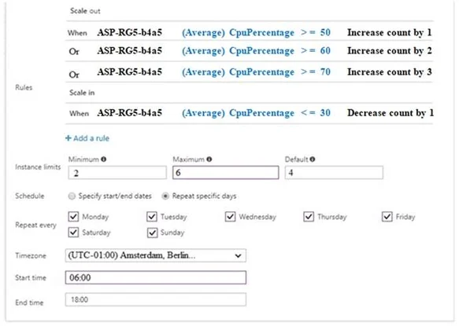

### Question 251

**SCENARIO:**

[Case-10](scenario.md#case-10)

You have an Azure SQL database named DB1.

You plan to create the following four tables in DB1 by using the following code.

You need to identify which table must be created last.

What should you identify? To answer, select the appropriate options in the answer area.

* A: Table1

* B: Table2

* C: Table3

* D: Table4

[See the answer](#answer-251)

### Question 252

**SCENARIO:**

[Case-10](scenario.md#case-10)

You have an Azure subscription that contains the resource groups shown in the following table. 

You have the Azure SQL servers shown in the following table. 

You create an Azure SQL database named DB1 on Sql1 in an elastic pool named Poo11. 

You need to create an Azure SQL database named DB2 in Poo11. 

Where should you deploy DB2?

* A: Sql1

* B: Sql2

* C: Sql3

* D: Sql4

[See the answer](#answer-252)

### Question 253

**SCENARIO:**

[Case-10](scenario.md#case-10)

Your company is developing an e-commerce Azure App Service Web App to support hundreds of restaurant locations around the world.

You are designing the messaging solution architecture to support the e-commerce transactions and messages. The e-commerce application has the following features and requirements:

You need to choose the Azure messaging solution to support the Shopping Cart feature. 

Which Azure service should you use?

* A: Azure Service Bus

* B: Azure Relay

* C: Azure Event Grid

* D: Azure Event Hub

[See the answer](#answer-253)

### Question 254

**SCENARIO:**

[Case-10](scenario.md#case-10)

You need to create a function app named corp10217507n1 that supports sticky sessions. The solution must minimize the Azure-related costs of the App Service plan.

What should you do from the Azure portal?

[See the answer](#answer-254)

### Question 255

**SCENARIO:**

[Case-10](scenario.md#case-10)

You have an Azure web app named App1 that contains the following autoscale conditions: The default auto created scale condition has a scale mode that has Scale to a specific instance count set to 2.

Scale condition 1 has the following configurations:
- Scale mode: Scale to a specific instance count
- Instance count: 3
- Schedule: Specify start/end dates
- Start date: August 1, 2019, 06:00
- End date: September 1, 2019, 18:00

Scale condition 2 has the following configurations:
- Scale mode: Scale to a specific instance count
- Instance count: 4
- Schedule: Repeat specific days
- Repeat every: Monday
- Start time: 06:00
- End time: 18:00

Scale condition 3 has the following configurations:
- Scale mode: Scale to a specific instance count
- Instance count: 5
- Schedule: Repeat specific days
- Repeat every: Monday
- Start time: 15:00
- End time: 20:00

You need to identify the number of running App1 instances.

What should you identify? To answer, select the appropriate options in the answer area.

[See the answer](#answer-255)

### Question 256

You have an Azure web app named App1 that contains the following autoscale conditions:

Every autoscale condition rule is configured to have a duration of 20 minutes and a cool down time of 10 minutes.

At 06:00, WebApp1 is running four instances.

You need to identify how many instances are running on WebApp1 based on the percentage of the CPU utilization.

How many instances should you identify? To answer, select the appropriate options in the answer area.

[See the answer](#answer-256)

### Answer 251

**CORRECT ANSWER:** B

**Explanation:**

Table1 references Table4. Therefore Table4 must be created before Table1.

Table2 references Table1 and Table3. Therefore Table1 and Table3  must be created before Table2.

>**Note:** FOREIGN KEY REFERENCES is a constraint that provides referential integrity for the data in the column or columns. FOREIGN KEY constraints require that each value in the column exists in the corresponding referenced column or columns in the referenced table. FOREIGN KEY constraints can reference only columns that are PRIMARY KEY or UNIQUE constraints in the referenced table or columns referenced in a UNIQUE INDEX on the referenced table.

Incorrect Answers:

A: Table1 is referenced by Table2 and should be crated before Table2.

C: Table3 is referenced by Table2 and should be crated before Table2.

D: Table4 is referenced by Table1 and should be crated before Table1.

**Reference:**

https://docs.microsoft.com/en-us/sql/t-sql/statements/create-table-transact-sql?view=sql-server-ver15

[Back to question](#question-251)

### Answer 252

**CORRECT ANSWER:** A

**Explanation:**

The databases in an elastic pool are on a single Azure SQL Database server and share a set number of resources at a set price.

**Reference:**

https://docs.microsoft.com/en-us/azure/sql-database/sql-database-elastic-pool

[Back to question](#question-252)

### Answer 253

**CORRECT ANSWER:** A

**Explanation:**

Microsoft Azure Service Bus is a fully managed enterprise integration message broker. Service Bus is most commonly used to decouple applications and services from each other, and is a reliable and secure platform for asynchronous data and state transfer.

One common messaging scenario is Messaging: transfer business data, such as sales or purchase orders, journals, or inventory movements.

Incorrect Answers:

B: The Azure Relay service enables you to securely expose services that run in your corporate network to the public cloud.

**Reference:**

https://docs.microsoft.com/en-us/azure/service-bus-messaging/service-bus-messaging-overview

[Back to question](#question-253)

### Answer 254

**CORRECT ANSWER:**

Step 1: Select the New button found on the upper left-hand corner of the Azure portal, then select Compute > Function App.

Step 2: Use the function app settings as listed below.

| Field | Value |
| --- | --- |
| App name | corp10217507n1 |
| Hosting plan | Azure App Service plan (required for sticky sessions) |
| Pricing tier of the App Service plan | Shared compute: Free |

Step 3: Select Create to provision and deploy the function app.

**Reference:**

https://docs.microsoft.com/en-us/azure/azure-functions/functions-create-function-app-portal

[Back to question](#question-254)

### Answer 255

**CORRECT ANSWER:**

**Explanation:**

Box 1: 5

Scale condition 1, Scale condition 2, and Scale condition 3 applies.

Scale condition 3 takes precedence as it the largest increase in the number of instances.

Box 2: 5

Scale condition 1 does not apply as its end date is exceeded.

Scale condition 2 and Scale condition 3 applies.

Scale condition 3 takes precedence as it the largest increase in the number of instances.

When you configure multiple policies and rules, they could conflict with each other. Autoscale uses the following conflict resolution rules to ensure that there is always a sufficient number of instances running:
- Scale-out operations always take precedence over scale-in operations.
- When scale-out operations conflict, the rule that initiates the largest increase in the number of instances takes precedence.
- When scale in operations conflict, the rule that initiates the smallest decrease in the number of instances takes precedence.

**Reference:**

https://docs.microsoft.com/en-us/azure/architecture/best-practices/auto-scaling

[Back to question](#question-255)

### Answer 256

**CORRECT ANSWER:**

**Explanation:**

Box 1: 3

At 6:00 the default 4 instances are running. The CPU utilization averages 10% for 25 minutes. The scale in rules states that 1 instance should be removed when CPU utilization averages 30% or less over a 20 minute period.

Box 2: 6

At 6:00 the default 4 instances are running. The CPU utilization averages 70% for 25 minutes. The scale out rules states that 3 instances should be added when CPU utilization averages 70% or more over a 20 minute period. However, the maximum number of instances is set at 6.

**Reference:**

https://docs.microsoft.com/en-us/azure/architecture/best-practices/auto-scaling

https://docs.microsoft.com/en-us/azure/azure-monitor/platform/autoscale-understanding-settings

[Back to question](#question-256)